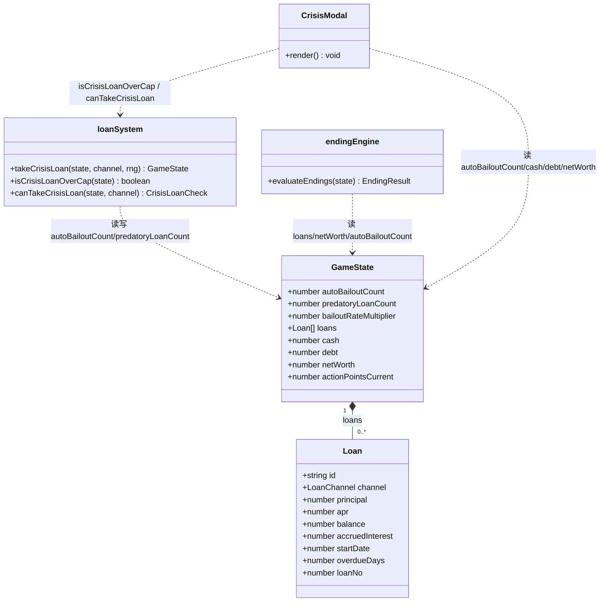
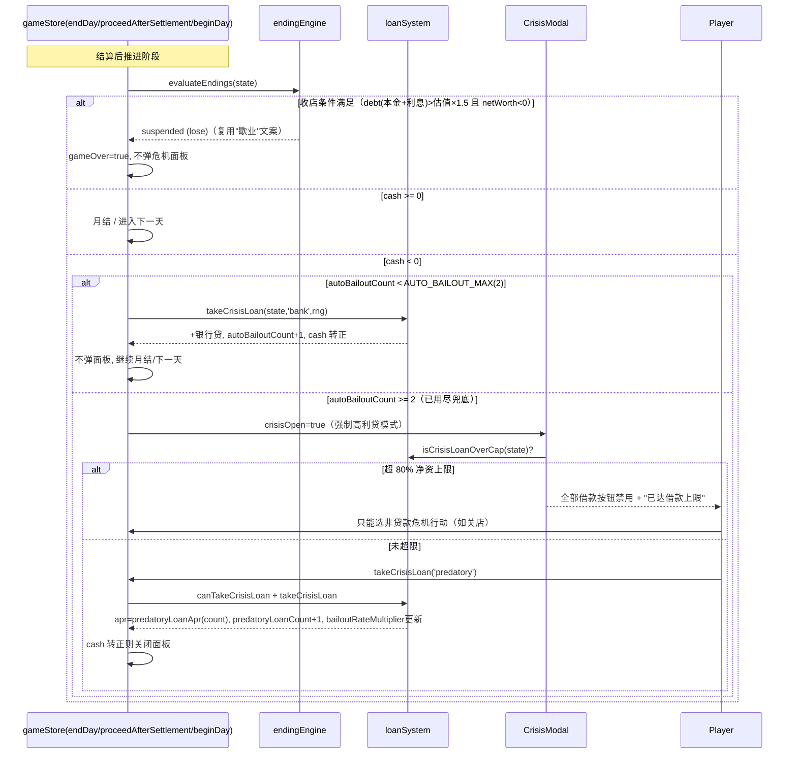

# 《开店说》v3 贷款子系统增量修复设计文档（INCREMENTAL_LOANFIX）

> 文档归属：架构师（高见远）｜团队 `software-kaidian-shuo-v3-loanfix`
> 配套任务：L-1 字段与迁移 → L-2 gameLoop 兜底限次 → L-3 takeCrisisLoan 上限+高利贷利率递增 → L-4 endingEngine 收店判定 → L-5 UI 禁用 → L-6 测试
> 设计基准：三项与产品方对齐的修复决策（见各节）。**只动贷款/结局相关代码，不触碰 v3 其他机制**；`events.v0.1.json` 内容原则不动，`endings.json` **一个字节都不动**（收店文案复用 `suspended`，已定）。

---

## 1. 实现方案与改动范围

### 1.1 核心问题
- `gameLoop.ts` 第 50 行在 F001 强制事件（cash<0）后**无条件** `takeCrisisLoan(state,'bank',rng)` 兜底，导致现金永远被拉回非负，**破产结局永不触发**。
- `takeCrisisLoan` 当前**无任何次数/总额限制**，玩家可无限借高利贷续命。
- `endingEngine.ts` 判定表**没有"被银行收走店"这一条**，资不抵债只会落入破产 5 天 / 高利贷跑路等既有结局。

### 1.2 三项修复的落地策略
1. **自动兜底限次（仅前 2 次）**：新增 `autoBailoutCount`，`gameLoop` 与 `store` 在 cash<0 时，若 `autoBailoutCount < 2` 维持现状（自动银行 4% 兜底、不弹面板、扣 1 行动点），否则不再兜底，改为强制弹出危机面板且**仅允许高利贷**。
2. **新增"被银行收走店"失败结局（复用 suspended 文案）**：在 `endingEngine.ts` 判定表新增一条收店分支；阈值用 `storeValuation(stores[0]) × 1.5 < Σ(本金+累计利息)` 且 `netWorth < 0`；达条件时**直接复用现有 `suspended`（歇业）结局的 id 与文案**，`endings.json` 一个字节都不改（已与产品方确认）。玩家看到的仍是"歇业"文案，但触发死法变成了"被收店"。
3. **危机贷款累计上限 = 当前净资 80%**：玩家在危机面板发起的 `takeCrisisLoan` 前检查 `state.debt >= state.netWorth × 0.8` → 拒绝（UI 禁用按钮 + 提示）。净资为负时右端为负，debt≥0 恒大于 → 直接禁用。setup 一次性贷款与自动兜底（core 直调 `takeCrisisLoan`）**不受此限**。

### 1.3 高利贷利率飙升公式（默认值，详见 §8）
- 基准利率取 `LOAN_APR.predatory = 0.36`。
- 第 n 笔高利贷（n = `predatoryLoanCount + 1`，即已借笔数 + 1）年利率：
  `apr = LOAN_APR.predatory × PREDATORY_APR_ESCALATION^(n-1)`，默认 `PREDATORY_APR_ESCALATION = 1.5`。
- 即：第 1 笔 36% → 第 2 笔 54% → 第 3 笔 81% → 第 4 笔 121.5% …（债务螺旋）。

### 1.4 改动范围（明确边界）
- **只改**：贷款生命周期（setup 自动贷 / 自动兜底 / 危机贷 / 月息 / 提前还本）与结局判定中"收店"一条；相关 UI（危机面板渠道锁 + 上限禁用）；类型字段与迁移。
- **不改**：`events.v0.1.json` 事件内容、`endings.json` 既有 9 条结局文案（收店复用 `suspended`，不再新增条目）；v3 的结算/暗线/分店/月度报表等其它机制；`takeCrisisLoan` 既有公开签名 `(state, channel, rng)` 保持不变（避免牵连 `gameLoop`、存量测试）。

---

## 2. 文件清单（新增 / 修改）

| 文件 | 动作 | 职责一句话 |
|------|------|-----------|
| `src/types/index.ts` | 修改 | `GameState` 新增 3 个增量字段：`autoBailoutCount` / `predatoryLoanCount` / `bailoutRateMultiplier`。 |
| `src/types/actions.ts` | 修改 | `Loan` 可选追加 `loanNo?: number`（仅 UI 文案展示用，非逻辑必需）；新增 `CrisisLoanCheck` 类型（`{ ok: boolean; reason: 'cap'\|'ap'\|null }`）。 |
| `src/data/setupCosts.ts` | 修改 | 新增贷款机制常量与纯函数：`AUTO_BAILOUT_MAX`、`PREDATORY_APR_ESCALATION`、`CRISIS_LOAN_NETWORTH_CAP_RATIO`、`predatoryLoanApr(count)`。 |
| `src/data/endingTriggers.ts` | 修改 | 新增收店阈值常量 `BANK_FORECLOSURE_DEBT_MULTIPLIER = 1.5`。 |
| `src/core/loanSystem.ts` | 修改 | `takeCrisisLoan` 在 `predatory` 时按公式写 `apr` 并递增 `predatoryLoanCount` / 更新 `bailoutRateMultiplier`；新增 `isCrisisLoanOverCap(state)` 与 `canTakeCrisisLoan(state, channel)` 纯函数。 |
| `src/core/gameLoop.ts` | 修改 | F001 兜底分支：仅当 `autoBailoutCount < AUTO_BAILOUT_MAX` 才自动银行兜底并 +1；否则不兜底（cash 保持负，由调用方弹危机面板）。 |
| `src/core/endingEngine.ts` | 修改 | 判定表新增"被银行收走店"分支（引入 `storeValuation` 与 `netWorth` 判定）；达条件时**复用 `getEnding('suspended')` 文案**（不新增 id）。 |
| `src/store/gameStore.ts` | 修改 | `beginDay` / `proceedAfterSettlement` 的 cash<0 分支改"兜底或强制高利贷危机"；`takeCrisisLoan` action 在玩家发起时强制 80% 上限校验。 |
| `src/components/modals/CrisisModal.tsx` | 修改 | 当 `autoBailoutCount >= AUTO_BAILOUT_MAX` 时禁用 bank/private 按钮（仅高利贷）；当 `isCrisisLoanOverCap` 时禁用全部借款按钮并提示"已达借款上限"；高利贷按钮展示当前飙升利率。 |
| `src/core/migration.ts` | 修改 | `migrateGameState` 补齐 3 个新字段默认值（旧档兼容）。 |
| `src/core/createNewGame.ts` | 修改 | 新局 `base` 初始化 3 个新字段（编译完整性必需）。 |
| `tests/loanfix.test.ts` | 新增 | L-6 测试：兜底限次、高利贷利率递增、80% 上限、收店判定、旧档迁移。 |

---

## 3. 数据结构与接口

### 3.1 GameState 增量字段（`src/types/index.ts`）

| 字段 | 类型 | 默认值 | 说明 |
|------|------|--------|------|
| `autoBailoutCount` | `number` | `0` | 自动银行兜底已使用次数（0–2）。仅 cash<0 自动兜底成功 +1；玩家手动高利贷不计入。 |
| `predatoryLoanCount` | `number` | `0` | 已借高利贷笔数（利率飙升计数器，逻辑真相源）。 |
| `bailoutRateMultiplier` | `number` | `1` | 下一笔高利贷相对基准利率的乘子，`= PREDATORY_APR_ESCALATION ^ predatoryLoanCount`（派生镜像，供 UI 展示当前利率）。 |

> 不变式：`bailoutRateMultiplier === PREDATORY_APR_ESCALATION ** predatoryLoanCount`，仅在 `takeCrisisLoan('predatory')` 成功时同步更新。

### 3.2 Loan 接口（`src/types/actions.ts`）
既有字段不变；可选追加：
```ts
interface Loan {
  id: string;
  channel: LoanChannel;          // 'bank' | 'private' | 'predatory'
  principal: number;
  apr: number;                   // 高利贷时由 predatoryLoanApr(count) 写入
  balance: number;
  accruedInterest: number;
  startDate: number;
  overdueDays: number;
  loanNo?: number;               // 可选：第几笔高利贷（UI 文案用，如"第3笔 81%"）
}
```

### 3.3 新增纯函数（`loanSystem.ts` / `setupCosts.ts`）
```ts
// setupCosts.ts
export const AUTO_BAILOUT_MAX = 2;                 // 自动兜底次数上限
export const PREDATORY_APR_ESCALATION = 1.5;       // 高利贷每多一笔的利率乘子
export const CRISIS_LOAN_NETWORTH_CAP_RATIO = 0.8; // 危机贷款净资占比上限
/** 第 (count+1) 笔高利贷年利率（count = 已借笔数）。 */
export function predatoryLoanApr(count: number): number {
  return Math.round(LOAN_APR.predatory * PREDATORY_APR_ESCALATION ** count * 1e4) / 1e4;
}

// loanSystem.ts
/** 是否超过"危机贷款 ≤ 当前净资 80%"上限（setup/自动兜底不走此限）。 */
export function isCrisisLoanOverCap(state: GameState): boolean {
  return state.debt >= state.netWorth * CRISIS_LOAN_NETWORTH_CAP_RATIO;
}
/** 玩家发起危机贷款前的可借性检查。 */
export function canTakeCrisisLoan(state: GameState, channel: LoanChannel): CrisisLoanCheck {
  if (state.actionPointsCurrent <= 0) return { ok: false, reason: 'ap' };
  if (channel === 'predatory' || isCrisisLoanOverCap(state)) return { ok: false, reason: 'cap' };
  return { ok: true, reason: null };
}
```

### 3.4 类图（Mermaid）


---

## 4. 程序调用流程

### 4.1 每日循环 cash<0 时的分流（前 2 次自动银行 / 第 3 次起强制高利贷）


### 4.2 gameLoop 纯函数分支（单测路径，与 store 对齐）
- `checkForcedEvents` 返回 F001（cash<0）时：若 `autoBailoutCount < 2` → `takeCrisisLoan(state,'bank',rng)` 且 `autoBailoutCount += 1`；否则**跳过兜底**，cash 保持负，由上层 store 在 `beginDay`/`proceedAfterSettlement` 中弹危机面板。

### 4.3 收店判定触发点
- 在 `evaluateEndings`（即 `proceedAfterSettlement` 每日结算后）与月结后复判中执行。条件不依赖 cash 正负，只看债务规模与净资，故可在任意结算后触发。
- 月息 `applyMonthlyInterest` 在 store 月结分支内执行，收店对其的响应延后到次日 `proceedAfterSettlement`（见 §7 共享知识）。
- 收店分支达条件时返回 `getEnding('suspended')` 的结局（复用"歇业"文案），**不新增 `bank_foreclosure` id**（产品方确认 `endings.json` 不动）。

---

## 5. 有序任务列表（按实现顺序，含依赖）

| 任务 | 名称 | 源文件 | 依赖 | 优先级 |
|------|------|--------|------|--------|
| **L-1** | 字段与迁移 | `types/index.ts`、`types/actions.ts`、`core/migration.ts`、`core/createNewGame.ts`、`data/setupCosts.ts`、`data/endingTriggers.ts` | — | P0 |
| **L-2** | gameLoop 兜底限次 | `core/gameLoop.ts`、`store/gameStore.ts`（beginDay/proceedAfterSettlement 的 cash<0 分支） | L-1 | P0 |
| **L-3** | takeCrisisLoan 上限 + 高利贷利率递增 | `core/loanSystem.ts`、`store/gameStore.ts`（takeCrisisLoan action） | L-1 | P0 |
| **L-4** | endingEngine 收店判定 | `core/endingEngine.ts`、`data/endingTriggers.ts`、`data/setupCosts.ts` | L-1 | P0 |
| **L-5** | UI 禁用与利率展示 | `components/modals/CrisisModal.tsx` | L-2, L-3 | P1 |
| **L-6** | 测试 | `tests/loanfix.test.ts`（及既有 `loanSystem.test.ts`/`crisis.test.ts`/`game-loop.test.ts` 适配） | L-2, L-3, L-4, L-5 | P1 |

> 说明：L-1 是其它任务的前置（字段与常量必须先就位）；L-2/L-3/L-4 互相独立，可并行实现；L-5 依赖 L-2/L-3 暴露的状态与函数；L-6 收尾。

---

## 6. 依赖包列表

**无新增第三方包。** 全部复用既有依赖：`zustand`（状态）、`react` + MUI（UI）、`clsx`（类名）。利率/上限均为纯函数与常量，无需额外库。

---

## 7. 共享知识（跨文件约定）

- **`autoBailoutCount` 计数时机**：仅在 `gameLoop` 的 F001 兜底分支、以及 `store` 的 `beginDay`/`proceedAfterSettlement` 的 cash<0 分支，成功调用 `takeCrisisLoan(state,'bank',rng)` 之后 `+1`。玩家手动危机贷款（predatory）**不计入**自动兜底次数。
- **高利贷利率公式**：`apr = LOAN_APR.predatory(0.36) × PREDATORY_APR_ESCALATION(1.5) ^ predatoryLoanCount`，结果四舍五入 4 位。每次成功 `takeCrisisLoan('predatory')` 后：`predatoryLoanCount += 1`；`bailoutRateMultiplier = PREDATORY_APR_ESCALATION ^ predatoryLoanCount`（下一笔乘子）。UI 高利贷按钮文案显示 `周转 ${(apr*100).toFixed(0)}%`。
- **店铺估值口径（收店用）**：`storeValuation(store) = store.rent × 6`（复用 `branch.ts`），主店取 `state.stores[0]`。收店阈值 = `storeValuation(主店) × BANK_FORECLOSURE_DEBT_MULTIPLIER(1.5)`。与 `computeNetWorth` 中的估值口径一致，实现简单、无需新字段。
- **80% 上限计算口径**：`isCrisisLoanOverCap = state.debt >= state.netWorth × 0.8`；`state.debt = Σloan.balance`（=累计未还本金）。净资为负时右端为负，debt≥0 恒大于 → 直接禁用（资不抵债不能再加贷）。**受此限的对象**：玩家在危机面板发起的 `takeCrisisLoan`。**不受此限**：setup 一次性贷款（`computeSetupLoan`）、自动兜底（`store`/`gameLoop` 直调 core `takeCrisisLoan`）。
- **`migration` 默认值**：`autoBailoutCount=0`、`predatoryLoanCount=0`、`bailoutRateMultiplier=1`；旧档缺失即补默认，绝不因 undefined 崩溃。
- **收店判定时序**：`evaluateEndings` 在 `proceedAfterSettlement` 每日结算后调用；月息在月结分支内 `applyMonthlyInterest` 执行，故"月息导致超过阈值"的收店会延后到**次日** `proceedAfterSettlement` 才被检测到（设计默认接受此延迟，见 §8）。
- **收店结局落地（已定）**：因产品方确认 `endings.json` 不改动，收店分支达条件时**直接 `getEnding('suspended')` 复用"歇业"文案**返回（保证有文案、不崩溃）；不新增 `bank_foreclosure` id，无"文案缺失安全跳过"问题。

---

## 8. 待明确事项（含推荐默认值）

| # | 待确认项 | 推荐默认值 / 方案 | 说明 |
|---|----------|-------------------|------|
| **Q1（已定）** | **收店结局文案是否允许新增到 `endings.json`？** | **已定：复用 `suspended`（歇业）文案**，`endings.json` 一个字节都不动。收店分支达条件时直接返回 `getEnding('suspended')` 结局（id 与文案均复用）。 | 原推荐 (b) 新增 `bank_foreclosure` 条目被产品方否决，采用 (a) 复用方案。玩家看到的是"歇业"文案，但触发死法为"被收店"。 |
| **Q2** | 店铺估值具体口径 | **推荐 `storeValuation = rent × 6`（主店 `stores[0]`）** | 备选：装修+设备残值（需新增字段，复杂度高）。rent×6 与 `computeNetWorth` 口径一致、零新增字段。需产品确认是否接受"主店"口径（多店时只算主店估值）。 |
| **Q3** | 高利贷利率飙升公式的具体系数 | **推荐复合 ×1.5**：`apr = 0.36 × 1.5^(n-1)`（36%→54%→81%→121.5%…） | 备选：每多一笔 **+12pp 线性**（36%→48%→60%…）。复合更具"债务螺旋"叙事张力；线性更可控。系数 `PREDATORY_APR_ESCALATION` 已抽成常量，确认后改一处即可。 |
| **Q4** | 收店判定与自动兜底的先后顺序 | **默认 `evaluateEndings` 先于 cash<0 兜底分支执行**：若收店条件已满足直接结束，2 次兜底不救场。 | 备选：先给完 2 次兜底再判收店（需把 `evaluateEndings` 的收店分支移到兜底之后）。需产品确认是否希望"兜底能延缓收店"。默认否。 |
| **Q5** | 月度利息驱动的收店判定时机 | **默认延后到次日 `proceedAfterSettlement` 检测**（月结内 `applyMonthlyInterest` 晚于 `evaluateEndings`）。 | 备选：月结分支执行完 `applyMonthlyInterest` 后立刻复判 `evaluateEndings`。若产品要求"月息一过线当月底即收店"，需工程师在月结后加一次 `evaluateEndings` 调用（L-4 预留接口）。 |
| **Q6** | 80% 上限是否也约束"第 1/2 次自动兜底" | **默认不约束**（自动兜底是安全网，见 §7）。 | 若产品要求连自动兜底也受净资上限约束，需在 core `takeCrisisLoan` 加 bypass 参数，复杂度上升。默认维持现状。 |

---

### 附：收店结局接入（已定：复用 suspended，不新增 endings.json 条目）
`endingEngine.ts` 触发代码（写入判定表，达条件直接复用 `suspended` 文案）：
```ts
if (
  state.stores[0] &&
  state.loans.reduce((s, l) => s + l.principal + l.accruedInterest, 0) >
    storeValuation(state.stores[0]) * BANK_FORECLOSURE_DEBT_MULTIPLIER &&
  state.netWorth < 0 &&
  !state.endingsUnlocked.includes('suspended')
) {
  const def = getEnding('suspended');
  if (def) return make(def, 'lose', '债务超过店铺估值1.5倍且资不抵债', state);
}
```
> 注意：`endingsUnlocked.includes('suspended')` 的判定需与既有 `suspended`（破产 5 天）分支的"是否已解锁"逻辑保持一致——收店与破产 5 天都归到同一 `suspended` 结局下，二者互斥触发（先触发的先锁定）。具体集成方式以 `endingEngine.ts` 现有结构为准，工程师实现时应复用既有 `make/getEnding` 与 `endingsUnlocked` 机制，不要重复造轮子。
