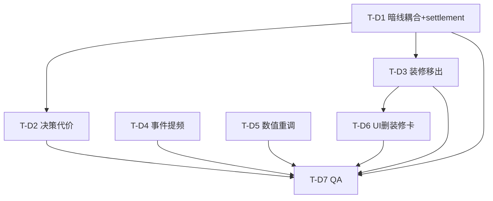

# 《开店说》餐饮开店模拟经营 — 增量设计 v2（深度重做 / INCREMENTAL）

> 作者：高见远（架构师）　|　版本：v2　|　性质：**增量重做**（不重写整个工程，只改平衡与耦合）
> 适用范围：`src/core/*`（纯函数，禁止 import React）、`src/data/*`、`src/types/*`、`src/store/gameStore.ts`、`src/components/*`
> **硬约束**：`src/data/events.v0.1.json` 与 `src/data/endings.json` 内容**禁止修改**；事件/结局/危机/月结/分店/风向的"存在性"与数据**禁止删除**，只改 `core` 对暗线的响应与数值；UI 仅删装修卡 + 加必要提示。

---

## 0. 根因确诊（已 Read 确认）

| # | 现象（用户实测） | 代码根因（精确位置） |
|---|---|---|
| R1 | 暗线（hidden）参与结算≈0 | `settlement.ts` 仅 `ownerFatigue>70` 有一点点转化/承载惩罚；`supplyRisk/hygiene/landlord/employee/promoHype/platform/customerTrust` **完全不进结算**，只用于 `eventEngine.selectPool` 抽池权重与 `wind.ts` 文案。 |
| R2 | 利润安全垫极厚 | `settlement.ts`：毛利（grossProfit≈2178）相对总成本（promo+staff+rent日摊+platform≈1364）余量约 **+814/天**，且订单被 `capacity` 截断后曝光浪费，坏决策几乎不亏。 |
| R3 | 装修不该每日决策 | `modifiers.ts:addDecisionModifiers` 把 `decorationLevel` 当每日决策累加 `entryRatePct/avgOrderValuePct`；`DecisionPanel.tsx` 有装修卡；`settlement.ts:settleAllStores` 的 `storeDecisions` 含 `decorationLevel`。 |
| R4 | 事件对店铺影响≈0 | `eventEngine.computeBaseProb` 普通日仅 **0.3**；且事件推高的暗线不造成亏损（见 R1），`durationDays` 虽有但幅度小。 |
| R5 | 决策怎么选都是正收益 | 同上 R1+R2：坏选择（低价供应商 / 老板顶班 / 猛推 / 低价引流）的"代价"只累加暗线数值，暗线不结算 → 无体感差异。 |

**设计总原则**：用 R1 的"暗线长牙齿"一次性同时解决 R2/R5（坏选择→暗线升高→结算真亏）；R4 用提频+保底+波动解决；R3 用"装修基准固化"解决。

---

## 1. 改动总览（vs v1，哪些文件改、改什么、为什么）

| 文件 | 改什么 | 为什么 |
|---|---|---|
| `src/core/hiddenPenalties.ts` | **新增**。导出 `deriveDailyPenalties(h, ctx)` 与 `applyHiddenLineDailyHits(state, rng)`。 | R1：暗线→结算的唯一落点（每日 Pct 增量 + 偶发重罚）。 |
| `src/core/settlement.ts` | 结算内合并 `deriveDailyPenalties`；`ownerFatigue` 与 `employeePressure` 合并为统一"人力压力"惩罚；应用 `store.decorationEntryBonus/AovBonus`；`fixedCostDaily` 加 `miscCostAdd` + 房东日摊杂费。 | R1 + R3。 |
| `src/core/modifiers.ts` | `emptyModifiers` 增加 `miscCostAdd`；`addDecisionModifiers` **移除 `decorationLevel`**；`addEffectModifiers` 支持合并 `miscCostAdd`。 | R3 + R1 落点。 |
| `src/core/eventEngine.ts` | `computeBaseProb` 0.3→**0.45**（周末/月末 0.55、高暗线>60 → 0.7）；`drawEvent` 加"每 5 天保底小事件"；新增 `dailyWeatherFluctuation(rng)`（小波动）。 | R4。 |
| `src/core/gameLoop.ts` | 结算前 **老板顶班每日 ownerFatigue +15**；结算后调用 `applyHiddenLineDailyHits`（现金罚款+评级下滑+日志）；叠加 `dailyWeatherFluctuation` 到 `dayModifiers`。 | R1 + R4 + R5。 |
| `src/core/createNewGame.ts` | 把装修档的 `entryRatePct/avgOrderValuePct` **固化**为 `store.decorationEntryBonus/AovBonus`；`decisions` 保留 `decorationLevel` 仅作记录。 | R3。 |
| `src/types/index.ts` | `StoreState` 增加 `decorationEntryBonus: number`、`decorationAovBonus: number`。 | R3。 |
| `src/data/storeProfiles.ts` | 各店型 `grossMargin` 下调 3pp（见 §6 表）。 | R2 收窄安全垫。 |
| `src/data/locationProfiles.ts` | 商场/写字楼月租小幅上调（见 §6 表）。 | R2。 |
| `src/utils/constants.ts` | `DEFAULT_PLATFORM_RATE` 0.18→**0.20**；新增 `SMALL_EVENT_EVERY = 5`。 | R1(platformDependence 叠加) + R4。 |
| `src/components/DecisionPanel.tsx` | 删除"装修"分类卡；移除 `getDecorationCost` 的装修 hint 引用（保留 `OpeningSetup` 的）。 | R3。 |
| `src/store/gameStore.ts` | `setDecision` 对 `decorationLevel` 设为 no-op（开局专属）；`endDay` 增加老板疲劳日累加、`applyHiddenLineDailyHits`、天气波动。 | R3 + R1 + R4。 |
| `tests/*` | 新增 `hiddenPenalties.test.ts`、`balance.test.ts`；更新 `event-engine.test.ts`（baseProb 0.3→0.45）、`settlement.test.ts`/`settlement-contract.test.ts`（毛利/平台率字面量同步）、`simulate.test.ts`（naive/balanced 断言）。 | T-D7。 |

**不动**：`events.v0.1.json`、`endings.json`、`crisis.ts`、`monthlyReport.ts`（月结选项存在性）、`branch.ts`、`wind.ts`（仅读取暗线）、`effectResolver.ts`（按需仅加 `miscCostAdd` 合并，不破坏语义）、`futureEffect.ts`。

---

## 2. 暗线→结算耦合规格（最关键）

### 2.1 设计落点（统一）

- **每日连续惩罚** → `deriveDailyPenalties(hiddenLines, ctx): DayModifiers`，在 `buildDailyModifiers`（即每次结算）里叠加，进入 `settlement` 的 Pct/成本字段。**纯函数、无 rng、可断言**。
- **阈值触发偶发重罚** → `applyHiddenLineDailyHits(state, rng): { state, logs }`，在 `gameLoop`/`endDay` 结算后调用：扣现金罚款、主店/分店评级下滑、写 `businessLog`。带 rng，固定 seed 可复现。
- **"人力压力"统一惩罚**（老板疲劳 + 员工压力）合并到 `settlement.ts` 一处（见 2.3）。

### 2.2 `deriveDailyPenalties` 签名与公式

```ts
// src/core/hiddenPenalties.ts
import type { DayModifiers, GameState, HiddenLines } from '../types';
import { clamp } from '../utils/constants';
import { emptyModifiers } from './modifiers';

const ramp = (v: number, t: number) => clamp((v - t) / (100 - t), 0, 1); // t 以下=0，100=1
const lowTrust = (v: number) => clamp((50 - v) / 50, 0, 1);              // 信任低=正值

export interface PenaltyCtx { rent: number; } // 房东日摊杂费需要门店月租

export function deriveDailyPenalties(h: HiddenLines, ctx: PenaltyCtx): DayModifiers {
  const m = emptyModifiers();
  // —— supplyRisk：毛利损耗 + 慢性缺货（订单少）——
  m.marginPct      -= 0.08 * h.supplyRisk;   // 满 100 → -8pp 毛利
  m.ordersPct      -= 0.04 * h.supplyRisk;   // 满 100 → -4% 订单（慢性缺货）
  // —— hygieneRisk：卫生差→转化掉（评级下滑在 dailyHits 处理）——
  m.conversionRatePct -= 6 * ramp(h.hygieneRisk, 30);   // 满 100 → -6pp 转化
  // —— platformDependence：平台抽成上升 ——
  m.platformCostPct += 8 * ramp(h.platformDependence, 40); // 满 100 → 平台成本 ×1.08
  // —— customerTrust：直接作用于进店/复购/转化（50 为中性）——
  const td = h.customerTrust - 50;            // [-50, +50]
  m.entryRatePct      += 0.10 * td;           // ±5pp 进店
  m.repurchaseRatePct += 0.15 * td;           // ±7.5pp 复购
  m.conversionRatePct += 0.05 * td;           // ±2.5pp 转化
  // —— promoHype 虚火：高虚火且信任低 → 进店被撑高、转化受罚 ——
  const hype = ramp(h.promoHype, 40);
  const lt = lowTrust(h.customerTrust);
  m.entryRatePct      += 10 * hype;           // 最多 +10pp 进店（来看热闹）
  m.conversionRatePct -= 12 * hype * lt;      // 最多 -12pp 转化（不买）
  // —— landlordAttention：日常找茬杂费（阈值以上才咬，按租金 1%/天 封顶）——
  if (h.landlordAttention > 40) {
    m.miscCostAdd += (h.landlordAttention - 40) / 60 * ctx.rent * 0.01; // 满 100 → +1% 月租/天
  }
  return m;
}
```

> 注意：`deriveDailyPenalties` 在 `buildDailyModifiers` 末尾合并（见 §3）。**初始态**（hidden 全 0、customerTrust=50）返回全 0，因此现有结算契约测试（init 态）不破。

### 2.3 结算内"人力压力"统一惩罚（`settlement.ts` 现有块扩展）

```ts
// resolveSettlement 内，替换原 ownerFatigue 单点处理
let effectiveCap = store.capacity;
const empPen = ramp(state.hiddenLines.employeePressure, 40); // 0..1
if (state.softHidden.ownerFatigue > 70) {
  conversionRate = clamp(conversionRate - 0.03, 0, 0.95);
  effectiveCap *= 0.95;
}
conversionRate = clamp(conversionRate - empPen * 0.08, 0, 0.95); // 员工压力：最多 -8pp 转化
effectiveCap *= (1 - empPen * 0.10);                            // 员工压力：最多 -10% 承载
```

### 2.4 偶发重罚 `applyHiddenLineDailyHits`（阈值触发，走现金+日志）

```ts
export interface HiddenHitLog {
  day: number;
  line: keyof HiddenLines | 'ownerFatigue';
  kind: 'shortage' | 'foodSafety' | 'landlord' | 'burnout' | 'rating';
  cashDelta: number;
  note: string;
}

export function applyHiddenLineDailyHits(state: GameState, rng: RNG): { state: GameState; logs: HiddenHitLog[] } {
  let s = cloneState(state);
  const logs: HiddenHitLog[] = [];
  const main = s.stores[0];
  const rent = main?.rent ?? 0;

  // (a) 卫生：主店+分店评级逐日下滑（连续、确定性）
  const hygieneDecline = ramp(s.hiddenLines.hygieneRisk, 30) * 1.0; // 满 100 → -1.0/天
  if (hygieneDecline > 0) {
    s.stores = s.stores.map((st) => ({ ...st, rating: clamp(st.rating - hygieneDecline, 0, 100) }));
    s.brandRating = s.stores[0].rating;
  }

  const roll = rng();
  // (b) 供应链隐患>70：偶发"到货短缺/食材损耗"
  if (s.hiddenLines.supplyRisk > 70 && roll < 0.15) {
    const fine = Math.round(rent * 0.05);
    s.cash -= fine; logs.push({ day: s.day, line: 'supplyRisk', kind: 'shortage', cashDelta: -fine, note: '供应商到货短缺，部分食材损耗' });
  }
  // (c) 卫生>60：偶发"食安罚款"
  else if (s.hiddenLines.hygieneRisk > 60 && rng() < 0.12) {
    const fine = Math.round(rent * 0.10);
    s.cash -= fine; s.stores[0].rating = clamp(s.stores[0].rating - 3, 0, 100);
    logs.push({ day: s.day, line: 'hygieneRisk', kind: 'foodSafety', cashDelta: -fine, note: '卫生抽检不合格，食安罚款' });
  }
  // (d) 房东关注>50：偶发"房东找茬"
  else if (s.hiddenLines.landlordAttention > 50 && rng() < 0.12) {
    const fine = Math.round(rent * 0.08);
    s.cash -= fine; logs.push({ day: s.day, line: 'landlordAttention', kind: 'landlord', cashDelta: -fine, note: '房东上门找茬，额外杂费' });
  }
  // (e) 人力崩：ownerFatigue>85 或 employeePressure>70 → "累垮/罢工"
  else if ((s.softHidden.ownerFatigue > 85 || s.hiddenLines.employeePressure > 70) && rng() < 0.10) {
    const fine = 800;
    s.cash -= fine; logs.push({ day: s.day, line: 'ownerFatigue', kind: 'burnout', cashDelta: -fine, note: '人手崩了，临时顶班/误工赔付' });
  }
  return { state: s, logs };
}
```

> 日志由调用方（`gameLoop`/`endDay`）追加到 `businessLog`（带 `note`）；现金罚款直接改 `s.cash`，保证日终 `cashAfter` 反映。偶发概率用同一个 `rng`（固定 seed 可复现）。

---

## 3. 决策代价落地映射表

决策选项（来自 `decision-options.json`，**不修改内容**）的即时 `hidden` 累加，现在通过 §2 真正变成结算亏损：

| 决策项 | 选项 | 触发暗线（已有） | 经 §2 的最终结算后果 |
|---|---|---|---|
| 供应商 | `cheap` 低价 | supplyRisk+8, hygieneRisk+5, customerTrust-3 | 毛利 -0.64pp/天 + 慢性缺货 -0.32%订单/天；supplyRisk 累积>70 触发"食材损耗"罚款；卫生差→转化-0.3pp |
| 供应商 | `stable` 稳定 | supplyRisk-8, customerTrust+3 | 反向抵消，安全垫厚 |
| 供应商 | `premium` 高端 | customerTrust+8, supplyRisk-5 | 信任高→进店/复购加成，几乎无惩罚 |
| 售价 | `low` 低价引流 | priceControversy-5, customerTrust+2 | avgOrderValue-10%、毛利-5pp（直接亏），但信任略回血缓和虚火 |
| 售价 | `premium` 高价定位 | priceControversy+12, customerTrust-3 | avgOrderValue+18% 但转化-12pp；争议+信任降→若叠加虚火转化再掉 |
| 推广 | `heavy` 猛推 | promoHype+12, employeePressure+8, landlordAttention+3 | 曝光+35% 但承载截断→浪费；虚火(进店+转化-) + 人力压力(转化/承载-) + 房东杂费 |
| 推广 | `gamble` 搏一把 | promoHype+25, employeePressure+15, landlordAttention+8, priceControversy+5 | 同上但更猛；日推广费 5000 直接吞噬薄利 |
| 人工 | `owner` 老板自己顶 | ownerFatigue+15（**且每日再 +15**，见 §2.3/§4） | 免费但承载仅 90（曝光浪费）；疲劳>70 转化-3%/承载-5%；>85 触发"累垮"罚款；更易触发 `one_person_shop` 结局 |
| 人工 | `standard` 标准 | — | 承载 220，人力压力中性，最稳 |
| 装修 | 仅开局选 | 见 §4 | 档位 Pct 固化为门店基准，不再每日参与 |

**关键机制**：坏选择≠当天即亏，而是"暗线升高→每日惩罚累积→长期必亏"。例如 `cheap+owner+gamble+low`：供应链损耗 + 虚火转化塌 + 房东杂费 + 每日 5000 推广费 + 疲劳罚款，迅速把 +814/天 的安全垫翻成深度负现金流。

---

## 4. 装修移出每日决策的落地步骤

### 4.1 涉及文件
- `src/types/index.ts`：`StoreState` 增加 `decorationEntryBonus: number`、`decorationAovBonus: number`。
- `src/core/createNewGame.ts`：开局把装修档 `effects.entryRatePct/avgOrderValuePct` 固化进 `mainStore.decorationEntryBonus/AovBonus`（取自 `getDecisionEffects('decorationLevel', level)`）；保留 `decorationLevel` 写入 `store` 与 `decisions` 仅作记录。装修 `initialCost` 扣减逻辑**不变**（已在 `createNewGame`）。
- `src/core/modifiers.ts`：`addDecisionModifiers` 的 `categories`/`ids` **删除 `decorationLevel`**。
- `src/core/settlement.ts`：`settleAllStores` 的 `storeDecisions` 对象删除 `decorationLevel`；结算公式应用固化基准：
  ```ts
  const entryRate = clamp(sp.entryRate + mods.entryRatePct / 100 + store.decorationEntryBonus / 100, 0, 0.95);
  const avgOrderValue = sp.avgOrderValue * (1 + (mods.avgOrderValuePct + store.decorationAovBonus) / 100);
  ```
- `src/components/DecisionPanel.tsx`：删除"装修" `CategoryDef` 及 `getDecorationCost` 的装修 hint（保留 `OpeningSetup` 的装修选择，含 `initialCost` 提示）。
- `src/store/gameStore.ts`：`setDecision` 对 `key === 'decorationLevel'` 直接 return（开局专属，运行期不可改）。

### 4.2 分店继承
`openBranch` 用 `{ ...main, ... }` 展开，自动继承 `decorationEntryBonus/AovBonus`，无需额外改动。

### 4.3 翻新装修（可选，本期不强做）
月结选项表（`monthlyReport.buildMonthOptions`）可加一项 `renovate`：扣现金（按目标档 `initialCost` 差额），更新主店 `decorationLevel/decorationEntryBonus/AovBonus` 并施加 `landlordAttention +5`。**默认不实现**，列为待确认（见 §9）。

---

## 5. 事件提频方案（更频更黏）

| 项 | v1 | v2 |
|---|---|---|
| `computeBaseProb` 普通日 | 0.30 | **0.45** |
| 周末/月末 | 0.40 | **0.55** |
| 高暗线（maxHiddenLine>60） | 0.55 | **0.70** |
| 大事件后 ≤3 天 | min 0.20 | 0.20（保持静默期） |
| 保底小事件 | 无 | **每 `SMALL_EVENT_EVERY=5` 天强制一次 small 事件**（若 `day-lastLargeEventDay≤3` 则跳过，避免压大事件） |
| 轻微日常波动 | 无 | `dailyWeatherFluctuation(rng)`：每日 ±2.5% `exposurePct`（在 `gameLoop`/`endDay` 叠加到 `dayModifiers`，不进 `buildDailyModifiers` 以免破结算契约测试） |

`drawEvent` 改造（伪代码）：
```ts
export function drawEvent(state, rng) {
  const quiet = state.day - state.lastLargeEventDay <= 3;
  const guaranteedSmall = !quiet && state.day % SMALL_EVENT_EVERY === 0;
  if (!guaranteedSmall && rng() > computeBaseProb(state)) return null;
  const pool = selectPool(state, rng);
  const candidates = guaranteedSmall
    ? eligible(state).filter((e) => e.level === 'small')   // 保底只取小事件
    : eligible(state, pool);
  if (candidates.length === 0) {
    const any = fallbackAnyPool(state, rng);
    if (!any) return null;
    return any;
  }
  return weightedPick(candidates, levelWeight, rng);
}
```

> 体感放大三件套：① 提频（0.45 起）→ ② 暗线牙齿（事件推高的暗线现在真造成亏损，见 §2）→ ③ `durationDays` 持续多日（沿用，不改）。**不改任何事件内容**。

---

## 6. 重调基准数值表（标注相对 v1 变化）

> 设计选择：安全垫收窄**主要靠 §2 暗线牙齿 + §4 老板疲劳日累加 + §5 提频**（这些在 init 态为中性，不破现有结算契约测试）；下表为**辅助微调**，仅动数值、不动结构。

### 6.1 `src/data/storeProfiles.ts` — `grossMargin`（统一 −3pp）
| 店型 | v1 | v2 |
|---|---|---|
| 奶茶饮品 | 0.55 | **0.52** |
| 小吃快餐 | 0.50 | **0.47** |
| 粉面店 | 0.52 | **0.49** |
| 咖啡主理人店 | 0.60 | **0.57** |
| 加盟连锁店 | 0.42 | **0.40** |

（entryRate / conversionRate / repurchaseRate / avgOrderValue / exposureFactor 保持 v1 不变）

### 6.2 `src/data/locationProfiles.ts` — `baseMonthlyRent`
| 商圈 | v1 | v2 |
|---|---|---|
| 学校门口 | 12000 | 12000（不变） |
| 写字楼 | 20000 | **22000** |
| 社区底商 | 10000 | 10000（不变） |
| 商场 | 35000 | **38000** |
| 冷清新商圈 | 6000 | 6000（不变） |

### 6.3 `src/utils/constants.ts`
| 常量 | v1 | v2 | 说明 |
|---|---|---|---|
| `DEFAULT_PLATFORM_RATE` | 0.18 | **0.20** | 平台抽成上行；与 `platformDependence` 叠加 |
| `BASE_EXPOSURE` | 1000 | 1000（不变） | — |
| `SMALL_EVENT_EVERY` | — | **5**（新增） | 保底小事件周期 |

### 6.4 推广成本 / 人工成本 / 承载 cap
| 项 | v1 | v2 | 说明 |
|---|---|---|---|
| `promotionTier` cost | none300/normal800/heavy2000/gamble5000 | **保持不变** | 已足够高；如需更狠可 +10%（附录可选） |
| `staffTier` dailyCost | owner0/basic250/standard450/peak750/redundant1200 | **保持不变** | — |
| 承载 cap | 90/140/220/330/450 | **保持不变**（见 §9 待确认是否 −10%） | 承载截断本就是"猛推浪费钱"的核心机制 |

### 6.5 验证 init 态不破测试
- `deriveDailyPenalties` 在 init（hidden 全 0、customerTrust=50）→ 全 0 ⇒ 结算契约测试（init 态）数值不变。
- 仅 §6.1/§6.3 的字面断言需同步更新（见 §8 / T-D7）。

---

## 7. 模拟验收目标（naive vs balanced，固定 seed 跑 120 天）

> 通用设定：`storeType='奶茶饮品'`、`locationType='学校门口'`、`decorationLevel='clean'`、`seed` 固定（建议 `12345`，与现有 `simulate.test` 对齐）。
> 以下为 **QA 断言目标**；精确阈值由 T-D7 跑通后校准（允许 ±10% 容差）。

### 7.1 参考组合定义
- **naive（全省钱/全贪）**：`supplierTier=cheap` + `staffTier=owner` + `promotionTier=gamble` + `priceStrategy=low`。
- **balanced（均衡稳健）**：`supplierTier=stable` + `staffTier=standard` + `promotionTier=normal` + `priceStrategy=raise`。

### 7.2 naive 断言（必须翻车）
- 起手现金 **100000（新手档）**：`cash` 在 **≤ 60 天** 转负（触发 F001 至少一次）。
- 起手现金 **300000（小有积蓄档）**：月均净现金流 **< -1000/天**；现金曲线单调向下；**120 天内必触发 ≥1 次 F001 或现金转负**。
- 定性：前期靠曝光猛但承载截断 → 推广费打水漂；中期 supplyRisk/虚火/房东杂费/疲劳罚款叠加 → 安全垫被吃穿。

### 7.3 balanced 断言（必须能赚但有起伏）
- 起手现金 **300000**：
  - `cash` **全程 ≥ 0**（或最低点不低于起手 15%）；期末现金 **> 起手** 且 **< 起手 × 1.8**（非暴利）。
  - 完整月（第 30/60/90 天月结）中 **≥ 3 个月 `monthlyNetProfit > 0`**。
  - 日净现金流**波动明显**（受保底小事件 + 天气波动 + 偶发暗线罚款影响），标准差 > 0（非直线）。
- 定性：稳定供应链几乎无 supply/卫生罚款；标准人工承载 220 不饱和不浪费；正常推广曝光有效转化；小幅涨价拉高客单价。赚钱但不"躺赢"。

### 7.4 回归不变量（沿用 `simulate.test`）
- 固定 seed 连续 120 天不抛错；`day` 终值 121、`month` 5、月结 ≥3 次。
- 开局现金为负（designer 装修 20 万 + 10 万起手）→ 进入 F001 分支（已存在用例，仍成立）。

---

## 8. 任务清单（有序、含依赖、映射文件）

> 说明：本清单直接采用 team-lead 指定的 T-D1..T-D7 编号。

| ID | 任务名 | 源文件（改/建） | 依赖 | 优先级 |
|---|---|---|---|---|
| **T-D1** | 暗线→结算耦合 + settlement | 新增 `core/hiddenPenalties.ts`；改 `core/settlement.ts`、`core/modifiers.ts`（加 `miscCostAdd`）、`utils/constants.ts`（`DEFAULT_PLATFORM_RATE`） | — | P0 |
| **T-D2** | 决策代价落地（老板疲劳日累加 + 统一人力惩罚） | 改 `core/gameLoop.ts`、`store/gameStore.ts`（owner 每日 +15 fatigue）、`core/settlement.ts`（人力统一块，已在 T-D1 内） | T-D1 | P0 |
| **T-D3** | 装修移出每日决策 + 基准固化 | 改 `types/index.ts`、`core/createNewGame.ts`、`core/modifiers.ts`、`core/settlement.ts`、`components/DecisionPanel.tsx`、`store/gameStore.ts` | T-D1 | P0 |
| **T-D4** | 事件提频（baseProb + 保底 + 波动） | 改 `core/eventEngine.ts`（baseProb、保底、`dailyWeatherFluctuation`）、`core/gameLoop.ts`/`store/gameStore.ts`（叠加天气波动） | — | P1 |
| **T-D5** | 数值重调（profiles / 平台率 / 租金） | 改 `data/storeProfiles.ts`、`data/locationProfiles.ts`、`utils/constants.ts` | — | P1 |
| **T-D6** | UI 删装修卡 + 提示 | 改 `components/DecisionPanel.tsx`；可选加虚火/疲劳提示（`WindPanel`/`StatusBar`） | T-D3 | P2 |
| **T-D7** | QA 回归 + 新增平衡测试 | 新增 `tests/hiddenPenalties.test.ts`、`tests/balance.test.ts`；更新 `tests/event-engine.test.ts`（0.3→0.45）、`tests/settlement.test.ts` & `tests/settlement-contract.test.ts`（毛利/平台字面量）、`tests/simulate.test.ts`（naive/balanced 断言） | T-D1..T-D6 | P0 |

### 8.1 任务依赖图（mermaid）



> 协作提示：`gameLoop.ts` 与 `store/gameStore.ts` 被 T-D1/T-D2/T-D4 共同改动——建议 T-D1 先落地结算/惩罚核心，T-D2、T-D4 在其上追加"日累加/天气波动"调用，避免同一文件多任务冲突。

---

## 9. 风险与待确认

1. **承载 cap 是否同步下调**：当前 cap（90/140/220/330/450）使"猛推/搏一把"的曝光被截断浪费，已是核心惩罚。若 QA 显示 naive 仍偏宽松，建议把 `standard` 220→**200**、`redundant` 450→**400**（−10%），但会同步压低 balanced 营收，需重新校准 §7.3。→ **待确认**。
2. **翻新装修是否本期做**：§4.3 列为可选；本期建议**不做**，保持范围聚焦。→ 默认不做。
3. **`applyHiddenLineDailyHits` 偶发罚款幅度**：§2.4 的 rent×0.05/0.10/0.08 与概率 0.15/0.12/0.12/0.10 为初值，最终以 §7 模拟目标为锚在 T-D7 校准；幅度过大会误伤 balanced。
4. **天气波动 ±2.5% 是否过大**：若 balanced 月度波动超标，下调到 ±1.5%。
5. **`customerTrust` 初始 50 为中性**：deriveDailyPenalties 在 trust=50 时进店/复购/转化增量=0，保证 init 态测试中性；玩家一旦把 trust 拉低，惩罚立即显现。
6. **测试字面量同步**：T-D7 必须更新 `settlement.test.ts`(`257*18*0.55`)、`settlement-contract.test.ts`(`2178`、`257*18*0.55`)、`event-engine.test.ts`(`baseProb 0.3→0.45`)；其余契约测试从 profile 派生，自动适配。
7. **不改事件数据**：所有提频/黏性均通过 `computeBaseProb` / 保底 / 天气波动实现，绝不触碰 `events.v0.1.json`。
