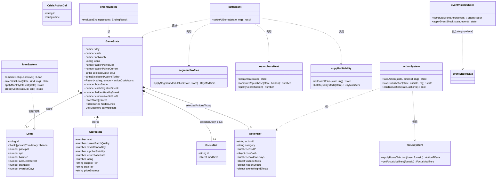
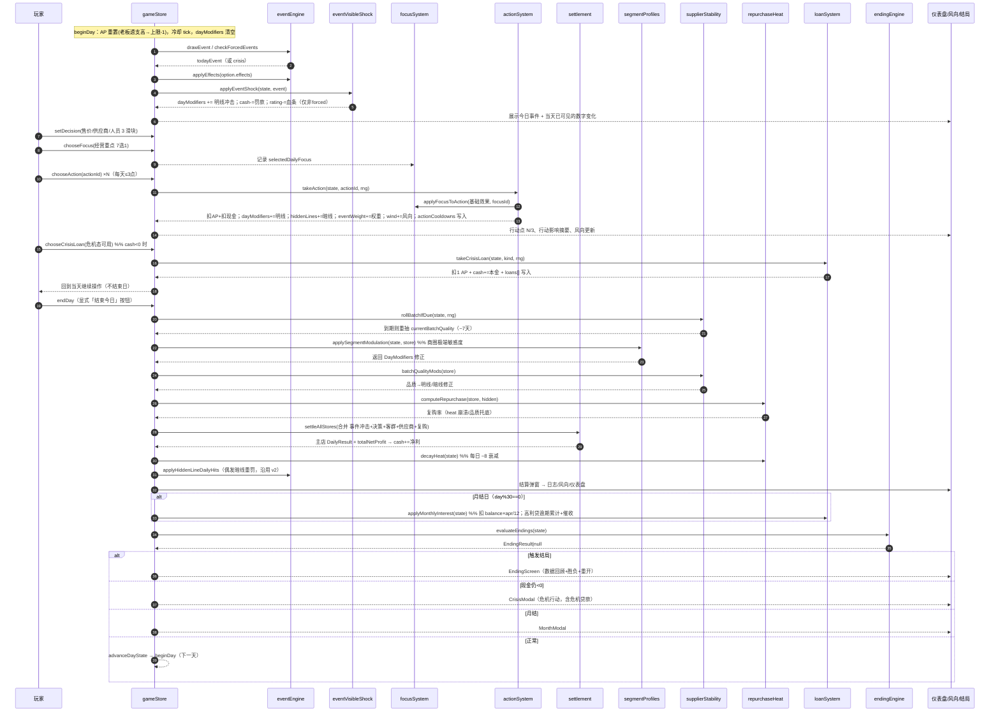
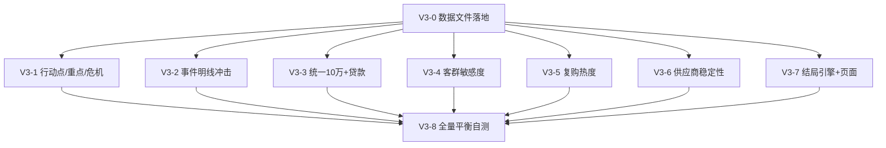

# 《开店说》v3 增量设计文档（INCREMENTAL_V3）

> 作者：高见远（架构师 Bob）　|　版本：v3　|　性质：**增量设计 + 任务分解**
> 适用范围：`src/core/*`（纯函数，禁止 import React）、`src/data/*`、`src/types/*`、`src/store/gameStore.ts`、`src/components/*`
> **硬约束**：`src/data/events.v0.1.json` 与 `src/data/endings.json` 内容**严禁修改**（只作"只读真相源/文案库"）；事件/结局的"存在性"与数据**不删除**，只在其外围新增 v3 机制；UI 仅做增量卡片与改造，不重写整个前端。
> **设计总纲**：模块化、数据驱动、可单测、避免 god-function。每个机制是一个独立 `core/*` 纯函数模块，由 `settlement.ts` / `gameStore.endDay` 编排。

---

## 0. 需求与现状对齐（已 Read 确认的关键事实）

| 维度 | v2 现状（已确认） | v3 增量 |
|---|---|---|
| 交互 | 5 滑块每日调（实为 4：装修已移出）；每日结束由「结束今天」触发 | **保留** 售价/供应商/人员 3 滑块 + **叠加** 行动点系统（3 点/天选行动卡）+ **1 经营重点** |
| 起手资金 | 4 档（10/30/60/100 万） | **统一 10 万**；setup 成本超 10 万部分自动成**一次性贷款**（不在"天"里弹窗） |
| 暗线 | v2 已让暗线"长牙齿"（暗线→结算真亏） | 保留 |
| 事件 | v2 已提频（0.45 起）+ 保底小事件 + 天气波动 | **新增当天明线冲击**（读 category+level 算，不碰 events 内容） |
| 装修 | v2 已固化开局项（decorationEntryBonus/AovBonus） | 不变（decision-options.json 已带 initialCost，三处一致） |
| 贷款 | v2 旧 `debt/monthlyRepayment` 是假的、会卡死循环 | **重构为真实债务 Loan[]**，绝不做每日循环弹窗 |
| 结局 | v2 仅一句话、无独立页、边界不清 | **结局引擎单判定表 + 独立 EndingScreen 页面** |
| 客群敏感度 | 无（仅 locationProfiles 的 trafficCoef/rent） | **新增 segmentProfiles 极端敏感度调制层** |
| 复购 | 仅靠 store.repurchaseRate 基线 | **新增 heat(0–100) 热度崩溃机制** |
| 供应商 | 档位固定效果 | **新增批次品质波动 stability（每 ~7 天重抽）** |

**直接采用的 v0.2 真相源**（不重造）：`actions.v0.2.json`（18 行动）、`business-focus.v0.2.json`（7 重点）、`crisis-actions.v0.2.json`（10 危机行动）。其 schema 见 §3 与 `src/types/actions.ts`。

---

## 1. 实现方案与框架选型

### 1.1 技术栈（沿用，无新增运行时依赖）

- **Vite + React + TypeScript + Tailwind CSS + Zustand**（与 v2 一致）。
- **Zustand** 持有 `GameState`，所有 UI 只调 store action；store action 调 `core/*` 纯函数（禁止在 core 里 import React）。
- **RNG**：沿用现有 `src/core/rng.ts` 的 `mulberry32`（`createRng(seed)`）。所有随机走注入的 `rng: RNG` 参数，**绝不**在 core 内直接调 `Math.random`，保证单测可复现。无新增 rng 工具库。
- 构建/测试：沿用现有 `vitest`（见 `tests/*`）。

### 1.2 模块化目录规划（新增/调整）

```
src/
├── core/                         # 纯函数，无 React
│   ├── actionSystem.ts          # 【新增】行动点结算：扣AP/扣现金/明线/暗线/事件权重/风向/冷却
│   ├── focusSystem.ts           # 【新增】经营重点修正行动效果 + 副作用
│   ├── eventVisibleShock.ts     # 【新增】事件当天明线冲击（读 category+level）
│   ├── segmentProfiles.ts       # 【新增】商圈客群极端敏感度调制层
│   ├── repurchaseHeat.ts        # 【新增】heat 衰减 + 复购崩溃公式
│   ├── supplierStability.ts     # 【新增】供应商批次品质波动（~7天重抽）
│   ├── loanSystem.ts            # 【新增】真实债务 Loan[]（setup/危机/月息/提前还/高利贷罚）
│   ├── endingEngine.ts          # 【新增】单一结局判定表（取代 core/endings.ts）
│   ├── settlement.ts            # 【改】编排器：调用上述模块，避免 god-function
│   ├── createNewGame.ts         # 【改】统一10万 + setup 一次性自动贷款
│   ├── gameLoop.ts              # 【改】与 endDay 对齐的纯循环镜像
│   ├── hiddenPenalties.ts / modifiers.ts / eventEngine.ts / hiddenLines.ts / wind.ts / crisis.ts / monthlyReport.ts / branch.ts / effectResolver.ts / rng.ts / storage.ts  # 按需小改
│   └── endings.ts               # 【弃用】逻辑迁至 endingEngine.ts（保留 getEnding 文本查找入口）
├── data/
│   ├── actions.v0.2.json        # 【新增·拷贝】18 行动（只读真相源）
│   ├── business-focus.v0.2.json # 【新增·拷贝】7 经营重点
│   ├── crisis-actions.v0.2.json # 【新增·拷贝】10 危机行动
│   ├── actionScale.ts           # 【新增·数据】行动符号令牌(+small/+medium…)→数值换算表
│   ├── focusMap.ts              # 【新增·数据】focus.modifiers 键→行动分类/暗线映射
│   ├── eventShock.json          # 【新增·数据】category→受冲击指标 默认映射 + 硬砸事件清单
│   ├── segmentProfiles.ts       # 【新增·数据】5商圈×客群敏感度极端系数
│   ├── setupCosts.ts            # 【新增·数据】开业备货/选址转让费 + 贷款档位阈值
│   ├── endingTriggers.ts        # 【新增·数据】5+4 结局触发阈值（覆盖 endings.json 的 conditions）
│   ├── decision-options.json    # 【改】supplierTier 增加 stability 字段
│   ├── events.v0.1.json         # 【不改】只读
│   └── endings.json             # 【不改】只读文案库
├── types/
│   ├── index.ts                 # 【改】GameState/StoreState 增量字段
│   ├── actions.ts               # 【新增】ActionDef/FocusDef/CrisisActionDef/Loan 类型
│   └── events.ts                # 不变
├── store/gameStore.ts           # 【改】接入行动点/重点/危机贷款/setup贷款/结局/heat
└── components/
    ├── ActionPointPanel.tsx     # 【新增】行动点 3/3 + 行动卡列表
    ├── FocusSelector.tsx        # 【新增】经营重点 7 选 1
    ├── EndingScreen.tsx         # 【新增】独立结局页（数据回顾 + 胜负基调 + 重开）
    ├── LoanPanel.tsx            # 【新增·可选】资产/贷款面板（展示 Loan[] + 提前还）
    ├── OpeningSetup.tsx         # 【改】统一10万 + setup 自动贷款预览
    ├── DecisionPanel.tsx        # 【改】保留 3 滑块（售价/供应商/人员）
    ├── Dashboard.tsx / StatusBar.tsx / CrisisModal.tsx / RiskEstimate.tsx / App.tsx  # 【改】接线
```

### 1.3 核心设计原则（落实产品方硬性要求）

1. **每个机制独立 `core/*` 纯函数模块**：`actionSystem / focusSystem / eventVisibleShock / segmentProfiles / repurchaseHeat / supplierStability / loanSystem / endingEngine`，各自清晰接口、可独立单测。
2. **数据驱动**：所有平衡数值、客群敏感度系数、事件冲击映射（category→指标、硬砸清单）、结局触发阈值、行动符号换算，全部放数据文件/常量模块。**改数值=改一处**，不硬编码进逻辑函数。
3. **`settlement.ts` 作为编排器**：只负责"按序调用各模块 + 合并结果"，不内嵌具体机制公式。
4. **保留 v2 已工作特性**：每日循环 / 店里风向 / 现金流危机 / 月度结算 / 分店 / localStorage / 事件提频。
5. **可调试**：每个模块输入/输出类型明确，出 bug 时只定位单模块，避免"一个小问题深度重做"。

---

## 2. 文件清单（新增 / 修改，含相对路径与职责）

### 2.1 新增文件

| 相对路径 | 职责一句话 |
|---|---|
| `src/core/actionSystem.ts` | 行动点结算：校验AP/冷却/危机态；扣AP+扣现金；翻译行动符号→DayModifiers/暗线；写事件权重、风向、日志；接入 focusSystem。纯函数。 |
| `src/core/focusSystem.ts` | 经营重点修正：读 `selectedDailyFocus`，按 `focusMap.ts` 对行动明线/暗线做倍率与副作用修正。纯函数。 |
| `src/core/eventVisibleShock.ts` | 事件当天明线冲击：读 `event.category + level`（只读），经 `eventShock.json` 算相关明线幅度；硬砸事件腰斩某明线 + cashDelta/ratingDelta。纯函数。 |
| `src/core/segmentProfiles.ts` | 商圈客群极端敏感度调制层：按 store 当前定价/装修/人员 vs 该商圈最优，产出 DayModifiers 修正（进店/转化/复购/出餐）。纯函数。 |
| `src/core/repurchaseHeat.ts` | heat 衰减（~8/天）+ 复购崩溃公式：`repurchaseRate = f(heat, qualityScore)`，heat=0 塌地板、品质≥70 托底。纯函数。 |
| `src/core/supplierStability.ts` | 供应商批次品质波动：按 `supplierTier.stability` 每 ~7 天重抽品质，产出品质修正（客单价/转化/复购 + 暗线 supplyRisk/品质托底资格）。纯函数。 |
| `src/core/loanSystem.ts` | 真实债务：`Loan` 结构 + setup 自动贷款 + 危机贷款 + 月息扣款 + 提前还本 + 高利贷逾期罚金/催收。纯函数。 |
| `src/core/endingEngine.ts` | 单一结局判定表（5 v3 + 4 遗留），返回 `EndingResult\|null`。取代 `core/endings.ts`。纯函数。 |
| `src/data/actions.v0.2.json` | 拷贝 v0.2 真相源（18 行动，只读）。 |
| `src/data/business-focus.v0.2.json` | 拷贝 v0.2 真相源（7 经营重点，只读）。 |
| `src/data/crisis-actions.v0.2.json` | 拷贝 v0.2 真相源（10 危机行动，只读）。 |
| `src/data/actionScale.ts` | 行动符号令牌→数值换算表（`+small/+medium/+large/+very_large`、成本区间、chance 概率）。数据驱动。 |
| `src/data/focusMap.ts` | focus.modifiers 键 → 行动分类/暗线键 的映射表，及焦点副作用（employeePressureGain 等）落点。数据驱动。 |
| `src/data/eventShock.json` | `CATEGORY_DEFAULT`（category→受冲击指标+利好/利空幅度）+ `HARD_HIT`（硬砸事件 id→指标/腰斩/cashDelta/ratingDelta）。数据驱动。 |
| `src/data/segmentProfiles.ts` | 5 商圈×客群画像（价格敏感/装修敏感/复购容忍/品类亲和/出餐敏感/季节波动）极端系数。数据驱动。 |
| `src/data/setupCosts.ts` | 开业备货成本、选址转让费（按商圈）、贷款档位阈值（≤5万/5–15万/>15万 → 银行4%/民间12%/高利贷36%）、月息公式系数。 |
| `src/data/endingTriggers.ts` | 结局触发阈值表（破产≥5天/连锁帝国/财务自由/高利贷跑路/主动关店 + 4 遗留失败），覆盖 endings.json 的 conditions。 |
| `src/types/actions.ts` | `ActionDef / FocusDef / CrisisActionDef / Loan / ShockResult / FocusModifiers` 等类型。 |
| `src/components/ActionPointPanel.tsx` | 行动点 3/3 展示 + 行动卡（成本/预估/代价/冷却/二次确认）+ 危机态切换危机行动。 |
| `src/components/FocusSelector.tsx` | 经营重点 7 选 1，展示副作用提示。 |
| `src/components/EndingScreen.tsx` | 独立结局页：标题+完整描述+本局数据回顾+胜负基调+「重新开始」(清 localStorage)。 |
| `src/components/LoanPanel.tsx` | 【可选】资产/贷款面板：展示 Loan[]（渠道/本金/月息/逾期）+ 提前还本按钮。 |

### 2.2 修改文件

| 相对路径 | 改什么（一句话） |
|---|---|
| `src/types/index.ts` | `GameState` 增 `loans/actionPointsMax/actionPointsCurrent/selectedDailyFocus/selectedActionsToday/actionCooldowns/bossStrain/cashNegativeStreak/hiddenHealthyStreak/cumulativeNetProfit`；`StoreState` 增 `heat/currentBatchQuality/batchRenewDay/supplierStability`。 |
| `src/data/decision-options.json` | `supplierTier` 每个档位加 `stability`（cheap 0.3 / local 0.6 / stable 0.7 / premium 0.9，初值，可校准）。 |
| `src/core/createNewGame.ts` | 起手固定 10 万（`INITIAL_CASH=100000`），计算 setup 成本（装修+押金+备货+转让费），超 10 万部分经 `loanSystem.computeSetupLoan` 写入 `loans`，游戏正常开始（不在天里）。 |
| `src/core/settlement.ts` | 作为编排器：在 `settleAllStores` 内按序调用 `segmentProfiles / supplierStability / repurchaseHeat` 产出修正并合并进 `DayModifiers`；不直接写机制公式。 |
| `src/core/gameLoop.ts` | 与 `gameStore.endDay` 对齐的纯循环镜像（便于单测）：加入事件冲击/客群/供应商/复购/贷款月息/结局检测。 |
| `src/core/eventEngine.ts` | 普通事件 resolve 时调用 `eventVisibleShock` 把明线冲击并入 `dayModifiers` + 即时 cash/rating（仅非 forced）。 |
| `src/store/gameStore.ts` | 接入：beginDay 重置 AP/冷却；chooseFocus；chooseAction（扣AP/现金/效果/冷却/风向）；takeCrisisLoan（扣1AP）；endDay 编排新模块；结算后 endingEngine 检测；OpeningSetup 统一10万回调。 |
| `src/components/OpeningSetup.tsx` | 移除 4 档资金选择 → 固定"起手 10 万"，展示 setup 成本与"将自动贷款 ¥X（渠道/月息）"预览。 |
| `src/components/DecisionPanel.tsx` | 仅保留 售价/供应商/人员 3 滑块（装修已移除，不回退）。 |
| `src/components/Dashboard.tsx` | 增加行动点/heat/贷款月息/复购率展示槽位。 |
| `src/components/StatusBar.tsx` | 顶部状态栏增加"行动点 N/3"与"热度"指示。 |
| `src/components/CrisisModal.tsx` | 危机态展示危机行动；银行贷款/亲友借/周转贷 按钮显示"消耗 1 行动点"，AP=0 时禁用。 |
| `src/components/RiskEstimate.tsx` | 风险预估融合：行动明线影响 + 事件冲击 + 客群调制 + 复购/供应商预测（不暴露暗线数值）。 |
| `src/components/App.tsx` | playing 阶段按 v0.2 顺序插入 `FocusSelector` + `ActionPointPanel`；结局弹窗改用 `EndingScreen`。 |
| `src/core/endings.ts` | 逻辑迁至 `endingEngine.ts`；保留 `getEnding` 文本查找入口（或移入 `data/endings.ts`）。 |
| `src/core/monthlyReport.ts` | 月结时调用 `loanSystem.applyMonthlyInterest`（扣月息、累计逾期）；`repay` 选项扩展为提前还本。 |
| `tests/*` | 新增各 core 模块单测 + 全量平衡自测（V3-8）。 |

---

## 3. 数据结构与接口

### 3.1 类型定义（增量）

```ts
// src/types/actions.ts
import type { EventCategory } from './events';

/** 行动卡（来自 actions.v0.2.json，只读） */
export interface ActionDef {
  actionId: string;
  name: string;
  category: '稳口碑' | '拉客流' | '管员工' | '救现金' | '控风险' | '谈资源';
  costAP: number;
  costCash: { min: number; max: number };       // 每日 rng 取区间内值
  cooldownDays: number;
  visibleEffects: Record<string, string>;         // 符号令牌见 actionScale.ts
  hiddenEffects: Partial<Record<HiddenLetter, number>>;
  eventWeightEffects: Record<string, number>;    // 未来事件权重 delta
  windMessages: string[];
  tradeoff: string;
  crisisAvailable: boolean;                       // 危机态可用
  requiresNonCrisis: boolean;                     // 非危机态才出现
  requiresConfirmation?: boolean;                 // 如"搏一把推广"
  confirmationText?: string;
  resultChances?: { success: number; neutral: number; fail: number }; // chance_* 类
}

/** 经营重点（来自 business-focus.v0.2.json，只读） */
export interface FocusDef {
  id: string;
  name: string;
  description: string;
  effectTags: string[];
  modifiers: Record<string, number>;             // 见 focusMap.ts
}

/** 危机行动（来自 crisis-actions.v0.2.json，只读） */
export interface CrisisActionDef {
  id: string;        // bank_loan / friend_family_loan / micro_loan / delay_rent / ...
  name: string;
  effect: string;
  risk: string;
}

/** 暗线字母代号 → HiddenLines/SoftHidden 键 */
export type HiddenLetter =
  | 'TRUST' | 'PRICE' | 'HYPE' | 'LAND' | 'STAFF'
  | 'BOSS_STRAIN' | 'HYGIENE' | 'SUPPLY' | 'PLATFORM' | 'CREDIT';

/** 真实债务（放入 StoreState 所在 GameState.loans） */
export interface Loan {
  id: string;                                 // loan_001 ...
  channel: 'bank' | 'private' | 'predatory'; // 银行/民间/高利贷
  principal: number;                          // 本金（原始借入）
  apr: number;                                // 年利率（0.04/0.12/0.36）
  balance: number;                            // 当前待还本金
  accruedInterest: number;                    // 累计已计未还利息
  startDate: number;                          // 起始 day
  overdueDays: number;                        // 高利贷逾期累计天数（触发催收/结局）
}

/** 事件明线冲击结果 */
export interface ShockResult {
  mods: Partial<DayModifiersPatch>;           // 并入 dayModifiers 的修正
  cashDelta: number;                          // 罚款/赔偿（即时）
  ratingDelta: number;                        // 口碑血条 −（即时）
  hardHit: boolean;                           // 是否硬砸（腰斩）
}
```

### 3.2 `GameState` / `StoreState` 增量字段（在 `src/types/index.ts`）

```ts
// —— GameState 增量 ——
interface GameState {
  // ...既有字段...
  loans: Loan[];                  // 真实债务列表（v3 新增）
  actionPointsMax: number;        // 当天行动点上限（默认 3；bossStrain>阈值→2）
  actionPointsCurrent: number;    // 当天剩余行动点
  selectedDailyFocus: string | null;  // 当天经营重点 id（7 选 1）
  selectedActionsToday: string[]; // 今天已选行动 id（含冷却跟踪）
  actionCooldowns: Record<string, number>;  // actionId → 到期 day
  bossStrain: number;             // 老板透支（= softHidden.ownerFatigue 的对外别名，复用不重复存储）
  cashNegativeStreak: number;     // cash<0 连续天数（破产检测）
  hiddenHealthyStreak: number;    // 8 暗线全健康连续天数
  peakNetWorth: number;           // 峰值净资（财务自由/连锁帝国触发用，每日更新为 max(peak, 当前净资)）
  cumulativeNetProfit: number;    // 累计净利（仅作 EndingScreen 数据回顾展示，不参与结局触发）
}

// —— StoreState 增量 ——
interface StoreState {
  // ...既有字段...
  heat: number;                   // 复购热度 0–100（v3 新增，每日衰减 ~8）
  currentBatchQuality: number;    // 当前供应商批次品质 0–100（v3 新增）
  batchRenewDay: number;          // 下一批次重抽 day（v3 新增，~7 天）
  supplierStability: number;      // 当前供应商 stability 缓存（0–1，v3 新增）
}
```

### 3.3 各 core 模块关键接口（签名）

```ts
// actionSystem.ts
export function canTakeAction(state, actionId): { ok: boolean; reason?: string };
export function takeAction(state: GameState, actionId: string, rng: RNG): { state: GameState; log: ActionLog };
// 危机行动（含危机贷款）
export function takeCrisisAction(state: GameState, crisisId: string, rng: RNG): { state: GameState; log: ActionLog };

// focusSystem.ts
export function getFocusModifiers(focusId: string | null): FocusModifiers;  // 读 focusMap
export function applyFocusToAction(base: ActionEffects, focusId: string | null): ActionEffects; // 倍率+副作用

// eventVisibleShock.ts
export function computeEventShock(event: EventDef): ShockResult;     // 只读 category+level + eventShock.json
export function applyEventShock(state: GameState, event: EventDef): GameState; // 并入 dayModifiers + cash/rating

// segmentProfiles.ts
export function applySegmentModulation(state: GameState, store: StoreState): DayModifiers; // 返回修正，供结算合并

// repurchaseHeat.ts
export function decayHeat(state: GameState): GameState;             // 每日 ~8 衰减
export function addHeat(store: StoreState, amount: number): StoreState;
export function qualityScore(hidden: HiddenLines): number;          // 综合"品质"得分（见 §7）
export function computeRepurchase(store: StoreState, hidden: HiddenLines): number; // 复购崩溃公式

// supplierStability.ts
export function rollBatchIfDue(state: GameState, rng: RNG): GameState; // 到期重抽品质
export function batchQualityMods(store: StoreState): DayModifiers;     // 品质→明线/暗线修正

// loanSystem.ts
export function computeSetupLoan(overAmount: number): Loan;                 // 按档位定渠道
export function takeCrisisLoan(state, kind: 'bank'|'private'|'predatory', rng): GameState; // 扣1AP+加现金+写Loan
export function applyMonthlyInterest(state: GameState): GameState;         // 月结扣月息+逾期累计
export function prepayLoan(state, loanId, amount): GameState;              // 提前还本减息

// endingEngine.ts
export function evaluateEndings(state: GameState): EndingResult | null;   // 单判定表
export interface EndingResult { def: EndingDef; tone: 'win'|'lose'; cause: string; stats: EndingStats; }
```

### 3.4 类图（Mermaid）



---

## 4. 程序调用流程（每日循环时序图）

> 关键：**事件明线冲击在事件 resolve 时并入当日 `dayModifiers`**（玩家当天可见）；客群调制/供应商批次/复购热度在 `endDay` 结算前由 `settlement.ts` 合并；贷款月息在月结日扣；结局在结算后检测。



---

## 5. 八项机制详细规格

### 5.1 行动点系统 + 经营重点 + 危机行动（V3-1）

- **直接采用** `actions.v0.2.json`（18）、`business-focus.v0.2.json`（7）、`crisis-actions.v0.2.json`（10），拷贝为 `src/data/*.json`，**不改内容**。
- **行动符号令牌换算**放 `src/data/actionScale.ts`（数据驱动）：`+small→+3%`、`+medium→+8%`、`+large→+15%`、`+very_large→+30%`、`chance_up→rng 50% 给 +12%` 等；`costCash` 每日 `rng()*` 区间内取整。
- **暗线字母→键映射**：`TRUST→customerTrust, PRICE→priceControversy, HYPE→promoHype, LAND→landlordAttention, STAFF→employeePressure, BOSS_STRAIN→softHidden.ownerFatigue, HYGIENE→hygieneRisk, SUPPLY→supplyRisk, PLATFORM→platformDependence, CREDIT→credit`。
- **行动效果落点**：
  - **明线**（当日）：翻译为 `DayModifiers` Pct/成本，并入 `state.dayModifiers`（日作用域，次日清空）→ 进入当日结算。
  - **暗线**（持续）：即时 `applyEffects({hidden/soft})`（accumulateMods:false）写入 `hiddenLines/softHidden`。
  - **事件权重**（未来）：累加到 `state.unlockedRoutes` 之外的专用 `eventWeightMods` 累加器（或复用 `pendingEffects` 机制）→ `eventEngine.selectPool` 读取。
  - **风向**：push 一条 `windMessages` 或 `businessLog` 备注。
- **经营重点**：`focusSystem.applyFocusToAction` 按 `focusMap.ts` 把 `focus.modifiers` 作用于行动：例如 `promotionEffect:0.2` → 拉客流类行动的 exposure/orders 明线 ×(1+0.2)；`employeePressureGain:0.15` → 追加 `STAFF+对应值`；`handleBadReviewsEffect:0.3` → 稳口碑类行动效果 ×1.3 且 `costMultiplier:1.05` 加现金成本。
- **危机态**：`cash<0` 时 `requiresNonCrisis` 行动禁用，展示 `crisisAvailable` 行动 + 危机行动卡。
- **AP 规则**：每天 `actionPointsCurrent` 恢复到 `actionPointsMax`；`bossStrain(ownerFatigue)>70` → 次日上限 −1（=2）。未用完不结转。`canTakeAction` 校验 AP≥cost、未冷却、危机态匹配。

### 5.2 事件明线冲击（更狠更刺激）（V3-2）

- **只读** `event.category + level`（绝不改 `events.v0.1.json`）。
- **category → 受冲击指标**（对照真实 11 类枚举填充，数据放 `eventShock.json` 的 `CATEGORY_DEFAULT`）：

| category | 受冲击明线（metric） | 说明 |
|---|---|---|
| weather | exposure（客流/曝光） | 天气直接影响到店 |
| district | exposure（商圈客流） | 选址/周边变动 |
| landlord | cash + exposure(小) | 房租/押金相关，附带客流扰动 |
| staff | conversionRate + capacity | 服务/承载受影响 |
| supplier | avgOrderValue + repurchase | 品质/客单价受影响 |
| promotion | exposure + conversionRate | 推广/转化 |
| platform | deliveryExposure | 外卖曝光 |
| competitor | exposure + conversionRate | 客流被抢 |
| equipment | capacity（出餐） | 设备故障降承载 |
| compliance | rating + cash | 口碑血条 − + 罚款（硬砸温床） |
| forced | cash + rating | F001/F002/F003（危机，由 crisis 处理，不重复冲击） |

- **幅度（数据驱动，可校准）**：
  - **利好类**（事件 options 含正向 visibleEffect 或 category 默认利好）：`small +5% / medium +10% / large +15% / fate +15%`（作用于该 metric）。
  - **利空类**：`level1(small) −10% / level2(medium) −20% / level3(large/fate) −35%`（作用于该 metric）。
  - level→tier 映射：`small=1, medium=2, large=3, fate=3`。
- **硬砸类（腰斩，不渐变）**：在 `eventShock.json` 的 `HARD_HIT` 列出事件 id → `{ metric: 'exposure'|'cash', cashDelta, ratingDelta }`，该事件当天直接把对应明线 **×0.5**（客流或现金 −50%），并带 `cashDelta`(罚款/赔偿) 与 `ratingDelta`(口碑血条−)。初始默认清单（对照真实事件，后续 V3-8 校准）：
  - `E032 核心原料断货` → exposure 腰斩（无货可卖）
  - `E058 后厨漏水` → capacity 腰斩 + cashDelta（维修）
  - `E020 房东卖铺` → cash 腰斩（买断/违约）
  - `E008 附近大公司搬走` → exposure 腰斩（客流蒸发）
  - `E055 连锁品牌进场` → exposure 腰斩（被抢）
  - `E006 台风预警` → cash 腰斩（损失）
  - `E059 卫生检查` / `E060 食安投诉` → rating 腰斩 + cashDelta（罚款）
  - `F001/F002/F003`（forced，危机处理，不在此列）
- **应用时机**：事件 resolve（玩家选选项 / 小事件 auto）时调 `applyEventShock`，把冲击并入当日 `dayModifiers` 并即时扣 `cash`/`rating` → **玩家当天可见数字变化**。与事件自身 `effects` 叠加（更狠），幅度由 `eventShock.json` 调。

### 5.3 统一 10 万起手 + 超额自动贷款（V3-3 · 修卡死 bug）

- **起手固定 10 万**：`createNewGame` 用常量 `INITIAL_CASH = 100000`；`OpeningSetup` 移除 4 档选择，改为展示"起手 10 万"。
- **setup 成本** = `装修 initialCost + 押金(deposit=rent×2) + 开业备货(OPENING_INVENTORY_COST) + 选址转让费(LOCATION_TRANSFER_FEE[location])`。数值放 `setupCosts.ts`（开业备货建议 20000，转让费默认 0，待 §8 确认）。
- **超额自动贷款（仅 setup 一次性）**：`over = max(0, setupCost − 100000)`；若 `over>0` 经 `loanSystem.computeSetupLoan(over)` 定档写入 `loans[]`：
  - `over ≤ 50000` → 银行 `bank` 4%/年
  - `50000 < over ≤ 150000` → 民间 `private` 12%/年
  - `over > 150000` → 高利贷 `predatory` 36%/年
  - `monthlyInterest = principal × apr / 12`
- **绝不做每日循环弹窗**：贷款在 `createNewGame` 一次性算完，在 OpeningSetup 结算预览页展示"本金 ¥X / 月息 ¥Y / 渠道"，游戏正常开始（不在"天"里）。`cash` 起手 = `100000 − setupCost + over(=贷款本金)`，即 `cash = 100000 − (装修+押金+备货+转让) + over`；等价 `cash = 100000 − (setupCost−over) = 100000 − 10万内自付部分`。

### 5.4 商圈客群极端敏感度（V3-4）

- **新增 `segmentProfiles.ts`（数据 `src/data/segmentProfiles.ts`）**：5 商圈 × 客群画像极端系数。
- **调制逻辑（数据驱动，系数极端）**，示例（数值在 `segmentProfiles.ts`，可校准）：
  - **学校门口**：价格敏感。当前 `avgOrderValue` 高于该商圈最优 +10% → `entryRate −30%`。
  - **商场**：装修敏感。装修档低于 `memorable` → `entryRate −40%`；复购容忍极低（首月高、次月崩：heat 衰减在商场额外 ×1.5，且 heat=0 时复购直接塌）。
  - **写字楼**：出餐速度敏感。`capacity` 不足基线 → `conversionRate −(缺口比例)×极端系数`（出餐慢丢单）。
  - **社区底商**：复购高。基线 `repurchaseRate +15%`，但对价格/品质波动钝感。
  - **冷清新商圈（旅游区）**：流量随季节剧震。`exposure` 叠加 `seasonalVolatility`（正弦/事件驱动 ±大幅）。
- **落点**：`applySegmentModulation(state, store)` 返回 `DayModifiers` 修正，由 `settlement.ts` 在结算前合并（与事件冲击/决策并列）。

### 5.5 复购热度崩溃（非渐变）（V3-5）

- **新增 `heat`（0–100，每店）**：由 `promoHype` 增益 + 开业初始 + 事件驱动；**每日 `decayHeat` 衰减 ~8**。
- **heat 与 promoHype 解耦**（共享知识）：heat 是独立累积量，不代表虚火；promoHype 高可**增益** heat，但 heat 衰减独立、代表"攒下的复购基础"。
- **复购公式** `computeRepurchase(store, hidden)`（数据驱动阈值）：
  - `qualityScore = clamp(100 − 0.4*(hygieneRisk+supplyRisk) − 0.2*employeePressure − 0.2*priceControversy + (customerTrust−50)*0.5, 0, 100)`（"暗线品质≥高"口径见 §7）。
  - `heat > 0`：`repurchase = clamp(baseRepurchase × (1 + heat/100 × HEAT_SENS) × qualityFactor, 0, 0.9)`，`HEAT_SENS` 数据常量。
  - `heat == 0`：**直接塌到地板** `repurchase = 0.05`（~5%），**除非** `qualityScore ≥ 70` → 托在"品质底" `repurchase = baseRepurchase × 0.5`，直到重新攒热度。
  - 与商场"首月高次月崩"咬合：商场 heat 衰减更快 + heat=0 无品质托底时直接塌。
- **落点**：`repurchaseRate` 由 `settlement.ts` 在结算时以 `computeRepurchase` 结果覆盖（取代原 `store.repurchaseRate` 基线直用）。

### 5.6 供应商稳定性波动（V3-6）

- **`decision-options.json` 的 `supplierTier` 加 `stability`**（数据）：`cheap 0.3 / local 0.6 / stable 0.7 / premium 0.9`（初值）。
- **批次品质**：`rollBatchIfDue(state, rng)` 每 `~7 天`（`BATCH_CYCLE` 数据常量）重抽 `currentBatchQuality`：以 `stability` 为基准，低端波动大（`±25`），中端 `±12`，高端 `±5`（具体换算系数放数据文件）。
- **品质影响**：
  - **明线**：`currentBatchQuality` 高 → `avgOrderValue/conversionRate/repurchase` 加成；低 → 减成。
  - **暗线**：低端抽差货 → `supplyRisk↑`（暗线掉）→ 影响复购托底资格（§5.5 品质底失效，死更快）；高端稳定 → 复购托底更稳。
- **落点**：`batchQualityMods(store)` 返回 `DayModifiers` 修正 + 暗线增量，由 `settlement.ts` 合并。`supplierStability` 缓存随 `supplierTier` 变更时刷新。

### 5.7 贷款系统重构（修上版卡死 bug）（V3-3 / 贯穿）

- **`Loan` 结构**（见 §3.1）放入 `GameState.loans`。**真实债务**：本金/利率/月息/可还款。
- **起手自动贷款**：见 §5.3，仅 setup 一次性。
- **危机贷款**（crisis-actions 的 `bank_loan / friend_family_loan / micro_loan`）：仅 `cash<0` 危机态可用；点 → `loanSystem.takeCrisisLoan`：加现金 + 写 `loans[]` + **扣 1 行动点** → **回到当天继续操作（不结束日）**。AP=0 时按钮禁用（不可透支，见 §8）。
  - 危机贷款金额：默认 `= max(0, −cash) + CRISIS_LOAN_BUFFER(建议10000)`，渠道按金额套用 §5.3 三档（`friend_family_loan` 走 `private` 低息，`micro_loan` 走 `predatory`）。数据放 `setupCosts.ts` 的 `CRISIS_LOAN_*`。
  - 其余危机行动（`delay_rent / delay_supplier_payment / layoff / sell_equipment / clearance_sale / temporary_price_increase / close_shop`）由 `actionSystem.takeCrisisAction` 经 `focusMap` 式映射应用其 effects（改现金/暗线/月结等），不写 Loan。
- **月息**：`applyMonthlyInterest(state)` 在月度结算日自动 `cash −= balance × apr/12`，累加 `accruedInterest`；`cash` 不足 → `overdueDays++`（仅 `predatory` 触发催收事件 + 结局，见下）。
- **提前还本**：`prepayLoan(state, loanId, amount)` 减 `balance` 与未来月息；可由月结 `repay` 选项扩展或 `LoanPanel` 按钮触发（消耗 1 行动点或由资产面板操作，见 §8）。
- **高利贷死亡螺旋**：`predatory` 贷款 `overdueDays ≥ 5` → 触发"被催收"事件（口碑−、现金−）且 `endingEngine` 判**高利贷跑路**负结局。

### 5.8 结局系统重构（修上版一句话无页 bug）（V3-7）

- **`endingEngine.ts` + 独立 `EndingScreen` 页面组件**。
- **`endings.json`（9 结局内容严禁修改）** 只作文案库（`getEnding(id)` 取文案）。
- **触发边界（每日/月度结算后检测，全部进 `endingEngine.ts` 一张判定表，阈值放 `endingTriggers.ts`）**：

| 结局 | 类型 | 触发条件（v3 重写） | 映射 endings.json id |
|---|---|---|---|
| 破产倒闭 | 负 | `cash<0` 连续 ≥ **5 天** | `suspended`（覆盖原 `<−50000`） |
| 主动关店 | 负 | 玩家选「关店止损」危机行动 / 月结 close | `decent_exit` |
| 高利贷跑路 | 负 | 任一 `predatory` 贷款 `overdueDays ≥ 5` | `debt_trap`（覆盖原债务比） |
| 连锁帝国 | 隐藏正 | 分店数 ≥ **3** 且总净资 ≥ **600 万** | `chain_empire`（覆盖原 ≥10店/500万） |
| 财务自由 | 隐藏正 | 总净资（资产−负债，取峰值或当前最大值）≥ **1200 万** | `financial_freedom`（覆盖原净资≥500万） |
| （遗留 4 失败） | 负 | `landlord_win`(房东关注≥90) / `one_person_shop`(全owner且>30天) / `menu_without_supply`(supply≥80且trust≤25) / `viral_failure`(hype≥80且trust≤30) | 沿用 v2 触发 |

- **`EndingScreen` 展示**：标题 + 完整描述（endings.json 文案）+ 本局数据回顾（存活天数 / 峰值净资 / 累计净利 / 触发原因 / 暗线健康度）+ 明确胜负基调（win/lose）+「重新开始」按钮（清 localStorage，回到 OpeningSetup）。
- **不强制结束存档**：触发结局后玩家可"继续经营"（沿用 v2 设计），但 `EndingScreen` 提供明确胜负基调与重开入口。

---

## 6. 有序任务列表（按实现顺序，含依赖）

> 直接采用 v0.2 开发计划（V2-1..V2-9）为骨架，按 v3 机制重组。每个任务对应若干独立 `core/*` 模块 + 数据文件，便于 debug。

| ID | 任务名 | 源文件（改/建） | 依赖 | 优先级 |
|---|---|---|---|---|
| **V3-0** | 数据文件落地（真相源 + 数据驱动表） | 新增 `data/actions.v0.2.json`、`business-focus.v0.2.json`、`crisis-actions.v0.2.json`、`actionScale.ts`、`focusMap.ts`、`eventShock.json`、`segmentProfiles.ts`、`setupCosts.ts`、`endingTriggers.ts`、`types/actions.ts`；改 `data/decision-options.json`(supplier stability)；改 `types/index.ts`(增量字段) | — | P0 |
| **V3-1** | 行动点 / 经营重点 / 危机行动系统 | 新增 `core/actionSystem.ts`、`core/focusSystem.ts`；改 `store/gameStore.ts`(chooseAction/chooseFocus/takeCrisisAction)、`components/ActionPointPanel.tsx`、`FocusSelector.tsx`、`CrisisModal.tsx`、`DecisionPanel.tsx`、`App.tsx` | V3-0 | P0 |
| **V3-2** | 事件明线冲击 | 新增 `core/eventVisibleShock.ts`；改 `core/eventEngine.ts`(applyEventShock)、`store/gameStore.ts`(事件 resolve 接入) | V3-0 | P0 |
| **V3-3** | 统一 10 万 + 贷款系统重构 | 新增 `core/loanSystem.ts`；改 `core/createNewGame.ts`(INITIAL_CASH+computeSetupLoan)、`core/monthlyReport.ts`(applyMonthlyInterest+repay)、`components/OpeningSetup.tsx`(统一10万+贷款预览)、`store/gameStore.ts`(takeCrisisLoan)、`components/LoanPanel.tsx` | V3-0 | P0 |
| **V3-4** | 商圈客群极端敏感度 | 新增 `core/segmentProfiles.ts`；改 `core/settlement.ts`(编排合并)、`store/gameStore.ts`(endDay 接入) | V3-0 | P1 |
| **V3-5** | 复购热度崩溃 | 新增 `core/repurchaseHeat.ts`；改 `core/settlement.ts`(computeRepurchase 覆盖 repurchaseRate)、`store/gameStore.ts`(decayHeat)、`gameLoop.ts`(镜像) | V3-0 | P1 |
| **V3-6** | 供应商稳定性波动 | 新增 `core/supplierStability.ts`；改 `core/settlement.ts`(batchQualityMods)、`store/gameStore.ts`(rollBatchIfDue)、`gameLoop.ts`(镜像) | V3-0 | P1 |
| **V3-7** | 结局引擎 + 独立页面 | 新增 `core/endingEngine.ts`、`components/EndingScreen.tsx`；改 `store/gameStore.ts`(evaluateEndings 接入)、`App.tsx`(EndingScreen)、弃用 `core/endings.ts` | V3-0 | P0 |
| **V3-8** | 全量平衡自测 + 回归 | 新增 `tests/actionSystem.test.ts`、`tests/loanSystem.test.ts`、`tests/eventVisibleShock.test.ts`、`tests/segmentProfiles.test.ts`、`tests/repurchaseHeat.test.ts`、`tests/supplierStability.test.ts`、`tests/endingEngine.test.ts`、`tests/balance-v3.test.ts`；更新 `tests/simulate.test.ts` | V3-0..V3-7 | P0 |

### 6.1 任务依赖图（Mermaid）



> 协作提示：V3-1/V3-2/V3-3 都改动 `store/gameStore.ts` 与 `App.tsx`——建议 V3-0 先冻结类型与数据，V3-1 落地 store action 骨架（beginDay/chooseAction/chooseFocus/endDay 编排点），其余任务在其上追加模块调用，避免同一文件多任务冲突。所有机制模块相互独立、可并行实现与单测。

---

## 7. 共享知识（跨文件约定）

1. **DayModifiers 结构**：当日修正累加器（见 `types/index.ts`）。行动明线效果、事件明线冲击、客群调制、供应商批次品质 **全部并入 `state.dayModifiers`**（日作用域，次日 `beginDay` 清空）→ 统一进入 `settlement.ts`。行动/事件的**暗线**效果则即时 `applyEffects({hidden/soft}, accumulateMods:false)` 写入 `hiddenLines/softHidden`（持续）。
2. **RNG 注入方式**：所有 core 随机函数签名带 `rng: RNG`（mulberry32）。**禁止** core 内 `Math.random()`。`gameStore` 持有模块级 `rng`，开局由 `state.seed` 重置，保证单测可复现。行动 `costCash`、供应商批次重抽、chance_* 类结果均走注入 rng。
3. **暗线品质≥高的判定口径**（复购托底 / 供应商品质底）：
   `qualityScore(hidden) = clamp(100 − 0.4*(hygieneRisk+supplyRisk) − 0.2*employeePressure − 0.2*priceControversy + (customerTrust−50)*0.5, 0, 100)`；**"≥高" = qualityScore ≥ 70**（阈值常量 `QUALITY_HIGH` 放数据文件，可校准）。
4. **heat 与 promoHype 解耦**：`heat` 是独立 0–100 字段，不代表虚火。promoHype 高可增益 heat（经 `addHeat`），但 heat 衰减独立（`decayHeat` ~8/天）。复购率由 `computeRepurchase(heat, qualityScore)` 决定，与 promoHype 无直接公式关系。
5. **数据文件不改 events/endings 内容**：`events.v0.1.json`、`endings.json` 仅作只读真相源/文案库。新数据（`eventShock.json` 的 HARD_HIT、`endingTriggers.ts`）只**引用其 id**，不复制/不改写其内容。
6. **贷款是真实债务，绝不做每日循环弹窗**：所有贷款经 `loanSystem` 写入 `GameState.loans`；setup 一次性、危机贷款回当天、月息月结扣。任何机制不得"选完贷款自动结束当天→次日又弹"形成无限循环。
7. **行动点消耗边界**：危机贷款当天扣 1 AP；AP=0 时危机贷款按钮禁用（不可透支，见 §8）。普通行动 `canTakeAction` 校验 AP≥cost 且未冷却。
8. **事件冲击与事件自身 effects 的关系**：事件明线冲击是**叠加层**（更狠），在事件 resolve 时并入 `dayModifiers` + 即时 cash/rating；与 `events.v0.1.json` 既有 `effects` 共存。幅度集中在 `eventShock.json`，便于 V3-8 校准，避免硬编码。
9. **结算编排顺序（endDay / settleAllStores）**：`buildDailyModifiers(决策)` → `+ 事件冲击(dayModifiers 已含)` → `+ segmentProfiles` → `+ supplierStability(batchQualityMods)` → `computeRepurchase(heat, quality)` 覆盖 repurchaseRate → `resolveSettlement` → `applyHiddenLineDailyHits`（沿用 v2）→ 风向/日志 → 月息(若月结) → 结局检测。
10. **bossStrain 别名**：v0.2 的 `bossStrain` 复用现有 `softHidden.ownerFatigue`，不新增重复字段；`GameState.bossStrain` 仅为对外别名（get/set 映射到 ownerFatigue）。

---

## 8. 待明确事项（歧义点 + 推荐默认值）

> 以下按"影响范围"排序。凡标注【待确认】的，建议产品方拍板；凡标注【默认实现】的，工程师按默认值先行，V3-8 校准。

1. **【已确认】"财务自由 ≥ 1200 万"口径**：产品方明确按原话"净资产"理解 = **总净资（资产−负债，取峰值或当前最大值）≥ 1200 万**，**不加暗线健康门槛**（纯看资产）。`endingEngine` 判定改用 `peakNetWorth`（每日更新为 max(peak, 当前净资)），`cumulativeNetProfit` 仅保留作 `EndingScreen` 数据回顾展示、不参与触发。`endingTriggers.ts` 常量 `FINANCIAL_FREEDOM_NET_WORTH_GOAL = 12000000`。连锁帝国同理：分店≥3 且 净资≥600万（同口径，常量 `CHAIN_EMPIRE_NET_WORTH_GOAL = 6000000`）。
2. **【已知不一致·待确认】`chain_empire` 文案"你已经开出了 10 家门店"与 v3 触发 `storeCount>=3` 矛盾**：`endings.json` 内容冻结不可改。→ **默认实现**：保留文案冻结，仅把触发阈值改为 `>=3`；若产品方允许微调文案，建议把"10 家"改为"3 家"（需单独申请改 endings.json，超出本任务硬约束）。
3. **【默认实现】危机贷款透支规则**：产品方建议"不可透支"。→ 默认 AP=0 时危机贷款按钮禁用；若产品方改口允许透支，则 `takeCrisisLoan` 改为允许 AP 为负（不推荐）。
4. **【待确认】开业备货成本 / 选址转让费**：新增 `OPENING_INVENTORY_COST`（建议 **20000**）、`LOCATION_TRANSFER_FEE`（按商圈，默认全 0，商场/写字楼可配小额）。→ 默认上述，数值放 `setupCosts.ts` 待校准。
5. **【待确认】事件明线冲击与既有 effects 叠加幅度**：硬砸清单 `HARD_HIT` 初始默认覆盖 E032/E058/E020/E008/E055/E006/E059/E060（见 §5.2）。具体 `cashDelta/ratingDelta` 与 category 默认幅度集中在 `eventShock.json`，需 V3-8 对照真实事件逐项校准（避免与既有 effects 双重过狠）。
6. **【待确认】复购 heat 衰减速率与品质阈值**：默认衰减 **8/天**、`QUALITY_HIGH=70`、`HEAT_SENS`（heat 敏感度）默认 1.0。商场额外衰减 ×1.5。→ 默认实现，阈值全在 `repurchaseHeat` 数据常量，V3-8 校准。
7. **【待确认】供应商批次周期与波动幅度**：默认 `BATCH_CYCLE=7` 天；波动 `cheap ±25 / local ±12 / stable ±10 / premium ±5`（绝对品质点，非百分比）。品质→明线换算系数放 `supplierStability` 数据常量。→ 默认实现，V3-8 校准。
8. **【待确认】月息扣款现金不足的处理**：默认 `balance×apr/12` 从现金扣；现金不足时 `overdueDays++`、**仅 `predatory` 触发催收事件 + 结局**；银行/民间不足同样 `overdueDays++` 但不结局、利息滚入 `balance`（利滚利上限待定，建议 `accruedInterest` 不反向超过本金 2 倍）。→ 默认实现。
9. **【待确认】提前还本的触发方式**：产品方说"消耗 1 行动点或资产面板操作"。→ 默认两者都支持：月结 `repay` 选项扩展为还 Loan（不耗 AP），`LoanPanel` 提供"提前还本"按钮（耗 1 AP 或面板直操作，由 `PREPAY_COST_AP` 常量控制，默认 0）。
10. **【默认实现】主动关店结算展示**：`close_shop` 危机行动 / 月结 `close` 触发 `decent_exit`，`EndingScreen` 复用同一数据回顾模板（带"主动关店"原因）。不额外新增结算页。

---

## 9. 风险与回归不变量

- **不改 events/endings 内容**：所有新增机制只在其外围，events.v0.1.json / endings.json 字节级不变。
- **v2 特性保留**：每日循环、店里风向、现金流危机、月度结算、分店、localStorage、事件提频（0.45 起）全部保留并接线。
- **回归不变量（沿用 simulate.test）**：固定 seed 跑 120 天不抛错；day 终值 121、month 5；开局统一 10 万（旧 4 档用例改为 10 万）；若 setup 超 10 万，自动贷款后游戏正常开始（不再卡死）。
- **模块化 debug**：任一机制出 bug 仅定位单 `core/*` 模块 + 其数据文件，不波及结算主链路。
- **平衡目标（V3-8）**：naive（全贪/猛推/low 价/老板顶班 + 乱用行动点）必翻车（现金转负/复购塌/供应商崩）；balanced（稳定供应链 + 合理行动点 + 适度重点）能赚但有起伏；危机贷款能续命但高利贷必死循环。
