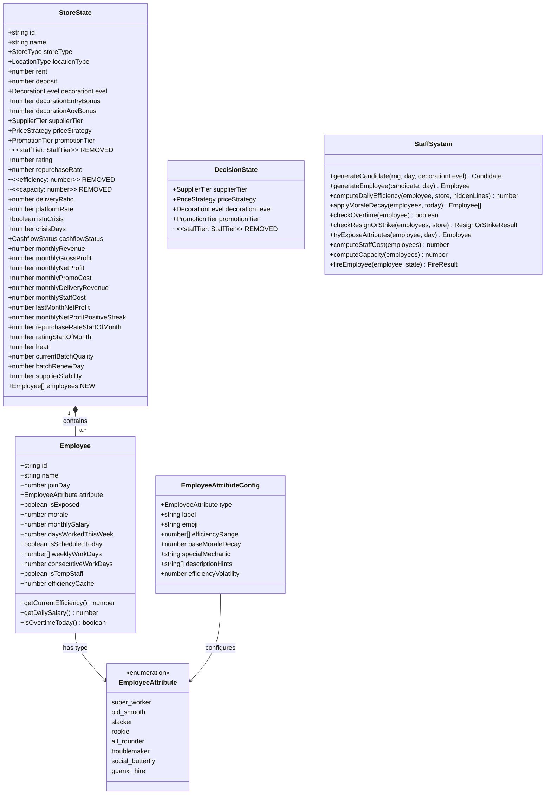
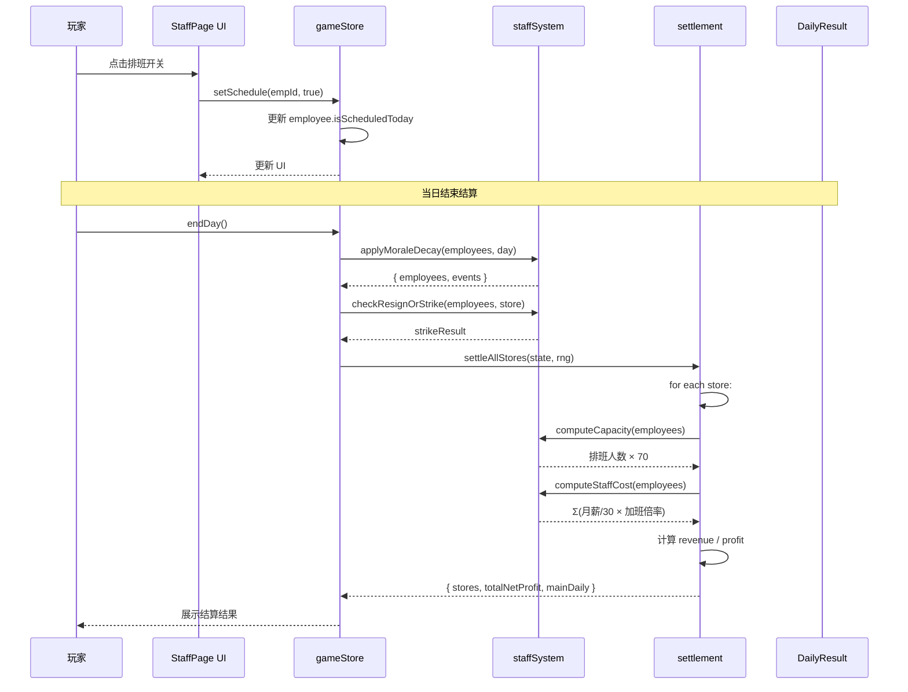
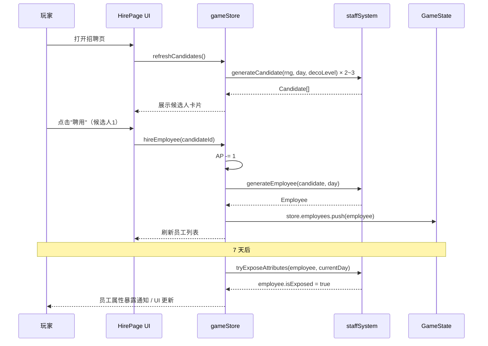
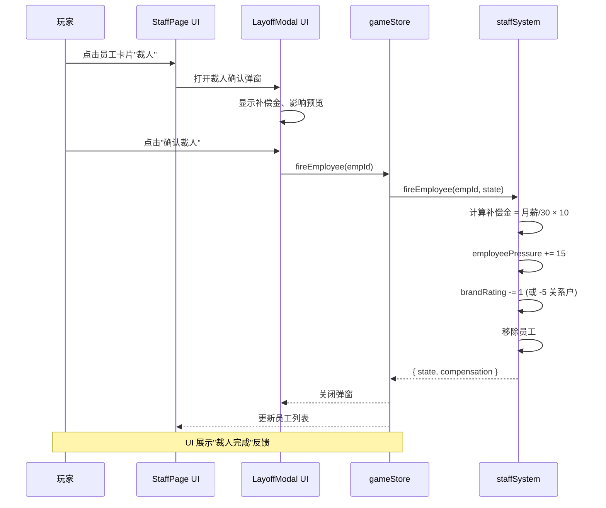
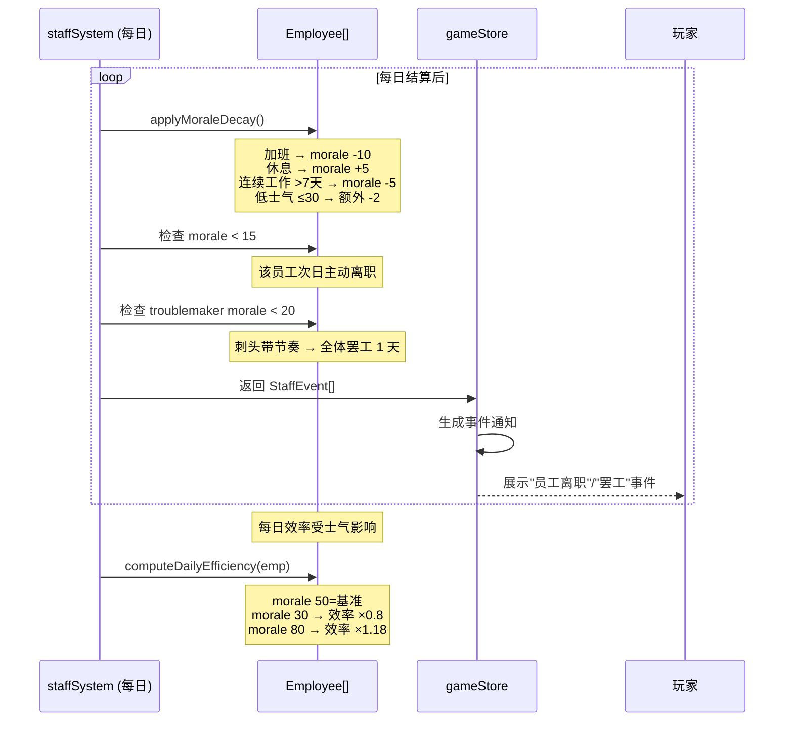
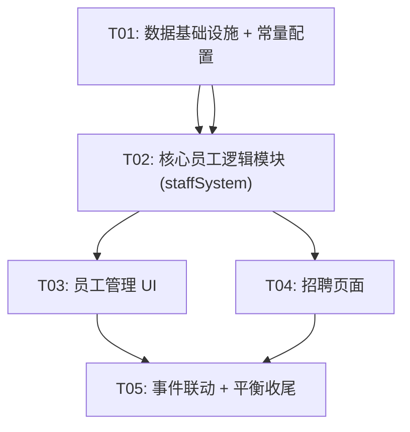

# 《开店说》员工系统重构 — 架构设计方案

> 作者：高见远（Architect）｜ 版本：v1.0 ｜ 日期：2026-07-08
> 基于 PRD（许清楚 v1.0）｜ 技术栈：Vite + React 18 + TypeScript strict + Tailwind CSS + Zustand

---

## 1. 实现方案（整体架构变化）

### 1.1 核心变更总结

将粗暴的 `staffTier` 五档滑块替换为**真实的员工数组 + 动态排班系统**。这是自 v3 行动点系统以来最大的一次架构改动，涉及类型层、核心逻辑层、结算层、状态管理层、UI 层五个层次。

### 1.2 架构变化总览

```
旧架构：
  StoreState.staffTier ──→ settlement: getStaffDailyCost(staffTier) → staffCost
                      └──→ getStaffCapacity(staffTier) × efficiency → capacity

新架构：
  StoreState.employees[] ──→ settlement: Σ(排班员工月薪/30 × 加班倍率) → staffCost
                       └──→ 今日排班人数 × BASE_CAPACITY_PER_STAFF → capacity
```

### 1.3 模块拆解

| 层次 | 模块 | 职责 |
|------|------|------|
| **类型层** | `src/types/employee.ts`（新增） | Employee 接口、EmployeeAttribute 枚举 |
| **数据层** | `src/data/employeeAttributes.ts`（新增） | 属性配置表、隐晦描述池 |
| **数据层** | `src/data/employeeNames.ts`（新增） | 员工姓名随机库 |
| **核心层** | `src/core/staffSystem.ts`（新增） | 招聘生成、属性暴露、士气计算、加班检测、罢工/离职检测 |
| **核心层** | `src/core/settlement.ts`（修改） | staffCost/capacity 重写为员工聚合计算 |
| **核心层** | `src/core/gameLoop.ts`（修改） | 每日循环中加入士气衰减、离职检测 |
| **核心层** | `src/core/effectResolver.ts`（修改） | 移除 staffTier 相关逻辑 |
| **状态层** | `src/store/gameStore.ts`（修改） | 新增员工 actions（hire/fire/schedule/salary） |
| **状态层** | `src/core/createNewGame.ts`（修改） | 开局生成初始员工 |
| **UI 层** | `src/components/StaffPage.tsx`（新增） | 员工管理首页 |
| **UI 层** | `src/components/HirePage.tsx`（新增） | 招聘页面 |
| **UI 层** | `src/components/EmployeeDetailModal.tsx`（新增） | 员工详情弹窗 |
| **UI 层** | `src/components/LayoffConfirmModal.tsx`（新增） | 裁人确认弹窗 |

### 1.4 数据流

```
[招聘页] → hireEmployee(action) → gameStore → staffSystem.generateEmployee() → employees.push()
    ↓
[排班开关] → setSchedule(action) → gameStore → 更新 employee.isScheduledToday
    ↓
[endDay] → gameStore
    ├─ staffSystem.applyMoraleDecay(employees) → 士气衰减/恢复
    ├─ staffSystem.checkOvertime(employees) → 加班标记
    ├─ staffSystem.checkResignOrStrike(employees) → 离职/罢工事件
    └─ settleAllStores → resolveSettlement
         ├─ capacity = 排班人数 × 70
         └─ staffCost = Σ(排班员工月薪/30 × 加班倍率)
```

### 1.5 旧模块清理策略

- `staffTier` 从 `StoreState`、`DecisionState`、`decision-options.json` 中移除
- `getStaffDailyCost()` / `getStaffCapacity()` 调用全部替换
- `CrisisModal` 中的 `layoff` 危机行动改为调用员工系统的 `fireEmployee`
- `decisionOptions.ts` 中的 `staffTier` 相关导出保留但标记废弃，最终清理
- `effectResolver.ts` 中 `efficiencyPct` 修改 `capacity` 的逻辑移除（capacity 不再依赖 efficiency）

---

## 2. 文件清单

### 新增文件

| # | 文件路径 | 职责 |
|---|----------|------|
| 1 | `src/types/employee.ts` | Employee 接口、EmployeeAttribute 枚举、EmployeeAttributeConfig 类型 |
| 2 | `src/data/employeeAttributes.ts` | 8 种属性配置表（效率范围、特殊机制、描述文案池） |
| 3 | `src/data/employeeNames.ts` | 员工姓名随机库（预设 40+ 中文名 + 随机生成器） |
| 4 | `src/data/staffConstants.ts` | 员工系统常量（BASE_CAPACITY_PER_STAFF、裁人补偿天数、士气衰减系数等） |
| 5 | `src/core/staffSystem.ts` | 核心逻辑：招聘生成、属性暴露、士气计算、加班/罢工/离职检测 |
| 6 | `src/components/StaffPage.tsx` | 员工管理首页（列表 + 排班开关 + 摘要） |
| 7 | `src/components/HirePage.tsx` | 招聘页面（候选人卡片 + 聘用） |
| 8 | `src/components/EmployeeDetailModal.tsx` | 员工详情弹窗 |
| 9 | `src/components/LayoffConfirmModal.tsx` | 裁人确认弹窗 |

### 修改文件

| # | 文件路径 | 修改内容 |
|---|----------|----------|
| 10 | `src/types/index.ts` | 移除 `StaffTier` 类型 + `staffTier`/`capacity`/`efficiency` 字段；StoreState 新增 `employees: Employee[]`；DecisionState 移除 `staffTier` |
| 11 | `src/core/settlement.ts` | `staffCost` 由排班员工聚合计算；`effectiveCap` 由排班人数 × 基准系数；移除 `getStaffDailyCost` 调用 |
| 12 | `src/core/gameLoop.ts` | 每日循环中加入 `staffSystem.applyEndDayStaff()`（士气衰减 + 加班检测 + 离职/罢工检测） |
| 13 | `src/core/effectResolver.ts` | 移除 `efficiencyPct` 中对 `capacity` 的赋值逻辑；新增对 `employees` 的克隆 |
| 14 | `src/store/gameStore.ts` | 新增 `hireEmployee` / `fireEmployee` / `setSchedule` / `adjustSalary` / `refreshCandidates` actions；`endDay` 中插入员工每日逻辑 |
| 15 | `src/core/createNewGame.ts` | 开局生成 1-2 名初始员工；移除 `DEFAULT_STAFF` 引用 |
| 16 | `src/data/decisionOptions.ts` | `staffTier` 相关导出标记废弃；移除 `getStaffDailyCost`/`getStaffCapacity` 调用方 |
| 17 | `src/data/decision-options.json` | 移除 `staffTier` 段 |
| 18 | `src/components/modals/CrisisModal.tsx` | `layoff` 危机行动改为跳转到员工管理页/调用员工系统的裁人接口 |
| 19 | `src/data/crisisActionDefs.ts` | 更新 `layoff` 效果为调用员工系统裁人 |
| 20 | `src/core/hiddenLines.ts` | 无需大改，`employeePressure` 已存在；裁人时由 `fireEmployee` 直接加值 |
| 21 | `src/core/branch.ts` | 移除 `staffTier` 相关引用（检查是否有残留） |
| 22 | `src/core/actionSystem.ts` | 招聘消耗 1 行动点（已有 AP 机制，无需额外修改，仅需在招聘 action 中校验） |

---

## 3. 数据结构设计

### 3.1 EmployeeAttribute 枚举

```typescript
// src/types/employee.ts

export type EmployeeAttribute =
  | 'super_worker'      // 超级卷王：效率 1.5-2.0，无副作用
  | 'old_smooth'        // 老油条：效率 0.9-1.0，稳定
  | 'slacker'           // 摸鱼王：效率 0.3-0.9，波动大
  | 'rookie'            // 新手上路：效率 0.5→1.0 成长（入职后每日 +0.02）
  | 'all_rounder'       // 全能选手：效率 1.0-1.2，可顶任何缺岗
  | 'troublemaker'      // 刺头：效率 0.8-1.1，超时排班会带罢工
  | 'social_butterfly'  // 社交蝴蝶：效率 0.7-0.9，转化率 +5~10%
  | 'guanxi_hire';      // 关系户：效率 0.5-1.2 随机波动，辞退有惩罚
```

### 3.2 Employee 接口

```typescript
// src/types/employee.ts

export interface Employee {
  id: string;
  name: string;
  joinDay: number;                      // 入职 day
  attribute: EmployeeAttribute;         // 真实属性（入职时确定）
  isExposed: boolean;                   // 是否已暴露（入职 >= 7天 → true）
  morale: number;                       // 士气 0-100
  monthlySalary: number;                // 月薪
  daysWorkedThisWeek: number;           // 本周已上班天数
  isScheduledToday: boolean;            // 今日是否排班
  weeklyWorkDays: number[];             // 本周每天排班记录 [day1, day2, ...]
  consecutiveWorkDays: number;          // 连续工作天数（用于长期不放假检测）
  isTempStaff: boolean;                 // 是否为事件临时员工
  efficiencyCache: number;              // 今日效率系数（由属性+士气+特殊机制计算后缓存）
}
```

### 3.3 EmployeeAttributeConfig 配置表

```typescript
// src/data/employeeAttributes.ts

export interface EmployeeAttributeConfig {
  type: EmployeeAttribute;
  label: string;                        // 中文名
  emoji: string;                        // 图标
  efficiencyRange: [number, number];    // 效率系数范围 [min, max]
  baseMoraleDecay: number;              // 每日基础士气衰减
  specialMechanic: string;              // 特殊机制描述
  descriptionHints: string[];           // 隐晦自介绍文案池（3-5条）
  efficiencyVolatility: number;         // 效率波动幅度（0=稳定，>0=每日波动）
}
```

### 3.4 StoreState 变更

```typescript
// src/types/index.ts — StoreState 变更

// --- 移除 ---
// staffTier: StaffTier;             // ❌ 删除
// capacity: number;                 // ❌ 删除（改为动态计算）
// efficiency: number;               // ❌ 删除（注意：efficiencyPct 修改器仍保留作用于旧系统，需清理）

// --- 新增 ---
employees: Employee[];              // 该店面的员工列表
```

### 3.5 DecisionState 变更

```typescript
// src/types/index.ts — DecisionState 变更

export interface DecisionState {
  supplierTier: SupplierTier;
  priceStrategy: PriceStrategy;
  decorationLevel: DecorationLevel;
  promotionTier: PromotionTier;
  // staffTier: StaffTier;           // ❌ 删除
}
```

### 3.6 GameState 新增字段

```typescript
// 无需新增全局字段，所有员工数据挂在 StoreState.employees 上
// 候选人列表作为局部状态存在于招聘页面（不持久化到 GameState）
```

### 3.7 常量配置表

```typescript
// src/data/staffConstants.ts

/** 基准承载系数：每人每天可承载订单数 */
export const BASE_CAPACITY_PER_STAFF = 70;

/** 裁人补偿天数 */
export const LAYOFF_COMPENSATION_DAYS = 10;

/** 属性暴露天数 */
export const ATTRIBUTE_EXPOSE_DAYS = 7;

/** 每周最大正常排班天数 */
export const MAX_WORK_DAYS_PER_WEEK = 5;

/** 加班工资倍率 */
export const OVERTIME_SALARY_MULTIPLIER = 1.5;

/** 临时员工工资倍率 */
export const TEMP_STAFF_SALARY_MULTIPLIER = 1.5;

/** 士气衰减基数（超时一天） */
export const MORALE_DECAY_OVERTIME = -10;

/** 士气衰减基数（不排班休息一天） */
export const MORALE_RECOVERY_REST = 5;

/** 士气衰减基数（连续工作 > 7 天） */
export const MORALE_DECAY_CONTINUOUS = -5;

/** 主动离职士气阈值 */
export const RESIGN_MORALE_THRESHOLD = 15;

/** 罢工士气阈值（刺头 triggering） */
export const STRIKE_MORALE_THRESHOLD = 20;

/** 基准月薪 */
export const BASE_MONTHLY_SALARY = 5000;

/** 月薪浮动范围 ± */
export const SALARY_VARIANCE = 0.2;

/** 招聘候选人数量范围 */
export const CANDIDATE_COUNT_MIN = 2;
export const CANDIDATE_COUNT_MAX = 3;

/** 刷新候选人 AP 消耗（0 = 首次免费） */
export const REFRESH_CANDIDATES_AP_COST = 1;
```

### 3.8 类图



---

## 4. 核心逻辑模块设计

### 4.1 `src/core/staffSystem.ts`

```typescript
// 核心 public API

/** 生成一名候选人（含随机属性、薪资、隐晦描述） */
export function generateCandidate(rng: RNG, day: number, decorationLevel: DecorationLevel): Candidate;

/** 将候选人转为正式员工（入职） */
export function generateEmployee(candidate: Candidate, day: number): Employee;

/** 计算员工当日实际效率系数（属性基础 × 士气修正 × 特殊机制） */
export function computeDailyEfficiency(employee: Employee, store: StoreState, hiddenLines: HiddenLines): number;

/** 每日结束时的士气处理：加班扣减、休息恢复、连续工作惩罚 */
export function applyMoraleDecay(employees: Employee[], today: number): { employees: Employee[]; events: StaffEvent[] };

/** 检查是否超时加班（本周已排满 5 天） */
export function checkOvertime(employee: Employee): boolean;

/** 检测是否有员工要主动离职或罢工 */
export function checkResignOrStrike(employees: Employee[], store: StoreState): ResignOrStrikeResult;

/** 尝试暴露属性（入职满 7 天） */
export function tryExposeAttributes(employee: Employee, currentDay: number): Employee;

/** 计算今日总人力成本 */
export function computeStaffCost(employees: Employee[]): number;

/** 计算今日承载上限 */
export function computeCapacity(employees: Employee[]): number;

/** 裁员（包含补偿金计算、品牌评级影响、employeePressure 联动） */
export function fireEmployee(employeeId: string, state: GameState): { state: GameState; compensation: number };

/** 生成员工姓名 */
export function generateEmployeeName(rng: RNG): string;
```

### 4.2 与 `settlement.ts` 的集成

```typescript
// 在 resolveSettlement 中：
// 替换:
//   const staffCost = (getStaffDailyCost(decisions.staffTier) + mods.staffCostAdd) * (1 + mods.staffCostPct / 100);
// 为:
//   const staffCost = (computeStaffCost(store.employees) + mods.staffCostAdd) * (1 + mods.staffCostPct / 100);

// 替换:
//   let effectiveCap = store.capacity;
// 为:
//   let effectiveCap = computeCapacity(store.employees);
```

### 4.3 与 `gameStore.ts` 的集成（新增 actions）

```typescript
// 新增 actions（在 GameStore 接口中）：

/** 刷新候选人列表（首次免费，后续消耗 AP） */
refreshCandidates: () => void;

/** 聘用候选人 */
hireEmployee: (candidateId: string) => void;

/** 切换员工排班状态 */
setSchedule: (employeeId: string, scheduled: boolean) => void;

/** 裁人 */
fireEmployee: (employeeId: string) => void;

/** 涨工资 */
adjustSalary: (employeeId: string, amount: number) => void;
```

### 4.4 与 `gameLoop.ts` 的集成

在 `endDay` / `runDailyLoop` 的结算后、推进前插入员工逻辑：

```typescript
// 在 settleAllStores 之后：
// 1) 士气衰减/恢复
const moraleResult = applyMoraleDecay(store.employees, s.day);
s.stores[0].employees = moraleResult.employees;

// 2) 属性暴露检查（入职满 7 天）
s.stores[0].employees = s.stores[0].employees.map(e => tryExposeAttributes(e, s.day));

// 3) 离职/罢工检查
const strikeResult = checkResignOrStrike(s.stores[0].employees, s.stores[0]);
if (strikeResult.type === 'resign') {
  // 移除离职员工
  // 生成事件通知
} else if (strikeResult.type === 'strike') {
  // 当天 capacity = 0 或大降
  // 生成罢工事件
}

// 4) 每周排班记录刷新（day 跨越周边界时重置 weeklyWorkDays）
if (isWeekStart(s.day)) {
  resetWeeklyWorkDays(store.employees);
}
```

### 4.5 招聘候选人生成逻辑

```typescript
export function generateCandidate(rng: RNG, day: number, _decorationLevel: DecorationLevel): Candidate {
  // 1) 按概率抽取属性（关系户 5%、其它均匀分布）
  const attribute = drawAttribute(rng);
  
  // 2) 从对应配置表中取一条隐晦描述
  const hint = pickRandom(rng, ATTRIBUTE_CONFIG[attribute].descriptionHints);
  
  // 3) 薪资：基准 ±20% 随机
  const salaryVariance = 1 + (rng() - 0.5) * 2 * SALARY_VARIANCE;
  const salary = Math.round(BASE_MONTHLY_SALARY * salaryVariance);
  
  // 4) 姓名
  const name = generateEmployeeName(rng);
  
  return {
    id: `candidate_${day}_${rng().toString(36).slice(2, 6)}`,
    name,
    attribute,        // 真实属性（对玩家隐藏）
    hint,             // 隐晦描述
    monthlySalary: salary,
    generatedDay: day,
  };
}
```

### 4.6 效率系数计算

```typescript
export function computeDailyEfficiency(employee: Employee, _store: StoreState, _hiddenLines: HiddenLines): number {
  const cfg = ATTRIBUTE_CONFIG[employee.attribute];
  let base = (cfg.efficiencyRange[0] + cfg.efficiencyRange[1]) / 2;
  
  // 波动属性（摸鱼王、关系户）每日波动
  if (cfg.efficiencyVolatility > 0) {
    const wave = (rng() - 0.5) * 2 * cfg.efficiencyVolatility;
    base += wave;
  }
  
  // 新手上路成长（每日 +0.02，上限 1.0）
  if (employee.attribute === 'rookie') {
    const daysWorked = employee.daysWorkedThisWeek;
    base = Math.min(1.0, 0.5 + daysWorked * 0.02);
  }
  
  // 士气修正：士气 50 为基准，每低 10 点 -5% 效率，每高 10 点 +3% 效率
  const moraleFactor = 1 + (employee.morale - 50) / 100 * (employee.morale < 50 ? -0.1 : 0.06);
  
  return Math.round(base * moraleFactor * 100) / 100;
}
```

---

## 5. 程序调用流程（Mermaid 时序图）

### 5.1 排班 → 结算链路



### 5.2 招聘 → 入职 → 属性暴露



### 5.3 裁人流程



### 5.4 士气 → 效率影响 → 离职/罢工



---

## 6. 任务分解

### 6.1 依赖包

不需要新增外部包。全部使用项目已有依赖：
- `zustand` — 状态管理
- `clsx` — className 工具
- Tailwind CSS — 样式

### 6.2 任务列表（有序，最多 5 个）

---

#### T01: 数据基础设施 + 常量配置

**优先级**: P0

**源文件**:
- `src/types/employee.ts`（新增）— Employee 接口、EmployeeAttribute 枚举
- `src/data/employeeAttributes.ts`（新增）— 8 种属性配置表、隐晦描述文案池
- `src/data/employeeNames.ts`（新增）— 员工姓名随机库（40+ 中文名）
- `src/data/staffConstants.ts`（新增）— 所有员工系统常量
- `src/types/index.ts`（修改）— 移除 `StaffTier`、`staffTier`、`capacity`、`efficiency` 字段；StoreState 新增 `employees: Employee[]`；DecisionState 移除 `staffTier`
- `src/data/decision-options.json`（修改）— 移除 `staffTier` 段
- `src/data/decisionOptions.ts`（修改）— 移除 `staffTier` 相关导出（`getStaffDailyCost`/`getStaffCapacity`）；清理 `CATEGORIES` 和 `DecisionCategory` 中的 staffTier
- `src/core/effectResolver.ts`（修改）— 移除 `efficiencyPct` 中对 `capacity` 的赋值（第 196 行）；`cloneState` 中无需额外修改（stores 已浅克隆，employees 将在后续任务中处理）

**依赖**: 无

**说明**: 这是所有后续任务的基石。先定义好所有类型和常量，确保编译通过。`StaffTier` 被引用处较多（`settlement.ts`/`createNewGame.ts`/`gameStore.ts`/`branch.ts`/`decisionOptions.ts`/`effectResolver.ts`/`modifiers.ts`/`gameLoop.ts`），需一并清理干净。

---

#### T02: 核心员工逻辑模块（staffSystem）

**优先级**: P0

**源文件**:
- `src/core/staffSystem.ts`（新增）— 所有核心逻辑：
  - `generateCandidate()` / `generateEmployee()` / `generateEmployeeName()`
  - `computeDailyEfficiency()` / `computeStaffCost()` / `computeCapacity()`
  - `applyMoraleDecay()` / `checkOvertime()` / `checkResignOrStrike()`
  - `tryExposeAttributes()` / `fireEmployee()`
- `src/core/settlement.ts`（修改）— 集成员工系统：
  - 第 59 行 `let effectiveCap = store.capacity` → `let effectiveCap = computeCapacity(store.employees)`
  - 第 94-96 行 `staffCost` 计算替换为 `computeStaffCost(store.employees)`
  - 移除第 13 行的 `getStaffDailyCost` import
- `src/core/createNewGame.ts`（修改）— 开局生成 1-2 名初始员工（调用 `generateEmployee`）；移除 `DEFAULT_STAFF` / `getStaffCapacity` 引用；恢复 `StaffTier` import（但只用于清理）
- `src/store/gameStore.ts`（修改）— 新增 actions：
  - `refreshCandidates()` / `hireEmployee()` / `fireEmployee()` / `setSchedule()` / `adjustSalary()`
  - 在 `endDay()` 中插入员工每日逻辑（士气衰减、属性暴露、离职/罢工检测）
- `src/core/gameLoop.ts`（修改）— 在 `runDailyLoop()` 中插入员工每日逻辑（同步 store 的变更）
- `src/core/branch.ts`（修改）— 移除 `staffTier` 引用（检查 `storeValuation`/`openBranch` 等函数）

**依赖**: T01

**说明**: 这是最核心的任务，实现所有员工系统逻辑。需要确保 settlement 集成后，旧系统完全切换到新系统。`createNewGame` 开局生成 1-2 名员工。`gameStore.endDay` 中的员工逻辑需要在结算前后正确执行。

---

#### T03: 员工管理 UI（列表 + 排班 + 裁人）

**优先级**: P0

**源文件**:
- `src/components/StaffPage.tsx`（新增）— 员工管理首页：
  - 排班摘要区域（在岗数/承载/成本）
  - 员工卡片列表（姓名/属性图标/士气/排班开关/详情/裁人按钮）
  - 低士气（≤20）红色警告样式
  - 招聘入口按钮
- `src/components/LayoffConfirmModal.tsx`（新增）— 裁人确认弹窗：
  - 员工信息 + 补偿金展示
  - 影响预览（employeePressure + 品牌评级 + 关系户额外惩罚）
  - 确认/取消按钮
- `src/components/EmployeeDetailModal.tsx`（新增）— 员工详情弹窗：
  - 属性展示（7天后显示）、士气条、效率系数
  - 本周排班统计、工资信息
  - 特性说明
  - 操作按钮（排班/涨工资/裁人）
- `src/components/modals/CrisisModal.tsx`（修改）— `layoff` 按钮改为调用员工系统裁人接口（或跳转到员工管理页）

**依赖**: T02

**说明**: 三个 UI 组件。StaffPage 是核心入口，需要做成游戏内底部 Tab 或独立页面。Layout 参考 PRD §4.1 的单列卡片流。LayoffConfirmModal 和 EmployeeDetailModal 复现现有 Modal 组件的样式模式。

---

#### T04: 招聘页面

**优先级**: P0

**源文件**:
- `src/components/HirePage.tsx`（新增）— 招聘页面：
  - 行动点展示
  - 候选人卡片列表（隐晦描述 + 期望薪资 + 聘用按钮）
  - 刷新候选人按钮
  - 关闭按钮返回员工管理页
- `src/core/actionSystem.ts`（修改）— 确认招聘/刷新均消耗 1 行动点（已有 AP 校验机制，只需确保 hire action 通过 `canTakeAction` 检查）
- `src/data/crisisActionDefs.ts`（修改）— 更新 `layoff` 效果为调用员工系统 `fireEmployee` 接口（不再直接给现金/扣员工压力）

**依赖**: T02, T03

**说明**: 招聘页面是员工系统的"入口"。每次打开/刷新生成 2-3 候选人。聘用消耗 1 行动点。候选人信息不暴露真实属性。

---

#### T05: 事件联动 + 平衡收尾

**优先级**: P1

**源文件**:
- `src/core/staffSystem.ts`（修改）— 完善特殊机制：
  - 社交蝴蝶：转化率 +5~10%（需要在 `dayModifiers` 中注入）
  - 全能选手：自动顶缺岗（某员工不排班时代替）
  - 关系户辞退：额外品牌 -5 + employeePressure +25
  - 刺头带罢工：低士气时触发全体员工罢工
- `src/store/gameStore.ts`（修改）— 完善事件联动：
  - 临时员工事件支持（事件触发时调用 `generateEmployee` + `isTempStaff: true`）
  - 团建事件恢复全体士气
- `src/components/StaffPage.tsx`（修改）— 临时员工特殊标记、罢工状态展示
- 全部 P1 需求细化实现

**依赖**: T03, T04

**说明**: 所有"锦上添花"的功能放在最后。先确保基础流程跑通（招聘→排班→结算→士气→裁人），再添加特殊机制。临时员工事件需要事件系统配合。

---

### 6.3 任务依赖图



---

## 7. 共享知识

### 7.1 跨文件约定

1. **员工 ID 格式**: `emp_{day}_{4位随机}`，例 `emp_15_a3f2`
2. **候选人 ID 格式**: `candidate_{day}_{4位随机}`，例 `candidate_15_b7k9`
3. **士气范围**: 0-100，UI 显示为 `士气值/100`
4. **效率系数**: 浮点数，保留 2 位小数，范围 0.3-2.0
5. **薪资计算**: 所有员工薪资以"月薪"存储，日薪 = `monthlySalary / 30`（向下取整）
6. **每周排班**: `weeklyWorkDays` 数组记录当日上班的 day 编号，第 1 天 day=1。每周重置（周日 → 周一交界）
7. **属性暴露**: `isExposed` 标志在 `tryExposeAttributes` 中由 false 切换为 true，UI 据此决定是否展示属性
8. **AP 消耗**: 招聘消耗 1 AP；首次刷新免费，后续刷新消耗 1 AP（通过 `REFRESH_CANDIDATES_AP_COST` 常量控制，设为 0 则永远免费）
9. **裁员补偿金**: `monthlySalary / 30 × LAYOFF_COMPENSATION_DAYS`，从现金中扣除
10. **员工压力联动**: `fireEmployee` 中增加 `employeePressure += 15`，裁关系户额外 +25
11. **品牌评级联动**: 每次裁人 `brandRating -= 1`（0-100 分制，UI 除以 20），裁关系户额外 -5
12. **员工数据克隆**: `effectResolver.cloneState` 中需要确保 `stores[].employees` 被深克隆（目前 `stores.map(st => ({...st}))` 只能浅克隆，需要改为 `employees: st.employees.map(e => ({...e}))`）
13. **周边界检测**: 使用 `isWeekStart(day)` 工具函数（`day % 7 === 1`），在周一时重置所有员工的 `daysWorkedThisWeek = 0` 和 `weeklyWorkDays = []`
14. **事件系统集成**: 罢工/离职事件通过 `StaffEvent` 接口返回，由 `gameStore` 转换为 UI 通知
15. **旧存档兼容**: `migrateGameState` 函数需要处理旧存档缺失 `employees` 字段的情况（默认为空数组）

### 7.2 StaffEvent 接口

```typescript
// 员工系统返回的事件类型（供 gameStore 处理，转换为 UI 通知或 GameState 变更）
export interface StaffEvent {
  type: 'resign' | 'strike' | 'morale_warning' | 'attribute_exposed' | 'overtime_warning';
  employeeId?: string;
  employeeName?: string;
  description: string;
}
```

---

## 8. 待明确事项

| # | 事项 | 建议 | 需要决策方 |
|---|------|------|-----------|
| Q1 | **装修档 ↔ 最大员工数映射** | bare=4人, clean=8人, memorable=12人, viral=16人, designer=20人。已由产品方确认。 | 已定 |
| Q2 | **刷新候选人 AP 消耗** | 首次打开免费，后续刷新消耗 1 AP | PM 确认 |
| Q3 | **裁人补偿 N 值** | 建议 N=10（10 天工资），可调 | PM 确认 |
| Q4 | **基准承载系数 BASE_CAPACITY_PER_STAFF** | 建议 70（参考旧档：90/140/280/330/450 对应 ~1~5 人，平均 ~78） | PM + 数值策划 |
| Q5 | **员工月薪基准值** | 先固定 ¥5,000 ±20%（4,000-6,000），后续按店型区分 | PM + 数值策划 |
| Q6 | **假期系统** | 是否允许"全员放假一天"按钮？建议实现：点击后当天所有员工不排班，士气 +10 | PM 确认 |
| Q7 | **关系户出现概率** | 建议 5%（低概率、双刃剑） | PM + 数值策划 |
| Q8 | **多店员工管理** | 本期仅做单店（主店：store_001），多店迭代后续版本 | PM 确认 |
| Q9 | **员工最大数量上限** | 由装修档决定。建议 bare=2, clean=3, memorable=4, viral=5, designer=6。当尝试招聘时已达上限则提示"店太小，装不下更多人" | PM 确认 |
| Q10 | **罢工时长和影响** | 建议：罢工持续 1 天，当天该店 capacity = 0（或减半），次日恢复 | PM 确认 |
| Q11 | **离职工资结算** | 离职员工当天是否照常算工资？建议：离职当天不计入排班 | PM 确认 |
| Q12 | **old_smooth 和 slacker 的名字** | 老油条/摸鱼王带贬义，UI 展示时是否用美化名称（如"老手"/"自由派"）？建议 UI 显示中性名，属性说明中标注 | PM 确认 |
| Q13 | **staffTier 移除后，owner 模式（老板自己顶班）的去向** | 旧"老板自己顶班"模式：不招员工、无成本、capacity=90、ownerFatigue+15。新系统开局有员工，但极端情况下（全员离职）可触发老板亲自顶班模式 | PM 确认 |
