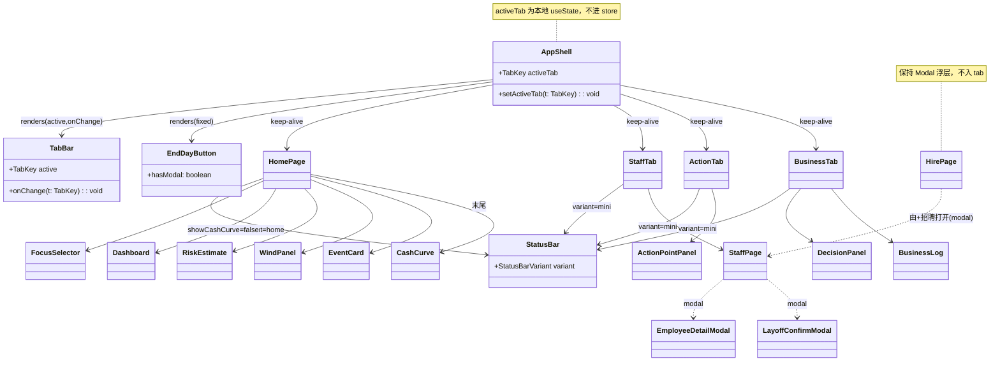
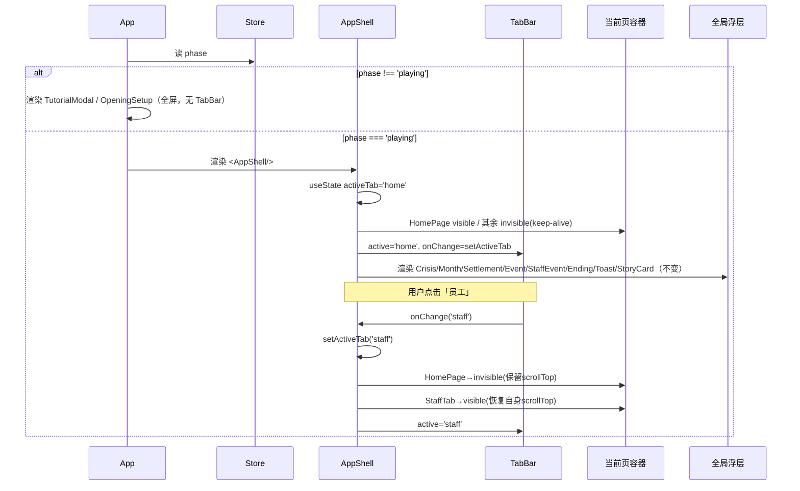
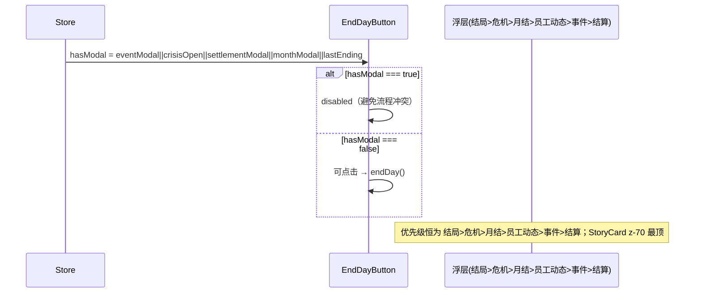
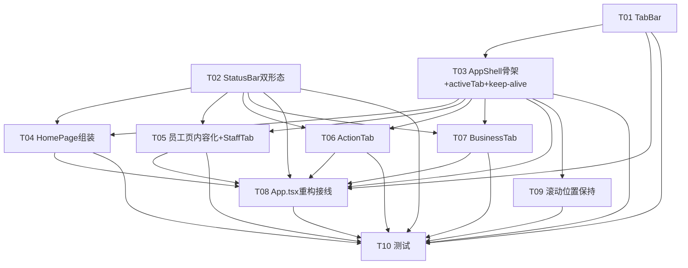

# 《开店说》分页重构 · 系统架构设计 + 任务分解

> 文档性质：技术架构设计（**不含实现代码**，只做技术设计）。
> 作者：架构师 高见远。
> 输入：`docs/page-restructure-ia.md`（PM 许清楚）+ 主理人/用户已确认决策 + 现状代码核对（`src/App.tsx`、`StatusBar`、`Dashboard`、`StaffPage`、`HirePage`、`EndDayButton`、`store/gameStore.ts`、`types/index.ts` 等）。
> 设备形态：移动端竖屏（375–480px），底部 4 tab 导航。

---

## 0. 代码事实核对结论（与已确认决策对齐）

| # | 核对项 | 现状（代码事实） | 设计处理 |
|---|---|---|---|
| 0.1 | 现有 380 测试环境 | `vite.config.ts` 中 `test.environment: 'node'`，**无 `*.test.tsx`，无组件渲染测试**，全部为 core/store 纯逻辑测试 | 组件/JSX 重构**天然不会破坏 380 测试**；真正的约束是「不改动 store/core 逻辑」（本方案未触碰） |
| 0.2 | CashCurve 位置 | `Dashboard.tsx` 内第 4 张卡渲染 `<CashCurve log={game.businessLog}/>` | 决策①：移到**首页末尾**。给 `Dashboard` 加 `showCashCurve?: boolean`（默认 `true`，向后兼容），`HomePage` 传 `false` 并在末尾自行渲染 `<CashCurve/>` |
| 0.3 | StaffPage / HirePage | 均为 `fixed inset-0` 全屏遮罩（z-40 / z-50），由 `staffPageOpen` / `hirePageOpen` 开关 | 决策③：仅 `StaffPage` 改为 **Tab2 内容页**（去 ✕、去 `fixed` 遮罩）；`HirePage` + 员工详情/裁人 **保留 Modal 浮层**（详见 §3、§8） |
| 0.4 | StatusBar 形态 | 单一紧凑条 | 决策：改 `variant` 双形态（`home` 大卡 / `mini` 精简条） |
| 0.5 | activeTab 状态 | 现状无 tab 基础设施 | 决策：放 **AppShell 本地 `useState`**，不进 store（约束硬性） |
| 0.6 | 装修/人工 | `decorationLevel` 为开局一次性（store `setDecision` 对 `decorationLevel` 直接 `return`，运行期不可改）；人工归 `StaffPage` 排班/招聘/裁人 | 决策②：Tab4 = `DecisionPanel` 现有 3 项（供应商/售价/推广）+ `BusinessLog`；**不新增装修/人工 UI**，PM「五项决策缺口」为概念误会，已消除 |
| 0.7 | 浮层优先级 | `结局 > 危机 > 月结 > 员工动态 > 事件 > 结算` + `Toast` / `StoryCard(z-70)` | 重构前后**完全一致**，浮层不进 tab（约束硬性） |
| 0.8 | phase 分支 | `tutorial` / `opening` / `playing` | 决策④：`playing` 才显示 TabBar + 大卡；`tutorial`/`opening` 仍走全屏流程（现状不变） |

---

## 1. 实现方案 + 框架选型

### 1.1 核心结论

- **tab 切换用轻量本地 state（`AppShell` 内 `useState<TabKey>`），不引入 `react-router`。**
- **页面切换机制默认采用「keep-alive + visibility 切换」**：4 个页容器在 `AppShell` 内**同时挂载**，仅用 `visible` / `invisible pointer-events-none` 切换显隐。这样**每 tab 各自滚动位置天然保留，零 JS 滚动记账**（直接满足决策③「每 tab 记忆各自滚动位置」）。
- **布局**：`AppShell` 为移动端竖屏 flex 列向容器 = `页区(flex-1)` + `EndDayButton(贴底，bottom = TabBar 高)` + `TabBar(最底)`。

### 1.2 选型理由

| 方案 | 结论 | 理由 |
|---|---|---|
| react-router | ❌ 不引入 | 单页游戏、无 URL/深链/分享需求；store 为全局单例，切 tab 本就不丢状态；引入 router 徒增体积与复杂度、与「轻量」诉求相悖 |
| 本地 `useState` activeTab | ✅ 采用 | 现状无路由、URL 无意义；`useState` 即可驱动 4 视图切换；最契合「轻量」与「不改动 store」约束 |
| keep-alive（visible 切换） | ✅ 默认 | 4 页同时挂载、CSS `visibility` 切换即可保留各自 `scrollTop`；无滚动监听/ref 记账；DOM 成本对纯展示组件可忽略；测试时可一次性断言全部页存在 |
| scrollTop ref 记账法 | ○ 备选 | 仅挂载当前页、用 `useRef<Record<TabKey,number>>` 记账滚动位置；DOM 更轻但需 `scroll` 监听 + `useEffect` 恢复，逻辑更脆。仅在团队担心 DOM 体积时采用（见 §8） |

### 1.3 布局与避让方案（EndDayButton vs TabBar）

- `TabBar`：`fixed bottom-0`，高 **56px**，最底常驻。
- `EndDayButton`：`fixed`，`bottom = 56px`（即紧贴 TabBar 之上），常驻；沿用现状 `hasModal` 禁用逻辑（任意浮层开启时禁用）。
- 页区内容底部留白 = `TabBar(56) + EndDayButton(80) + 缓冲` ≈ **`pb-[144px]`**，确保末屏内容不被遮挡。
- `z` 层级阶梯（见 §7 共享知识）。

---

## 2. 文件列表及相对路径

### 2.1 新建（New）

| 文件 | 类型 | 职责 |
|---|---|---|
| `src/types/navigation.ts` | 类型 + 常量 | `TabKey`、`StatusBarVariant` 类型；`TAB_LIST` 常量；布局常量 `TAB_BAR_HEIGHT` / `ENDDAY_HEIGHT` |
| `src/components/TabBar.tsx` | 组件 | 底部 4 tab 导航（定义/高亮/点击回调），纯展示，不依赖 store |
| `src/components/AppShell.tsx` | 组件 | `playing` 阶段外壳：持有 `activeTab` 本地 state；keep-alive 渲染 4 页容器 + `TabBar` + `EndDayButton` |
| `src/components/pages/HomePage.tsx` | 页面包装 | `StatusBar(home)` + `FocusSelector` + `Dashboard(showCashCurve=false)` + `RiskEstimate` + `WindPanel` + `EventCard` + 末尾 `CashCurve` |
| `src/components/pages/StaffTab.tsx` | 页面包装 | `StatusBar(mini)` + `StaffPage`（内容页） |
| `src/components/pages/ActionTab.tsx` | 页面包装 | `StatusBar(mini)` + `ActionPointPanel` |
| `src/components/pages/BusinessTab.tsx` | 页面包装 | `StatusBar(mini)` + `DecisionPanel` + `BusinessLog` |

> 4 个 `*Tab`/`HomePage` 均为**薄包装组件**（只负责组装既有组件 + 顶部 StatusBar 形态），不含新业务逻辑。

### 2.2 修改（Modify）

| 文件 | 修改内容 |
|---|---|
| `src/App.tsx` | `playing` 阶段：移除旧「单页长滚动 + 浮层调度」整段与「👥 员工管理」按钮、移除全局 `<StaffPage/>`；改为 `<AppShell/>` + 全局浮层（保持不变）。`tutorial`/`opening` 分支**不变**。 |
| `src/components/StatusBar.tsx` | 增加 `variant?: StatusBarVariant` prop（默认 `'home'` 以向后兼容）；实现 `home` 大卡布局与 `mini` 精简条两种渲染分支。数据来源不变。 |
| `src/components/Dashboard.tsx` | 增加 `showCashCurve?: boolean`（默认 `true`）；为 `false` 时跳过「现金曲线」卡（仅布局调整，逻辑不变）。 |
| `src/components/EndDayButton.tsx` | 仅改 `bottom` 避让：`bottom-0` → `bottom-[56px]`（引用 `TAB_BAR_HEIGHT`）；其余逻辑不变。 |
| `src/components/StaffPage.tsx` | 由全屏遮罩 → Tab2 内容页：移除 `fixed inset-0 z-40 bg-bg` 外层遮罩与 `staffPageOpen` 开关门、移除 ✕ 关闭按钮；保留内部「排班摘要 + 员工卡片 + 全员放假/+招聘」与 `EmployeeDetailModal`/`LayoffConfirmModal` 子浮层。 |

### 2.3 纯布局调整、逻辑不变（确认清单）

| 组件 | 调整 |
|---|---|
| `FocusSelector` / `RiskEstimate` / `WindPanel` / `EventCard` | 整体搬入 `HomePage`，顺序见 §2.1，逻辑不变 |
| `ActionPointPanel` | 整体搬入 `ActionTab`，不变 |
| `DecisionPanel` / `BusinessLog` | 整体搬入 `BusinessTab`，不变（`DecisionPanel` 仍只渲染 3 项） |
| `CashCurve` | 组件本身不变，仅挂载点从 `Dashboard` 内移到 `HomePage` 末尾 |
| `HirePage` / `EmployeeDetailModal` / `LayoffConfirmModal` | 保持 Modal 浮层，不变 |
| `store/gameStore.ts` | **结构不动**。`staffPageOpen`/`openStaffPage`/`closeStaffPage` 保留（改后遗留为「无害空操作」，详见 §7）；不新增 `activeTab` 等字段 |

---

## 3. 数据结构与接口（类型 + 类图）

### 3.1 关键类型定义（TypeScript）

```ts
// src/types/navigation.ts
export type TabKey = 'home' | 'staff' | 'action' | 'business';
export type StatusBarVariant = 'home' | 'mini';

/** 底部导航项定义（单一事实来源，供 TabBar / 测试共用） */
export const TAB_LIST: { key: TabKey; label: string; icon: string }[] = [
  { key: 'home',     label: '首页', icon: '🏠' },
  { key: 'staff',    label: '员工', icon: '👥' },
  { key: 'action',   label: '行动', icon: '⚡' },
  { key: 'business', label: '经营', icon: '📊' },
];

/** 布局常量（单一来源，供 TabBar / EndDayButton / AppShell 共用） */
export const TAB_BAR_HEIGHT = 56;  // px，底部 TabBar 高度
export const ENDDAY_HEIGHT  = 80;  // px，结束今天按钮区高度（按钮+padding）
// 页区内容底部留白 ≈ TAB_BAR_HEIGHT + ENDDAY_HEIGHT + 缓冲
```

```ts
// src/components/TabBar.tsx —— Props 契约
interface TabBarProps {
  active: TabKey;
  onChange: (t: TabKey) => void;
}

// src/components/StatusBar.tsx —— Props 契约（默认 'home' 向后兼容）
interface StatusBarProps {
  variant?: StatusBarVariant; // 'home' | 'mini'
}

// src/components/AppShell.tsx —— 本地状态契约（不进 store）
//   const [activeTab, setActiveTab] = useState<TabKey>('home');

// src/components/Dashboard.tsx —— 新增可选 prop
interface DashboardProps {
  showCashCurve?: boolean; // 默认 true；HomePage 传 false 自行在末尾渲染
}
```

### 3.2 类图（组件 / 类型关系）



---

## 4. 程序调用流程（时序图）

### 4.1 初始渲染 + tab 切换（playing 阶段）



### 4.2 EndDayButton 禁用 + 浮层优先级（不变）



---

## 5. 任务列表（有序 + 依赖 + 优先级）

> 说明：任务按**实现顺序**排列（故把「App.tsx 最终接线」后置到页面容器就绪之后，以保证依赖正确）。每项标注 `Source Files` / `Dependencies` / `Priority`。

| ID | 任务名 | Source Files | Dependencies | Priority |
|---|---|---|---|---|
| **T01** | TabBar 导航组件 | `src/components/TabBar.tsx`(新), `src/types/navigation.ts`(新) | ∅ | P0 |
| **T02** | StatusBar 双形态 | `src/components/StatusBar.tsx`(改) | ∅ | P0 |
| **T03** | AppShell 骨架 + activeTab + 布局 + keep-alive 切换 | `src/components/AppShell.tsx`(新), `src/types/navigation.ts`(改：布局常量) | T01 | P0 |
| **T04** | 首页容器 HomePage 组装（含 CashCurve 重定位） | `src/components/pages/HomePage.tsx`(新), `src/components/Dashboard.tsx`(改：`showCashCurve`) | T02, T03 | P0 |
| **T05** | 员工页内容化 + StaffTab 包装 | `src/components/StaffPage.tsx`(改), `src/components/pages/StaffTab.tsx`(新) | T02, T03 | P0 |
| **T06** | 行动页容器 ActionTab | `src/components/pages/ActionTab.tsx`(新) | T02, T03 | P1 |
| **T07** | 经营页容器 BusinessTab | `src/components/pages/BusinessTab.tsx`(新) | T02, T03 | P1 |
| **T08** | App.tsx playing 阶段重构（最终接线） | `src/App.tsx`(改), `src/components/EndDayButton.tsx`(改：`bottom` 避让) | T01, T02, T03, T04, T05, T06, T07 | P0 |
| **T09** | 滚动位置保持机制落地 + 边界收尾 | `src/components/AppShell.tsx`(改) | T03 | P2 |
| **T10** | 测试（tab 相关新增 + 380 回归） | `tests/**` / `src/**/*.test.tsx`(新) | T01–T09 | P0 |

### 5.1 任务依赖图



---

## 6. 依赖包列表

| 类别 | 包 | 结论 |
|---|---|---|
| **运行时（Runtime）** | — | **无需新增任何 npm 包**。`useState`(React 内置)、`clsx`(已装)、`zustand`(已装)、Tailwind(已装) 均满足需求；不引入 `react-router`。 |
| **测试（devDependencies，仅新增 tab 渲染测试需要）** | `jsdom` | **需新增**：Vitest 当前 `environment: 'node'`，组件渲染测试需 jsdom。用文件级 `// @vitest-environment jsdom` 注释隔离，**不改动全局 380 测试环境**。 |
| | `@testing-library/react` | **需新增**：React 18 组件渲染/查询。 |
| | `@testing-library/jest-dom`（可选） | 建议新增：提供 `toBeInTheDocument` 等 matcher，提升断言可读性。 |
| | `@testing-library/user-event`（可选） | 建议新增：模拟 tab 点击切换交互。 |

> 注：以上测试包均为 **devDependencies**，不影响生产打包与运行时体积。

---

## 7. 共享知识（跨文件约定）

1. **`activeTab` 状态位置**：仅存于 `AppShell` 的 `useState<TabKey>('home')`，**绝不进 store**。`AppShell` 仅在 `playing` 阶段挂载，离开 `playing`（如 `resetGame`→`opening`）即卸载，state 自然重置为 `'home'`，无需额外重置逻辑。
2. **StatusBar variant 约定**：`variant="home"` = 首页大号主体数据卡；`variant="mini"` = 其他页精简条（周几·第X周·品牌★·现金）。默认 `'home'`（向后兼容，任何未传参的老调用方行为不变）。两形态共享同一份 store 数据，仅展示密度不同。
3. **浮层优先级常量（不变）**：`结局 > 危机 > 月结 > 员工动态 > 事件 > 结算`；`StoryCard` 始终最顶（z-70）。浮层不进任何 tab，由 `App.tsx` 在 `AppShell` 之外统一渲染。
4. **TabBar / EndDayButton 贴底布局约定**：
   - `TabBar`：`fixed bottom-0 h-[56px]`（引用 `TAB_BAR_HEIGHT`）。
   - `EndDayButton`：`fixed bottom-[56px]`（引用 `TAB_BAR_HEIGHT`），位于 TabBar 正上方。
   - 页区内容统一 `pb-[144px]`（`TAB_BAR_HEIGHT + ENDDAY_HEIGHT + 8` 缓冲），避免末屏被遮挡。
5. **z-index 层级阶梯**：页内容 `z-0`（in-flow）｜ `EndDayButton` / `TabBar` `z-40`（二者不重叠）｜ 各 Modal（Crisis/Month/Settlement/Event/StaffEvent/Ending/`HirePage`/`EmployeeDetailModal`/`LayoffConfirmModal`）`z-50`｜ `Toast` `z-60`｜ `StoryCard` `z-70`。keep-alive 的隐藏页用 `invisible pointer-events-none`（`visibility` 切换，非 `display:none`，以保留 `scrollTop`）。
6. **store 遗留字段说明**：`staffPageOpen` / `openStaffPage` / `closeStaffPage` 在重构后**不再用于 StaffPage 显隐**（StaffPage 改为 tab 内容页）。保留在 store 中（不删，确保 380 测试与类型兼容）；`HirePage` 的「员工管理」返回按钮仍调用 `openStaffPage()`，属无害空操作。
7. **CashCurve 重定位约定**：`Dashboard` 由 `showCashCurve`(默认 `true`) 控制是否渲染现金曲线卡；`HomePage` 传 `false` 并在末尾自行渲染 `<CashCurve log={game.businessLog}/>`。`CashCurve` 组件本身零改动。
8. **测试环境隔离约定**：新增 `*.test.tsx` 组件测试文件头部加 `// @vitest-environment jsdom`，避免污染全局 `node` 环境、确保 380 既有测试全绿。组件测试通过 `useGameStore.getState().startGame(cfg)` 注入游戏状态后再 `render(<AppShell/>)`。

---

## 8. 待明确事项（歧义 / 风险点）

| # | 事项 | 现状 / 建议 | 风险 |
|---|---|---|---|
| 8.1 | **滚动位置保持最终方案** | 推荐 keep-alive（visible 切换，零 JS 记账）。备选 scrollTop ref 记账法（DOM 更轻）。 | 低。两种均可满足决策③，建议确认采用 keep-alive。 |
| 8.2 | **首页大卡是否展示「月份 / 多店数 / 储备」** | PM §3.1 建议：月份并入一级标题小字；多店数/储备仅在 `storeCount>1` 时极简次级行显示。 | 低。纯展示层取舍，不影响逻辑。建议采纳 PM 建议。 |
| 8.3 | **mini StatusBar 是否「常驻」（sticky）** | 「常驻顶部」可理解为随页滚动（简单）或 `sticky top-0`（滚动时钉住）。建议 `sticky top-0 z-10 bg-bg` 以字面满足「常驻」。首页大卡不 sticky（作为招牌随页滚走）。 | 低。视觉细节，建议确认 sticky。 |
| 8.4 | **StaffPage/HirePage 改造措辞澄清** | 已确认决策原文将二者并列「改为 Tab2 内容页」，但详细规格与 PM IA 一致认定 **仅 `StaffPage` 转内容页，`HirePage` 保留 Modal**。本方案按详细规格执行（HirePage 保持浮层）。 | 低。已按详细规格落地，列出以防误读。 |
| 8.5 | **多店 / 月份展示是否需要** | 当前以单店为主（`stores[0]`）。多店相关 UI 不在本次范围；如未来多店，`StatusBar` 的 `storeCount>1` 分支已埋点。 | 低。本次不处理。 |
| 8.6 | **进入 playing 后 activeTab 是否强制 home** | AppShell 仅在 playing 挂载，卸载即重置为 `'home'`，**无需额外重置**。 | 无。已在 §7.1 说明。 |
| 8.7 | **新增测试依赖的安装** | 需 `npm i -D jsdom @testing-library/react @testing-library/jest-dom`（见 §6）。若暂不引入测试库，可暂缓 T10 中渲染类测试，仅保留「组件存在性 / 导出契约」等轻量断言。 | 中。需主理人/用户确认是否允许新增 devDependencies。 |

---

*文档作者：架构师 高见远 · 基于 `docs/page-restructure-ia.md` + 已确认决策 + 现状代码核对产出。本文件仅含技术设计，不含实现代码。*
