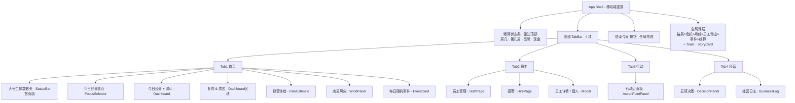

# 《开店说》页面分页重构 · 信息架构方案 + 每页 UI 布局草稿

> 文档性质：PRD / 信息架构（IA）草案，**不含任何代码实现**。
> 目的：先与用户对齐「结构」与「每页长什么样」，再进入架构/工程阶段。
> 设备形态：移动端竖屏（375–480px 宽），底部 4 个 tab 导航。
> 现状确认：当前 `src/App.tsx` 为**单页长滚动**，所有模块按固定顺序堆在一根滚动条里；弹窗均为跨页浮层。本项目**无路由/tab 基础设施**，状态由全局 Zustand store 持有（切 tab 天然不会丢失游戏状态）。

---

## 0. 代码事实确认（写方案前的核对）

| 项 | 现状（代码事实） | 与需求的关系 |
|---|---|---|
| 顶部状态栏 `StatusBar` | 单条紧凑：第X天·周几·第X周·第X月 / 现金 / TrafficPill / 净资产 / 品牌★ / 现金流 / 店铺数 / 储备 / 行动点 / 负债 / 月供 / 复购热 | 用户明确说"太拥挤"，首页要放大、分层、留白 |
| `Dashboard` 内部 | 4 张卡片：①今日经营(流水/毛利/净利+成本拆解) ②经营漏斗 ③复购&供应(复购热/复购率/批次品质/供应稳定/月供/负债) ④**现金曲线(CashCurve)** | ①②→首页"今日经营+漏斗"；③→首页"复购供应"；**④现金曲线在 4 tab 中均未被点名（孤儿）** |
| `DecisionPanel` | **仅渲染 3 项**：供应商 / 售价 / 推广 | 需求称"五项决策(供应商/售价/装修/推广/人工)"，**装修、人工均未在面板实现** |
| `DecisionState` 类型 | 含 `supplierTier`/`priceStrategy`/`decorationLevel`/`promotionTier` 4 字段；`decorationLevel` 无 UI 入口，`人工` 不在类型里 | "装修/人工" 待确认（见 §5） |
| `ActionPointPanel` | 6 类行动卡（稳口碑/拉客流/管员工/救现金/控风险/谈资源）+ 行动点进度条；`cash<0` 时普通行动被拦截 | 原样搬入 Tab3 行动 |
| `StaffPage` / `HirePage` | 当前是**全屏遮罩覆盖层**（`fixed inset-0`，z-40 / z-50） | 需改造为 Tab2 的内容页（去掉 ✕ 关闭，由 tab 切换退出） |
| 周/周几算法 | `getDayOfWeek(day)`：`((day-1)%7)+1`→周一..周日；`getWeekNumber(day)`：`ceil(day/7)` | 纯基于 `day`，与真实日历无关（见 §5） |
| 浮层优先级 | `App.tsx`：结局 > 危机 > 月结 > 员工动态 > 事件 > 结算；另 `StoryCard`(z-70) / `Toast` | 重构后**优先级不变** |

---

## 1. 信息架构总览

### 1.1 四 Tab 结构图



### 1.2 全局常驻元素清单（不进任何 tab）

| 元素 | 位置 | 说明 |
|---|---|---|
| 精简状态条（MiniBar） | 顶部常驻 | 仅显示 **周几 / 第几周 / 品牌分数 / 现金**（见 §3） |
| 底部 TabBar | 最底部常驻 | 4 项：首页 / 员工 / 行动 / 经营 |
| 结束今天 按钮 | 全局常驻（建议位于 TabBar 上方） | 任意页都能结束当天；任意浮层开启时禁用（沿用现状 `hasModal` 逻辑） |
| 危机 Modal | 浮层 | `cash<0` 触发，优先级高于月结/事件/结算 |
| 月结 Modal | 浮层 | 每月末触发 |
| 结算 Modal | 浮层 | 结束当天后触发 |
| 事件 Modal | 浮层 | 每日事件弹窗 |
| 员工动态 Modal | 浮层 | 每日结算后员工事件集中展示 |
| 结局屏 `EndingScreen` | 浮层 | 最高优先级 |
| `Toast` | 浮层 | 行动/借款结果数字摘要（~2.5s 自动消失） |
| `StoryCard` | 浮层（z-70） | 借款/危机逐字叙事，与 Toast 并存，不进 tab |

**浮层优先级（重构前后保持一致）：**
`结局 > 危机 > 月结 > 员工动态 > 事件 > 结算`；`StoryCard` 始终最顶。

### 1.3 Tab 切换交互规则（建议，待 §5 确认部分项）

1. **不重置游戏状态**：store 为全局单例，4 个 tab 仅为同一份状态的"不同视图"，切换 tab 不触发任何结算/重算。
2. **浮层不受 tab 影响**：危机/月结/结算/事件/员工动态/结局/Toast/StoryCard 在任意 tab 都可能弹出，弹出时阻断"结束今天"。
3. **滚动位置**：建议**首页保留滚动位置**（内容最长，用户常返回定位），Tab2/3/4 内容较短可重新挂载；是否需要"keep-alive 仅首页"由 §5 拍板。
4. **TabBar 高亮**：当前激活 tab 用主色高亮；默认进入 **Tab1 首页**。
5. **员工系统改造**：原 `StaffPage`（全屏遮罩）改为 Tab2 的内容页（去掉 ✕，tab 切换即退出）；`HirePage` 保留为 Tab2 内的子覆盖层；员工详情/裁人 Modal 在 Tab2 内弹出。
6. **布局避让**：EndDayButton（固定）与 TabBar（固定）都贴底，需错开——建议 EndDayButton 的容器 `bottom` = TabBar 高度，避免重叠。

---

## 2. 每页 UI 布局草稿

> 约定：`[Card]` 表示一张圆角卡片（沿用现有 `ui/Card`）；`—` 表示卡片间距；纵向为从上到下阅读顺序。所有页面宽度 375–480px，左右留 16px 边距。

### 2.1 Tab1 首页（店的主体 + 今日经营全景）

```
┌──────────────────────────────────────────────┐
│  【大号主体数据卡】  ← StatusBar 首页版（见 §3） │
│  第 12 天 · 周三 · 第 2 周      品牌 ★★★★☆ 86/100│
│  ┌───────────────┐  ┌──────────────────────┐ │
│  │ 现金           │  │ 净资产               │ │
│  │ ¥128,500       │  │ ¥342,000            │ │
│  └───────────────┘  └──────────────────────┘ │
│  ┌──────────────────────────────────────────┐ │
│  │ 🔥 工作日高峰   预估到店 ~1,240 人  (主店)  │ │ ← TrafficPill 大块
│  └──────────────────────────────────────────┘ │
│  现金流 健康 · 行动点 3/3 · 月供 ¥9,800 · 复购热 72│ ← 次级指标行
└──────────────────────────────────────────────┘
— (留白)
[Card] 今日经营重点 · FocusSelector（7 选 1 胶囊 + 副作用提示）
—
[Card] 今日经营  · Dashboard
      流水 / 毛利 / 净利（3 宫格大数字）
      成本拆解：推广 / 人工 / 房租日摊 / 平台（小字）
[Card] 经营漏斗 · FunnelChart
—
[Card] 复购 & 供应 · Dashboard区块
      复购热度 / 复购率 / 批次品质 / 供应稳定 / 月供 / 负债
—
[Card] 经营体检 · RiskEstimate
      现金流 / 承载 / 风向（3 宫格，超载时红字提示）
—
[Card] 店里风向 · WindPanel
      等级标签 + 症状文案列表
—
[Card] 每日随机事件 · EventCard   ← resolvedEvent 行内卡
      分类 · 已发生 · 标题 · 可见效果
—
（建议）[Card] 现金曲线 · CashCurve   ← 见 §5，归属待定
—
（底部留白，避免被 EndDayButton 遮挡）
```

> 说明：需求清单的 Tab1 模块顺序为「主体数据 → 经营重点 → 今日经营(流水毛利净利/漏斗) → 复购供应 → 经营体检 → 店里风向 → 故事(EventCard)」，上图严格遵循。现金曲线为当前 `Dashboard` 第 4 张卡，但 4 tab 均未点名，本图暂置于末尾并标注待确认（§5-①）。

### 2.2 Tab2 员工（员工管理系统）

```
┌──────────────────────────────────────────────┐
│ 精简状态条（MiniBar）· 周几·第几周·品牌·现金    │
├──────────────────────────────────────────────┤
│ 标题行：员工管理            [全员放假][+招聘]    │
│ [Card] 排班摘要（3 宫格）                        │
│        今日在岗 N/上限 · 承载上限 X单 · 今日成本  │
│ [Card×N] 员工卡片                              │
│        姓名 + 属性标签(待揭示/临时) + 士气       │
│        本周排班：周X · 本周已上 N天(超时⚠) · 月薪│
│        [排班中/休息] [详情] [裁人]              │
│ （无员工时显示空态卡 + 招聘引导）               │
└──────────────────────────────────────────────┘
    │ 点击 +招聘 → HirePage（Tab2 内子覆盖层）
    │ 点击 详情 → EmployeeDetailModal
    │ 点击 裁人 → LayoffConfirmModal
```

> 改造要点：原 `StaffPage` 是 `fixed inset-0 z-40` 全屏遮罩、带 ✕ 关闭；改为 tab 内容页后**移除 ✕**（切 tab 即离开），整体改为可滚动页面容器。`HirePage` 与两个 Modal 保持浮层形态。

### 2.3 Tab3 行动（消耗行动点的操作）

```
┌──────────────────────────────────────────────┐
│ 精简状态条（MiniBar）· 周几·第几周·品牌·现金    │
├──────────────────────────────────────────────┤
│ [Card] 行动点  N / max  + 进度条               │
│        （cash<0 时红字：普通行动已暂停，先处理危机）│
│ [Card] 稳口碑    → 行动卡列表（名称/AP/现金/代价/执行）│
│ [Card] 拉客流    → ...                          │
│ [Card] 管员工    → ...                          │
│ [Card] 救现金    → ...                          │
│ [Card] 控风险    → ...                          │
│ [Card] 谈资源    → ...                          │
└──────────────────────────────────────────────┘
```

> 原样搬入 `ActionPointPanel`（含 6 类行动卡、二次确认、冷却）。**危机应对的 CrisisModal 不在本页内**——它是全局浮层，触发时盖在所有 tab 之上（与现状一致）。

### 2.4 Tab4 经营（每日五项决策 + 经营日志）

```
┌──────────────────────────────────────────────┐
│ 精简状态条（MiniBar）· 周几·第几周·品牌·现金    │
├──────────────────────────────────────────────┤
│ [Card] 供应商   → 档位胶囊（cheap/local/stable/premium）│
│ [Card] 售价     → 档位胶囊（low/normal/raise/premium）  │
│ [Card] 推广     → 档位胶囊（含"每日 ¥X"提示）           │
│ [Card] 装修     → （见 §5-②，当前未实现，待确认）       │
│ [Card] 人工     → （见 §5-②，当前未实现，待确认）       │
│ —                                                │
│ [Card] 经营日志 · BusinessLog                    │
│        倒序最近 12 天：D天数 事件标题 流水 净利    │
└──────────────────────────────────────────────┘
```

> `DecisionPanel` 与 `BusinessLog` 原样搬入。注意：**当前 `DecisionPanel` 仅渲染 供应商/售价/推广 三项**，装修/人工尚未有 UI（见 §5-②）。

---

## 3. StatusBar 两形态规格

核心诉求：**现状太拥挤 → 首页要"框大、信息分层、字号大、留白足"；其他页只需 4 项精简条。**

### 3.1 形态 A：首页「大号主体数据卡」

- **形态**：一张大圆角卡，作为首页顶部"招牌"。
- **字段（10 项，需求点名）**：第几天 · 周几/第几周 · 现金 · 净资产 · 品牌分数 · 预估到店(TrafficPill) · 现金流状态 · 行动点 · 负债月供 · 复购热度。
- **布局与字号层级（响应"要可读"）**：

| 层级 | 内容 | 字号/样式建议 |
|---|---|---|
| 一级（标题行） | 第 X 天 · 周几 · 第 X 周 | 中号粗体；**品牌分数**以「★星级 + 86/100」放大放右侧 |
| 二级（主数字，2 列宫格） | 现金、净资产 | **大号粗体**（如 text-2xl/font-bold），占 2 列网格，留白充足 |
| 三级（整行大块） | 预估到店（TrafficPill） | 整行一块，pill 放大 + 预估人数，可点开 5×5 组合表 |
| 四级（次级指标行，小字 wrap） | 现金流状态(带色) · 行动点 N/max · 月供 · 复购热 | 小号（text-xs），横向排布，必要时换行；**不作为主视觉** |

- **设计原则**：主数字（现金/净资产）最醒目；预估到店单独成块强调"今天能来多少人"；现金流/行动点/月供/复购热降级为次级行，避免再挤成一条。
- **备注**：当前 StatusBar 还含「第 X 月 / 店铺数 / 储备 / 负债」等。需求清单未列月份与储备，建议：月份（第 X 月）并入一级标题行小字；多店数/储备仅在多店时以极简次级行显示（非强制，见 §5-③）。

### 3.2 形态 B：其他页「精简状态条」（顶部常驻）

- **形态**：贴顶紧凑小条，不占大块空间。
- **字段（需求点名的 4 项）**：**周几 · 第几周 · 品牌分数 · 现金**。
- **布局建议**：单行两端对齐 —— 左：`周三 · 第2周`；右：`品牌 86★` 与 `现金 ¥128,500`（小号 text-sm，紧凑 padding）。
- **目的**：员工/行动/经营页需要随时看到"今天周几、品牌掉没掉、还有多少钱"，但不必展示庞大的主体卡。

> 两种形态共用同一份 store 数据，仅"展示密度"不同——属于纯展示层调整，无新增业务逻辑。

---

## 4. 新增 / 调整组件清单

### 4.1 纯布局调整（移动现有组件，不改功能逻辑）

| 组件 | 调整内容 | 备注 |
|---|---|---|
| `StatusBar` | 拆成「首页大卡版」+「精简条版」两形态（可一个组件 + `variant` 参数，或两个渲染分支） | 数据来源不变 |
| `FocusSelector` / `Dashboard` / `RiskEstimate` / `WindPanel` / `EventCard` | 整体搬入 Tab1 首页 | 顺序见 §2.1 |
| `ActionPointPanel` | 整体搬入 Tab3 行动 | 不变 |
| `DecisionPanel` / `BusinessLog` | 整体搬入 Tab4 经营 | 不变 |
| `StaffPage` | 由全屏遮罩 → Tab2 内容页（去 ✕、改滚动容器） | 内部结构基本不变 |
| `HirePage` / `EmployeeDetailModal` / `LayoffConfirmModal` | 保留为 Tab2 内浮层 | 不变 |
| `EndDayButton` | 全局常驻，调整 `bottom` 避让 TabBar | 沿用 `hasModal` 禁用逻辑 |

### 4.2 需新建组件 / 机制

| 名称 | 类型 | 职责 | 说明 |
|---|---|---|---|
| `TabBar` | 新组件 | 底部 4 tab 导航 + 高亮 + 切换 | 移动端竖屏，常驻最底 |
| `AppShell` / 页面容器 | 新组件/机制 | 包裹 精简状态条 + 当前 tab 内容 + TabBar + EndDayButton | 实现 tab 视图切换 |
| tab 切换机制 | 新机制 | 本地状态 `activeTab` 控制显示哪个页（**推荐轻量本地 state，无需 react-router**；若未来需深链/分享再引路由） | 现状无路由，URL 无所谓 |
| 滚动位置保持（可选） | 新机制 | 切换 tab 时缓存/恢复首页滚动位置（keep-alive 或 scrollTop 记忆） | 是否做见 §5-④ |
| `StatusBar` 双形态封装 | 调整/小新 | 如上，建议 `variant="home" | "mini"` | — |

> 明确**不**在本次新增业务逻辑：经营体检、品牌分数、预估到店、供应商决策等均为既有功能，只搬位置/重组（与需求 §6 一致）。

---

## 5. 待确认问题（需用户 / 主理人拍板）

**① 现金曲线（CashCurve）归属**
当前 `Dashboard` 含「现金曲线」卡，但 4 个 tab 需求均未点名它。选项：(a) 留在首页末尾（作为经营趋势参考）；(b) 移到 Tab4 经营（贴近经营日志）；(c) 暂移除。→ **建议 (a) 或 (b)，勿丢**。

**② 装修 / 人工 是否真的进 DecisionPanel（五项决策）**
代码事实：`DecisionPanel` 当前**只渲染 3 项**（供应商/售价/推广）；`DecisionState` 有 `decorationLevel` 但无 UI 入口；`人工`(labor) 根本不在状态类型里（人工相关操作现在散落在 `StaffPage` 排班/招聘/裁人）。需求却说"五项决策含装修/人工"。需确认：(a) 本次就补齐装修/人工两个决策 UI（超出"只搬不新增功能"）；(b) 装修/人工延后，Tab4 先放已实现的 3 项；(c) 人工决策概念本就不存在，仅装修需补。

**③ 首页主卡是否需要展示「月份 / 多店数 / 储备」**
需求清单的 10 项未含第 X 月、店铺数、储备，但现状 StatusBar 有。建议：月份并入一级标题小字；多店数/储备仅在多店时极简显示。是否采纳待定。

**④ 切 tab 是否保留每页滚动位置**
首页内容最长，用户可能期望返回时停留在原处；其他页短，重挂即可。建议：仅首页 keep-alive / 记忆 scrollTop，其余重挂。是否采用待定。

**⑤ 周几 / 第几周 呈现口径**
`getDayOfWeek`/`getWeekNumber` 纯基于 `day`（`ceil(day/7)`，第 1–7 天=第 1 周，且"周几"从周一排起），与真实日历/开业星期无关。需确认：是否接受这种"游戏内周"口径，还是要对齐真实开业日（如需对齐属新增逻辑）。

**⑥ 首页大卡在"未开店 / 教程期"是否显示**
`App.tsx` 的 `phase` 有 `tutorial` / `opening` / `playing` 三态，tab 结构仅在 `playing` 生效。`opening`（开店设置 `OpeningSetup`）与 `tutorial` 阶段是否已有 tab 外壳？建议教程/开店期仍走全屏流程（同现状），进入 `playing` 才出现 TabBar + 大卡。是否同意待定。

**⑦ EndDayButton 与 TabBar 的层级/位置**
两者都贴底，必须错开。建议 EndDayButton 位于 TabBar 正上方（容器 bottom = TabBar 高）。具体像素由工程阶段定，此处仅确认"不重叠"原则。

---

## 6. 不做的事（明确边界）

- ❌ **不写任何代码**：本文档仅定义信息架构与每页 UI 布局草稿，不含组件实现、样式代码、路由配置。
- ❌ **不新增游戏业务逻辑**：经营体检、品牌分数、预估到店、供应商/售价/推广决策、行动点系统、员工系统均为既有功能，本次仅搬运位置 / 重组展示，不改动其计算与效果。
- ❌ **不调整浮层优先级**：危机/月结/结算/事件/员工动态/结局/Toast/StoryCard 的触发条件与优先级保持现状。
- ❌ **不改数据存储结构**：Zustand store 字段、类型定义（除 §5-② 可能需补装修/人工决策外）本次不动。
- ❌ **不做桌面端 / 横屏适配**：本次仅面向移动端竖屏；现有 `sm:max-w-[720px]` 等约束可保留但非重点。

---

*文档作者：产品经理（许清楚） · 依据 `src/App.tsx` 及各组件源码核对后产出*
