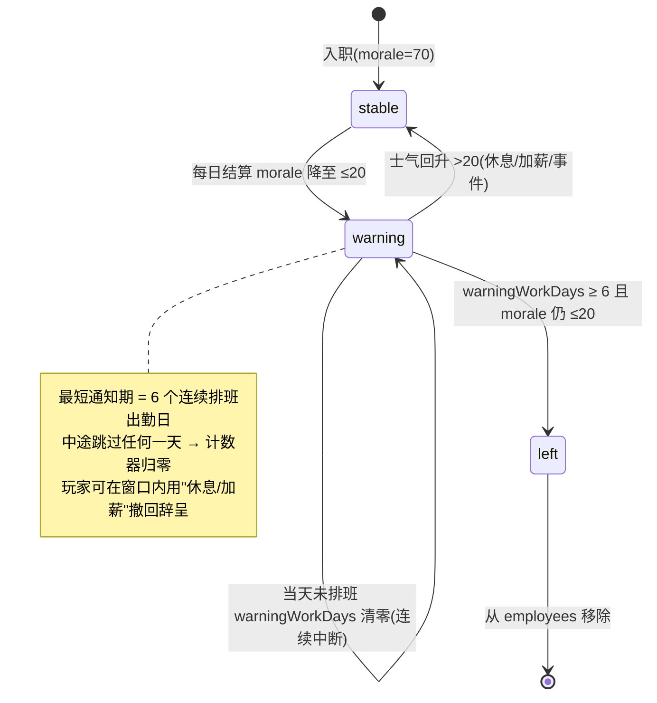

# 《开店说》离职过渡 / 老板顶班 / 弹窗故事 —— 设计方案与文案草稿

> 文档性质：**纯分析 + 规则设计 + 内容草稿**，不写任何代码、不改动任何源文件。
> 适用版本：389 绿版本（`/Users/yoren/WorkBuddy/2026-07-08-20-34-45/kaidian-shuo`）
> 目标：先把"为什么这么定"讲清楚，供用户 review 后再决定是否进入代码阶段。
> 配套摘要：见文末「待用户拍板问题」与回传主理人的中文摘要。

---

## 0. 结论速览（TL;DR）

| 问题 | 现状（代码事实） | 核心修正 |
|---|---|---|
| **1. 员工离职无过渡** | `checkResignOrStrike` 在 `morale < 15` 时**次日立即离职**；"濒临离职"只是一个 `morale ≤ 20` 的文本提示，无状态、无计数。 | 新增 `warning` 状态 + `warningWorkDays` 计数器：进入 warning 后，**必须连续上班满 6 天**才可能真正离职；中途断一天清零。士气恢复则退出 warning。 |
| **2. 老板顶班缺陷** | `owner_shift` 的 `capacity:"+small_today"` 被映射到 `ordersPct`(+3%)，**结算的承载上限只看员工**（`computeCapacity`）；无人排班时兜底只加疲劳、不加承载 → 流水恒为 0。 | 新增 `ownerCoverToday` 状态位；结算 `effectiveCap = 员工承载 + (顶班 ? 70 : 0)`。无员工时顶班 → 承载 70 → 产生基础流水。 |
| **3. 缺弹窗故事** | 随机事件有 `EventModal`，但员工预警只是 `staffNotifications` 里的纯文本；危机/月结有弹窗但文案偏报告体。 | 定义 `StoryModalData` 结构，把预警/随机/危机/月结都接成"有代入感的故事弹窗"。本文给出 **17 条**结构化草稿。 |

---

## Step 1 · 代码调研结论（只读，依据事实）

### 1.1 员工离职 / 濒临离职逻辑

| 文件:行号 | 当前行为 |
|---|---|
| `src/types/employee.ts:16-30` | `Employee` 含 `morale(0-100)`、`consecutiveWorkDays`（仅用于"连续>7天"惩罚）、`isScheduledToday`、`daysWorkedThisWeek`。**没有 `status`/`warning` 状态字段，没有"进入预警后连续天数"计数器。** |
| `src/data/staffConstants.ts:32,62` | `RESIGN_MORALE_THRESHOLD = 15`（低于即离职）；`LOW_MORALE_THRESHOLD = 20`（≤ 即"濒临离职"提示）。 |
| `src/core/staffSystem.ts:162-229` `applyMoraleDecay` | 每日结算：排班 → `morale -= baseMoraleDecay`（按属性 1~4 不等，见 `employeeAttributes.ts`）；休息 +5；加班/连续>7天/≤30 额外惩罚。当 `newMorale ≤ 20 && emp.morale > 20` 时 push 一条 `morale_warning` 的 `StaffEvent`，文案"濒临离职！建议安排休息或涨工资"。 |
| `src/core/staffSystem.ts:234-271` `checkResignOrStrike` | **若 `emp.morale < 15` → 立即 `resign`**（返回 resigning 列表）；刺头 `morale < 20` → 触发全员罢工。这里**没有 6 天过渡**，士气一跌破 15 第二天就走。 |
| `src/store/gameStore.ts:547-556` | `endDay` 中调用 `checkResignOrStrike`；`resign` 直接把员工从 `store.employees` 过滤掉；`strike` 把全员 `isScheduledToday=false`。 |
| `src/store/gameStore.ts:578` | 员工事件（含 `morale_warning` 的 `description`）写入 `s.staffNotifications: string[]`，由 `StaffEventModal` 以纯文本列表展示。 |

**结论（问题 1 的根因）：** "濒临离职"只是一次性的文本提示，离职由 `morale<15` 直接触发，中间没有任何"连续上班 N 天才走"的状态机。这正是用户说的"没有过渡"。

### 1.2 老板顶班 / 承载 / 流水逻辑

| 文件:行号 | 当前行为 |
|---|---|
| `src/core/staffSystem.ts:154-157` `computeCapacity` | `return scheduledCount * BASE_CAPACITY_PER_STAFF`。`BASE_CAPACITY_PER_STAFF = 70`（`staffConstants.ts:5`）。**0 人排班 → 承载 0。** |
| `src/core/staffSystem.ts:462-464` `computeOwnerCapacity` | `return 90;` —— **函数已定义但全代码未被调用（死代码）**，本意是"老板顶班时给 90 承载"，但从未接进结算。 |
| `src/data/actions.v0.2.json:165-194` `owner_shift` | 行动"老板亲自顶班"，`costAP:1`，`visibleEffects:{ staffCost:"-small", capacity:"+small_today" }`，`hiddenEffects:{ BOSS_STRAIN:12, STAFF:2 }`。 |
| `src/data/actionScale.ts:58-96` `VISIBLE_KEY_TO_MOD` | **`capacity` 被映射到 `ordersPct`**（不是承载上限！）。`+small_today` 在 `TOKEN_SCALE` 中 = `3`。即 `owner_shift` 只给当日订单 +3%，**不改变承载上限**。 |
| `src/core/settlement.ts:63` | `let effectiveCap = computeCapacity(store.employees);` 结算承载**只数员工**，完全不读 `ownerCover` 或 `mods.capacity`。所以 #1"承载上限没变化"成立。 |
| `src/store/gameStore.ts:566-575`（同 `src/core/gameLoop.ts:116-123`） | 兜底：当 `mainStore` 无人排班 → `ownerFatigue += 15`。**只加疲劳，不补承载**。于是 0 员工时 `effectiveCap=0` → `finalOrders=min(orders,0)=0` → `revenue=0`。这就是 #2"无员工时流水还是 0"。 |
| `src/data/events.v0.1.json:812-816, 873-876` | 事件选项里也有"老板顶班/老板亲自顶"分支（`ownerFatigue:20` / `staffCost:-200`），同样只动疲劳/成本，不动承载。 |

**结论（问题 2 的根因）：** 承载上限的计算路径里根本没有"老板"这一项；`owner_shift` 的 `capacity` 字段被错误地翻译成"订单+3%"，且结算从不消费它；兜底顶班只加疲劳不补承载。两处 bug 叠加导致用户看到的现象。

### 1.3 事件 / 故事弹窗结构

| 文件:行号 | 结构（用于挂接故事） |
|---|---|
| `src/store/gameStore.ts:75` | `eventModal: EventDef \| null` —— `EventModal` 的数据源。 |
| `src/components/modals/EventModal.tsx:13-39` | 读取 `ev.title / ev.level / ev.category / ev.trigger / ev.options[]`，每个选项显示 `o.label` 与 `o.visibleEffect`。`dismissable=false`。**这是现成的"故事弹窗"容器**，已有标题+引入文案+有代入感选项。 |
| `src/types/events.ts:74-83` `EventDef` | 事件结构：`{ id, title, category, level, trigger, cooldownDays, options:[{id,label,visibleEffect,effects}], wind }`。`trigger` 是引入叙事、`options[].visibleEffect` 是选择后的叙事。 |
| `src/components/EventCard.tsx` | 首页"已发生"卡：`resolvedEvent.event.title` + 所选 `option.visibleEffect`。 |
| `src/store/gameStore.ts:297` `staffNotifications: string[]` | 员工动态纯文本列表，`StaffEventModal` 渲染。目前"濒临离职"预警就在这里，只是 `⚠️ + 文字`，没有故事感。 |
| `src/components/modals/MonthModal.tsx:12-54` | `monthModal: MonthlyReport` 驱动；展示月报表 + `report.wind.lines[0]`（店里风向）。可在此塞入月结叙事。 |
| `src/core/crisis.ts` + `CrisisModal` | 危机弹窗（强制事件 F001/F002/F003），已有 `trigger` 文案空间。 |

**结论（问题 3 的挂接点）：** 随机事件 ⇒ 复用 `EventModal` + `events.v0.1.json`（只补文案即可）；员工预警 ⇒ 把 `staffNotifications` 升级为带 `title/body/tone` 的故事对象；危机/月结 ⇒ 复用各自 Modal 的叙事字段。无需新建重型机制，只需统一一套 `StoryModalData` 语义。

---

## Step 2 · 规则设计

### 2.1 问题 1 · 离职状态机（稳定 → 濒临离职 → 离职）

#### 新增字段（`Employee`，仅描述，不改代码）

```ts
// 新增
status: 'stable' | 'warning';   // 默认 'stable'
warningWorkDays: number;        // 进入 warning 后"连续上班天数"计数器，默认 0
```

> 不复用现有 `consecutiveWorkDays`（那是"连续工作>7天"惩罚用的，语义不同），避免互相干扰。

#### 状态定义与转移

- **stable（稳定）**：正常状态。
- **warning（濒临离职 / 已递辞呈）**：进入条件 = 士气 `≤ LOW_MORALE_THRESHOLD(20)`（保留现有触发，不重写逻辑，只是把"曾经触发过 morale_warning"固化为一个状态位）。
- **left（离职）**：`warning` 状态下满足离职称职条件后被从 `employees` 移除（沿用现有过滤逻辑）。

#### 计数规则（核心）

每天 `endDay` 员工逻辑里，对处于 `warning` 的员工：

1. **当日上班（排班且在岗，非罢工/非请假）** → `warningWorkDays += 1`。
2. **当日未上班（玩家不排班 / 休息 / 请假 / 被事件调走）** → `warningWorkDays = 0`（**连续上班被打断即清零**，这就是"连续"的含义）。
3. **离职称职条件**：`warningWorkDays >= WARN_GRACE_DAYS(6)` **且** 此刻 `morale <= LOW_MORALE_THRESHOLD(20)` → 真正离职。
   - 即：进入 warning 后，**至少连续上满 6 天班，才可能走**；6 天前绝不可能离职。
4. **恢复（退出 warning）**：若某日 `morale` 回升到 `> 20`（休息 +5 / 涨工资 / 全员放假 / 正向事件）→ `status='stable'`，`warningWorkDays=0`。
   - 直觉一致：现有提示就写"建议安排休息或涨工资"，休息通常 +5 士气 → 越过 20 → 撤回辞呈。

#### 为什么这么定（取舍说明）

- 用户原话"起码得再连续上六天班才会辞职" = 一个**最短通知期**。把"连续上班"定义为"连续排班出勤日"，跳过排班即清零，最贴合玩家对"连续上班"的直觉，也和现有 `isScheduledToday` 字段天然对齐。
- 离职条件要求"6 天 **且** 士气仍低"，意味着：玩家只要在 6 天窗口内让士气回血（休息/加薪），就能留住人——给了明确的可操作窗口，而不是纯随机。
- 保留"士气恢复即退出 warning"，避免让一个被玩家及时关怀的员工还卡在辞呈里，符合共情设计。

#### 对现有逻辑的改动点（供代码阶段参考，本文不改）

- `applyMoraleDecay`：在 push `morale_warning` 处，把该员工 `status` 置为 `'warning'`、`warningWorkDays=0`（若原本是 stable）。
- 新增一步（在 `applyMoraleDecay` 之后 / `checkResignOrStrike` 之前）：更新 `warningWorkDays` 计数，并判定是否达到离职条件。
- `checkResignOrStrike`：**移除** `morale < 15` 的即时离职分支（改由上面的 6 天规则接管）；罢工（刺头）逻辑保留不变。
- `setEmployeeSchedule` / `applyAllRest` / `applySalaryRaise`：在相应分支把 `status` 复位为 `stable`、`warningWorkDays=0`（恢复路径）。

#### 状态图（Mermaid）



> **Mermaid 渲染提示**：上述为 `stateDiagram-v2` 语法；若渲染器不支持 `note`，可去掉 note 块不影响主流程。

#### 待确认（写进"拍板问题"）
- **Q1**："6 天"按**连续排班出勤日**计（跳过排班即清零），还是按**自然日**计（含玩家主动休息日也算数）？→ 本文默认"连续排班出勤日"。
- **Q2**：满 6 天且士气仍低时，是**必然离职**还是**有概率离职**（"才可能"的字面义）？→ 本文默认必然离职（更可控、更好做故事铺垫）。
- **Q3**：刺头 `morale<20` 的**罢工**是否也要先经过 warning 状态？→ 本文建议保留罢工原逻辑（不卡 6 天），避免削弱该属性的戏剧性。

---

### 2.2 问题 2 · 老板顶班修正

#### 新增状态位（`GameState`，仅描述）

```ts
ownerCoverToday: boolean;   // 当天是否有老板顶班（行动点或兜底触发），beginDay/resetDailyActionState 时清零
```

#### 承载公式（结算侧）

```
effectiveCap = computeCapacity(employees)            // = 排班人数 × 70
             + (ownerCoverToday ? OWNER_CAPACITY_BONUS : 0)
```

- **`OWNER_CAPACITY_BONUS` 建议值 = `BASE_CAPACITY_PER_STAFF`(70)**，即"老板顶班 ≈ 补 1 个员工位"（贴合用户"等同于补 1 个员工位"的原话）。
  - 有员工时：1 人 + 老板 = 70+70 = 140（承载随顶班 +1 档）。
  - **无员工时**：effectiveCap = 70 → `finalOrders = min(orders, 70) > 0` → **产生基础流水**（修掉 #2）。
- 备选值：`computeOwnerCapacity()` 现有 90（老板单人产能略高于 1 个普通员工）。**不推荐**——会让"无员工时老板顶班"比"雇 1 人"还猛，破坏平衡。见 Q4。

#### `ownerCoverToday` 何时置 true

1. **兜底（无人排班）**：`gameStore.ts:566` / `gameLoop.ts:116` 的"无人排班→老板被迫顶班"分支，在 `ownerFatigue += 15` 的同时置 `ownerCoverToday = true`（保留疲劳惩罚，新增承载）。
2. **主动行动 `owner_shift`**：在 `takeAction` 执行该行动后置 `ownerCoverToday = true`（保留 `BOSS_STRAIN+12`、`staffCost -small` 等原有效果）。

#### 平衡性建议（为什么不会"无脑碾压雇人"）

- `owner_shift` 花费 **1 行动点**（机会成本：本可用于拉客流/稳口碑）；
- 每次顶班 `ownerFatigue +12~15`，`>70` 时结算 `conversionRate -3%`、`effectiveCap ×0.95`，且次日 `actionPointsMax -1`（`actionSystem.ts:192`）；
- 行动还会抬高 `owner_overwork(+0.25)`、`decision_mistake(+0.15)` 等事件权重（`actions.v0.2.json:184-186`）；
- 真招 1 个员工不仅给同等承载，还带属性加成（转化/效率/波动），且无疲劳副作用。
- ⇒ 顶班是"救火/过渡"杠杆，长期靠它必崩。把 `OWNER_CAPACITY_BONUS` 压在 70（=1 档）正好守住这条线。

#### 对 `owner_shift` JSON 的建议（不改，供参考）

`visibleEffects.capacity:"+small_today"` 当前是**误导字段**（被译成订单+3%）。建议代码阶段将其效果改为"设置 `ownerCoverToday=true`"，并把 `capacity` 这一键从本行动移除或改注释，避免后人误读。

#### 待确认
- **Q4**：`OWNER_CAPACITY_BONUS` 取 **70（=1 员工位，推荐）** 还是 **90（复用 `computeOwnerCapacity`）**？
- **Q5**：兜底顶班（被迫，无员工）与主动 `owner_shift`（花 1 AP）是否给**相同承载**？→ 本文建议相同（都是 70），差异只在疲劳/事件权重。

---

## Step 3 · 弹窗故事系统（问题 3，重头戏）

### 3.1 触发点分类与挂接方案（不写代码，只描述字段映射）

统一一套故事数据语义 `StoryModalData`：

```
StoryModalData = {
  id: string;                // 唯一 id
  type: 'random' | 'warning' | 'crisis' | 'monthly';
  title: string;             // 弹窗标题（有戏剧感）
  body: string;              // 1~3 句有代入感文案
  tone: 'positive' | 'negative' | 'humor' | 'warm';
  options?: { label: string; visibleEffect: string }[];  // 随机/危机类可带选择
  effectHint?: string;       // 给玩家的轻量提示（如"阿强状态不太对，考虑让他休息"）
}
```

**挂接映射表：**

| 触发点 | 现有容器 | 字段映射 | 触发时机 |
|---|---|---|---|
| 随机事件（好/坏/中性） | `EventModal` ← `eventModal: EventDef` | 直接复用 `EventDef`：`title`=标题，`trigger`=引入叙事(body)，`options[].visibleEffect`=选择后叙事。新增叙事事件写入 `events.v0.1.json` 即可。 | `eventEngine.drawEvent` 每日抽中 |
| 员工濒临离职预警 | `StaffEventModal` ← `staffNotifications` | 把纯文本升级为 `StoryModalData`（`type:'warning'`，带 `title/body/tone`），由 `applyMoraleDecay` 在 push `morale_warning` 时一并产出。 | 员工 `morale` 当日跌破 20 的瞬间 |
| 危机 | `CrisisModal` ← 强制事件 | 复用 `EventDef.trigger` 写叙事；`options[].visibleEffect` 写后果叙事。 | `eventEngine.checkForcedEvents`（cash<0 / 月底房租不足 / 债务爆表） |
| 月结小结 | `MonthModal` ← `monthModal.wind.lines` | 在 `wind.lines` 追加一条按当月盈亏 tone 生成的叙事句。 | 每月末结算 |

> 说明：随机/危机类本身就有"选择分支"，沿用 `EventDef` 的 `options` 即可，无需新增结构；只有**预警/月结**需要把现有纯文本/报告字段替换为带 `tone` 的叙事对象。

### 3.2 故事草稿（共 17 条，覆盖全分类）

> 风格：微信小游戏开店经营的轻松口语感，带戏剧张力与玩家共情，避免说教。
> `{}` 内为可运行时替换的变量（员工名/店名/数字）。

---

#### A. 随机事件 · 好（3 条）

**A1 · id:`R_GOOD_regular` · type:random · tone:positive**
- title：「老主顾带了个朋友来」
- body：「门口那个天天来买豆浆的大姐，今天拽着闺蜜站柜台前：‘这家我吃了小半年，闭眼放心点。’你瞅着她们扫码，忽然觉得这店好像真活起来了。」
- options：
  - { label:「给老主顾免单一杯`, visibleEffect:`大姐乐了，朋友圈多了条好评。`, effects:{ revenuePct:-5, customerTrust:+3 } }
  - { label:「照常营业`, visibleEffect:`踏踏实实又做了一单。`, effects:{} }

**A2 · id:`R_GOOD_checkin` · type:random · tone:humor**
- title：「隔壁博主来打卡了」
- body：「一个举着自拍杆的姑娘推门就喊‘家人们谁懂啊’，对着你家招牌拍了八张。你还没反应过来，店门口已经围了三个举手机的。流量这东西，有时候就这么不讲道理。」
- options：
  - { label:「配合摆拍送小食`, visibleEffect:`视频发出去，明儿大概率爆。`, effects:{ exposurePct:+12, promoCost:+200 } }
  - { label:「低调做生意`, visibleEffect:`博主走了，你继续擦桌子。`, effects:{} }

**A3 · id:`R_GOOD_supplier` · type:random · tone:warm**
- title：「供应商多送了一箱」
- body：「送货的小哥临走拍你肩：‘上回你帮我校秤，这箱算我请的。’你翻开箱子，是快过季的货——但够撑过这周淡日了。江湖嘛，有时候就是这点人情。」
- options：
  - { label:「收下并回请奶茶`, visibleEffect:`供应商关系 +，以后好说话。`, effects:{ supplyRisk:-4, cash:-150 } }
  - { label:「按价付钱`, visibleEffect:`清清白白，但少个人情。`, effects:{} }

---

#### B. 随机事件 · 坏（3 条）

**B1 · id:`R_BAD_review` · type:random · tone:negative**
- title：「一条差评炸了群」
- body：「‘服务慢得像树懒’——某个匿名家伙甩了条一星评价，底下已经有人跟着问‘是不是真的’。你盯着屏幕，手心有点汗。差评不会杀人，但会劝退人。」
- options：
  - { label:「公开道歉+补偿券`, visibleEffect:`火压下去了，心疼那点券钱。`, effects:{ cash:-300, customerTrust:+2, priceControversy:-3 } }
  - { label:「装没看见`, visibleEffect:`风头过了，但心里不踏实。`, effects:{ customerTrust:-3 } }

**B2 · id:`R_BAD_fridge` · type:random · tone:negative**
- title：「冰柜半夜罢工」
- body：「凌晨三点你被报警电话吵醒：冰柜灯灭了，半柜货在冒水。你冲过去的时候，闻到的不是冷气，是钱在化。」
- options：
  - { label:「连夜叫抢修`, visibleEffect:`保住货，但账单不便宜。`, effects:{ cash:-800, hygieneRisk:-2 } }
  - { label:「先扔一半止损`, visibleEffect:`亏了货，至少没吃坏客人。`, effects:{ cash:-400, hygieneRisk:+1 } }

**B3 · id:`R_BAD_newrival` · type:random · tone:negative**
- title：「马路对面开了家新的」
- body：「红布一扯，对面挂出‘开业全场五折’。你站在窗边看人家放气球，自己店里安静得能听见冰箱嗡嗡响。价格战这把刀，先砍的未必赢，但挨的一定疼。」
- options：
  - { label:「跟着打折`, visibleEffect:`留住了人流，毛利被削。`, effects:{ revenuePct:+10, marginPct:-6 } }
  - { label:「稳住不跟`, visibleEffect:`守住利润，赌客人认质量。`, effects:{ customerTrust:+2, exposurePct:-8 } }

---

#### C. 随机事件 · 中性（2 条）

**C1 · id:`R_NEU_rain` · type:random · tone:humor**
- title：「一场雨把人浇没了」
- body：「天气预报说阵雨，结果下成了瀑布。街上一个鬼影没有，你俩（你和员工）大眼瞪小眼，连拖地都拖出了哲学感。雨天不是你的错，但账单不认这个理。」
- options：
  - { label:「趁机搞卫生培训`, visibleEffect:`闲着也是闲着，队伍整齐了。`, effects:{ efficiencyPct:+3 } }
  - { label:「提前打烊歇着`, visibleEffect:`省了灯钱，也省了心。`, effects:{ staffCost:-100 } }

**C2 · id:`R_NEU_inspect` · type:random · tone:neutral**
- title：「例行检查来了」
- body：「穿制服的同志进门先看了眼健康证墙，又蹲下去瞄了眼后厨边角。你后背发凉，但还好上周刚大扫除。检查这事儿，平时嫌烦，真来了才知平时没白做。」
- options：
  - { label:「全程陪同配合`, visibleEffect:`检查顺利，没挑出刺。`, effects:{ hygieneRisk:-4 } }
  - { label:「递根烟打哈哈`, visibleEffect:`气氛热络，但合规这事别靠运气。`, effects:{ hygieneRisk:+2 } }

---

#### D. 员工濒临离职预警（5 条，情绪梯度：从轻微→平静→认真→孤独→崩溃）

**D1 · id:`WARN_mild` · type:warning · tone:humor · effectHint:`{name} 状态有点飘，考虑排个休息日`**
- title：「{name} 今天话特别少」
- body：「平时最爱贫嘴的 {name}，今天一整天没怎么出声，连你递过去的玩笑都只‘嗯’了一声。你以为他感冒了，他说没有。有些人不说，但身体比嘴诚实。」

**D2 · id:`WARN_quiet` · type:warning · tone:neutral · effectHint:`{name} 似乎在犹豫，安排半天休息或许有用`**
- title：「{name} 把围裙挂在了椅背上」
- body：「下班时 {name} 没像往常那样把围裙随手一搭，而是叠得整整齐齐，挂在椅背正中间。你问他咋了，他笑了一下：‘没咋，就是今天有点累。’那个笑，你见过，是成年人说不出口的那种累。」

**D3 · id:`WARN_note` · type:warning · tone:warm · effectHint:`{name} 在递辞呈边缘，加薪或休息能拉回来`**
- title：「{name} 递了张纸条」
- body：「纸条上就一行字：‘老板，最近家里事多，干着干着就走神了。’你攥着那张纸，忽然想起招他进来那天，他眼睛亮得像刚充满电。人不是机器，电量低了会提前打招呼的。」

**D4 · id:`WARN_lonely` · type:warning · tone:negative · effectHint:`{name} 已连续硬撑，再不干预就要走了`**
- title：「{name} 的最后一天？」
- body：「你翻排班表，{name} 已经连着上了六天没歇，黑眼圈快掉到嘴角。他跟你请假条似地递来一句：‘再撑撑，店里人不够。’你心里一咯噔——最怕的就是这种‘我还能行’的员工，真不行了才让你知道。」

**D5 · id:`WARN_break` · type:warning · tone:negative · effectHint:`{name} 即将离职，这是告别`**
- title：「{name} 红着眼眶算完了最后一单」
- body：「打烊前 {name} 把最后一单算得清清楚楚，连零头都找对了。然后他摘下工牌放柜台：‘老板，我对不住，这阵子心思不在。谢谢你当初收我。’你张了张嘴，最后只说出‘路上小心’。有些离职，前一天你根本看不出来。」

> 情绪梯度设计意图：D1 轻描淡写（给玩家早期信号）→ D2/D3 渐进认真（提示可干预）→ D4 高危（连续硬撑）→ D5 告别（若玩家未干预、走完 6 天）。与 §2.1 状态机天然咬合：**D5 对应 `warningWorkDays` 满 6 且士气仍低的离职时刻**。

---

#### E. 危机预警（2 条）

**E1 · id:`CRISIS_cash` · type:crisis · tone:negative**
- title：「账上没钱了」
- body：「你点开余额，是个刺眼的数字——负数。供应商的账、员工的工资、房东的脸色，全在这一刻排队找你。开店最怕的不是亏，是亏到连转圜的余地都没了。」

**E2 · id:`CRISIS_rent` · type:crisis · tone:negative**
- title：「房东的短信」
- body：「‘小X，这个月房租啥时候安排？’一句话，后面跟着三个问号。你盯着屏幕，想起这月流水像漏了底的桶。房东不坏，但他也不靠情怀活。得想招了。」

---

#### F. 月结小结（2 条，按盈亏 tone 二选一生成）

**F1 · id:`MONTH_profit` · type:monthly · tone:positive**
- title：「这个月，居然赚了」
- body：「你把月度表从上看到下，净利的那个数是正的。你靠在椅背上长舒一口气——想起月初还差点关店。原来熬过来的人，不是赢了谁，是没让自己先认输。」

**F2 · id:`MONTH_loss` · type:monthly · tone:negative**
- title：「这个月，又亏了」
- body：「红色的数字像在笑话你。但你翻了翻日志，知道哪几天是人手崩了、哪几天是硬顶着没休息。亏钱不可怕，怕的是亏得不明不白。下个月，得换个打法了。」

---

### 3.3 故事与现有 Modal 的字段映射（速查）

| 草稿 id | 落入 | 映射字段 |
|---|---|---|
| A1~A3, B1~B3, C1~C2 | `events.v0.1.json` 新增 `EventDef` | `title` / `trigger`(=body) / `options[].visibleEffect`(=选择后叙事) |
| D1~D5 | `staffNotifications`→`StoryModalData[]`（预警升级） | `type:'warning'` / `title` / `body` / `tone` / `effectHint` |
| E1~E2 | 强制事件 `F001/F002`（已有结构） | 扩充 `trigger`(=body) / `options[].visibleEffect` |
| F1~F2 | `monthModal.wind.lines` | 按当月 `netProfit` 符号选 F1 或 F2 追加一句 |

---

## 4. 待用户拍板问题（汇总，回传主理人用）

1. **Q1（6天定义）**："连续上六天班"按**连续排班出勤日**（跳过排班即清零，推荐）还是**自然日**（含休息日）？
2. **Q2（必然 vs 可能）**：满 6 天且士气仍低时，离职是**必然**还是**有概率**（"才可能"字面义）？→ 默认必然。
3. **Q3（罢工）**：刺头 `morale<20` 的**罢工**是否也先卡 warning 状态？→ 默认保留原逻辑（不卡）。
4. **Q4（顶班承载值）**：`OWNER_CAPACITY_BONUS` 取 **70（=1 员工位，推荐）** 还是 **90（复用 `computeOwnerCapacity`）**？
5. **Q5（兜底 vs 主动）**：被迫兜底顶班与主动 `owner_shift` 是否给**相同承载（70）**？→ 默认相同。
6. **Q6（故事分支影响数值）**：随机/危机类故事是否要带**真实数值选择分支**（如 A1 免单→`revenuePct-5/customerTrust+3`）？还是先只做**纯叙事无数值**的轻量版？→ 本文草稿已给出带数值的版本，若想先低成本上线可砍掉 `effects` 只留叙事。
7. **Q7（预警故事展示形式）**：D1~D5 是**单独弹窗**（每次一个 StoryModal）还是**并入现有 StaffEventModal 列表**（每条带标题+语气色）？→ 默认并入 StaffEventModal 升级，不打断节奏。

---

## 5. 附录 · 关键文件 / 行号索引

- 员工类型：`src/types/employee.ts:16-30`
- 员工常量：`src/data/staffConstants.ts:5,32,62`
- 士气衰减 / 离职检测：`src/core/staffSystem.ts:154-157,162-229,234-271,462-464`
- 属性士气衰减值：`src/data/employeeAttributes.ts:24,39,54,69,84,99,114,129`
- 结算承载：`src/core/settlement.ts:63`
- 老板顶班兜底：`src/store/gameStore.ts:566-575` / `src/core/gameLoop.ts:116-123`
- 顶班行动：`src/data/actions.v0.2.json:165-194`
- 行动符号映射：`src/data/actionScale.ts:58-96,7-26`
- 事件结构：`src/types/events.ts:74-83`
- 事件弹窗：`src/components/modals/EventModal.tsx:13-39`
- 员工动态弹窗：`src/components/StaffEventModal.tsx:7-41`
- 月结弹窗：`src/components/modals/MonthModal.tsx:12-54`
- 事件数据源：`src/data/events.ts` / `src/data/events.v0.1.json:1047-1084`(E027 样例)
